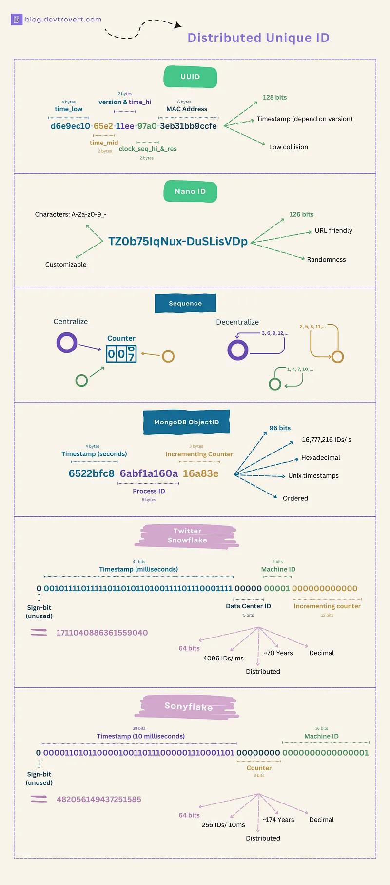

# 唯一 ID 生成算法


## 结构说明



## 1. UUID

When talking about generating unique IDs, UUIDs or Universal Unique Identifiers come to mind. 

A UUID is made of 32 hexadecimal characters. Remember, each character is 4 bits. So, all in all, it’s 128 bits. And when you include the 4 hyphens, you’ll see 36 characters:

```
6e965784–98ef-4ebf-b477–8bd14164aaa4

5fd6c336-48c4-4510-bfe5-f7928a83a3e2

0333be18-5ecc-4d7e-98d4-80cc362e4ade
```

There are 5 common types of UUID:

* **Version 1 — Time-based MAC**: This UUID uses the MAC Address of your computer and the current time.
* **Version 2 — DCE Security**: Similar to Version 1 but with extra info like POSIX UID or GID.
* **Version 3 — Name-based MD5**: This one takes a namespace and a string, then uses MD5 to create the UUID.
* **Version 4 — Randomness**: Every character is chosen randomly.
* **Version 5 — Name-based SHA1**: Think of Version 3, but instead of MD5, it uses SHA-1.
* …You may want to consider other drafts like Version 6 - Reordered Time and Version 7 - Unix Epoch Time, etc, among the latest proposals at ramsey/uuid.

I won’t go into the details of each version right now. But if you’re unsure about which to choose, I’ve found **Version 4 — Randomness** to be a good starting point. It’s straightforward and effective.

> “Random and unique? How’s that even possible?”

The magic lies in its super low chance of collision. 

Pulling from Wikipedia, imagine generating 1 billion UUIDs every second for 86 whole years and only then would you have a 50% chance of getting a single match.

    “Why do some say UUID has only 122 bits when it’s clearly 128 bits?”

When people talk about UUIDs, they often refer to the most common type, which is variant 1, version 4. 

In this type, 6 out of the 128 bits are already set for specific purposes: 4 bits tell us it’s version 4 (or “v4”), and 2 bits are reserved for variant information. 

So, only 122 bits are left to be filled in randomly.
Pros

* It’s simple, there’s no need for initial setups or a centralized system to manage the ID.
* Every service in your distributed system can roll out its own unique ID, no chit-chat needed.

Cons

* With 128 bits, it’s a long ID and it’s not something you’d easily write down or remember.
* It doesn’t reveal much information about itself.
* UUIDs aren’t sortable (except for versions 1 and 2).

## 2. NanoID

Drawing from the concept of UUID, NanoID streamlines things a bit with just 21 characters but these characters are sourced from an alphabet of 64 characters, inclusive of hyphens and underscores.

Doing the math, each NanoID character takes up 6 bits, as opposed to the 4 bits of UUID and a quick multiplication, and we see NanoID coming in at a neat 126 bits.

```
NUp3FRBx-27u1kf1rmOxn
XytMg-01fzdSaHoKXnPMJ
_4hP-0rh8pNbx6-Qw1pMl

```

> “Does storing NanoID vs. UUID in a database make much of a difference?”

Well, if you’re saving them as strings, NanoID might be a bit more efficient, being 15 characters shorter than UUID, but in their binary forms, the difference is a mere 2 bits, often a minor detail in most storage scenarios.

Pros

* NanoID uses characters (A-Za-z0–9_-) which is friendly with URLs.
* At just 21 characters, it’s more compact than UUID, shaving off 15 characters to be precise (though it’s 126 bits versus UUID’s 128)

Cons

* NanoID is newer and might not be as widely supported as UUID.


网上查的各种文章都说 NanoID 比 UUID 快 40% / 60%，但我直接看它 README 的 benchmark，明显说明 NanoID 比 UUID v4 慢很多很多！这使我相当迷惑，花了很长时间研究，最终确认了是版本问题...

我一开始看到的数据（nanoid 最新版本）：

> https://github.com/ai/nanoid/tree/5.0.4#benchmark

```
$ node ./test/benchmark.js
crypto.randomUUID         21,119,429 ops/sec
uuid v4                   20,368,447 ops/sec
@napi-rs/uuid             11,493,890 ops/sec
uid/secure                 8,409,962 ops/sec
@lukeed/uuid               6,871,405 ops/sec
nanoid                     5,652,148 ops/sec
customAlphabet             3,565,656 ops/sec
secure-random-string         394,201 ops/sec
uid-safe.sync                393,176 ops/sec
shortid                       49,916 ops/sec

Non-secure:
uid                       58,860,241 ops/sec
nanoid/non-secure          2,744,615 ops/sec
rndm                       2,718,063 ops/sec
```

这个数据中，NanoID 每秒生成的 ID 数（ops/sec）为 5,652,148，而 uuid-v4 为 20,368,447，**uuid-v4 反而比 NanoID 快了 3.6 倍**！

而旧的 v3 最新版本的 benchmark 结果如下：

> https://github.com/ai/nanoid/tree/3.3.7#benchmark

```
$ node ./test/benchmark.js
crypto.randomUUID         25,603,857 ops/sec
@napi-rs/uuid              9,973,819 ops/sec
uid/secure                 8,234,798 ops/sec
@lukeed/uuid               7,464,706 ops/sec
nanoid                     5,616,592 ops/sec
customAlphabet             3,115,207 ops/sec
uuid v4                    1,535,753 ops/sec
secure-random-string         388,226 ops/sec
uid-safe.sync                363,489 ops/sec
cuid                         187,343 ops/sec
shortid                       45,758 ops/sec

Async:
nanoid/async                  96,094 ops/sec
async customAlphabet          97,184 ops/sec
async secure-random-string    92,794 ops/sec
uid-safe                      90,684 ops/sec

Non-secure:
uid                       67,376,692 ops/sec
nanoid/non-secure          2,849,639 ops/sec
rndm                       2,674,806 ops/sec
```

这个旧的 v3 版本的 README 显示，NanoID 每秒生成的 ID 数（ops/sec）为 5,616,592，而 uuid-v4 为 1,535,753，**nanoid 比 uuid-v4 快了 3.6 倍**！


## 3. ObjectID(MongoDB 96Bits)

ObjectID is MongoDB’s answer to a unique document ID, this 12-byte identifier typically resides in the “_id” field of a document, and if you’re not setting it yourself, MongoDB steps in to do it for you.

Here’s what makes up an ObjectID:

* Timestamp (4 bytes): This represents the time the object was created, measured from the Unix epoch (a timestamp from 1970, for those who might need a refresher).
* Random Value (5 bytes): Each machine or process gets its own random value.
* Counter (3 bytes): A simple incrementing counter for a given machine

> “But how does each process ensure its random value is unique?”

With 5 bytes, we’re talking about 2⁴⁰ potential values, given the limited number of machines or processes, collisions are exceedingly rare
ObjectID (source: blog.devtrovert.com)

When representing ObjectIDs, MongoDB goes with hexadecimal, turning those 12 bytes (or 96 bits) into 24 characters

```
6502b4ab cf09f864b0 074858
6502b4ab cf09f864b0 074859
6502b4ab cf09f864b0 07485a
```

Pros

* Ensures a global order without needing a centralized authority to oversee uniqueness
* In terms of byte size, it’s more compact than both UUID and NanoID.
* Using IDs for sorting is straightforward, and you can easily see when each object was made.
* Reveals the specific process or machine that created an item.
* Scales gracefully, thanks to its time-based structure ensuring no future conflicts.

Cons

* Despite its relative compactness, 96 bits can still be considered long.
* Be careful when sharing ObjectIDs with clients, they might reveal too much.


## 4. Snowflake(64 Bits)

Twitter Snowflake (64 bits)

Commonly known as “Snowflake ID”, this system was developed by Twitter to efficiently generate IDs for their massive user base.

Also, a Snowflake ID boils down to a 64-bit integer, which is more compact than MongoDB’s ObjectID

* Sign Bit (1 bit): This bit is typically unused, though it can be reserved for specific functions.
* Timestamp (41 bits): Much like ObjectID, it represents data creation time in milliseconds, spanning ~70 years from its starting point.
* Datacenter ID (5 bits): Identifies the physical datacenter location. With 5 bits, we can have up to 2⁵ = 32 datacenter.
* Machine/ Process ID (5 bits): Tied to individual machines, services, or processes creating data.
* Sequence (12 bits): An incrementing counter that resets to 0 every millisecond.


> “Hold on. 70 years? So from 1970, it’s done by 2040?”

Exactly.

Many Snowflake implementations use a custom epoch that begins more recently, like Nov 04 2010 01:42:54 UTC, for instance. As for its advantages, they’re pretty evident given the design.

Cons

* Might be over-engineered for medium-sized businesses, especially with complex setups like multiple data centers, millisecond-level timestamps, sequence resets...
* Limited lifespan, it has a lifespan of ~70 years.

It packs features some may find excessive, but for giants like Twitter, it’s right on the money.


## 性能测试

https://github.com/knifecake/python-id-benchmarks

测试结果（时间单位为 ns，中间 Mean 为平均值，StdDev 为标准差）：

```
----------------- benchmark 'test_generate': 7 tests -----------------
Name (time in ns)                 Mean                StdDev          
----------------------------------------------------------------------
generate[snowflake]           492.1435 (1.0)         46.7127 (1.0)    
generate[cyksuid]             695.9376 (1.41)       119.0593 (2.55)   
generate[python-ulid]       1,719.8319 (3.49)       240.3840 (5.15)   
generate[uuid4]             1,961.3799 (3.99)       119.5277 (2.56)   
generate[timeflake]         2,637.3506 (5.36)       451.9482 (9.68)   
generate[svix]              3,746.8204 (7.61)       685.0287 (14.66)  
generate[cuid2]           317,832.6200 (645.81)   4,876.3859 (104.39) 
----------------------------------------------------------------------
```

结论：

1. snowflake 是其中最快的算法，但是它的缺点是依赖于时钟，如果时钟回拨，会导致 ID 重复。
2. python 标准库中的 uuid4 用时是 snowflake 的 400%，也即它比 snowflake 慢了 300%，它甚至还是 C 语言实现的！而 snowflake 是纯 python.

