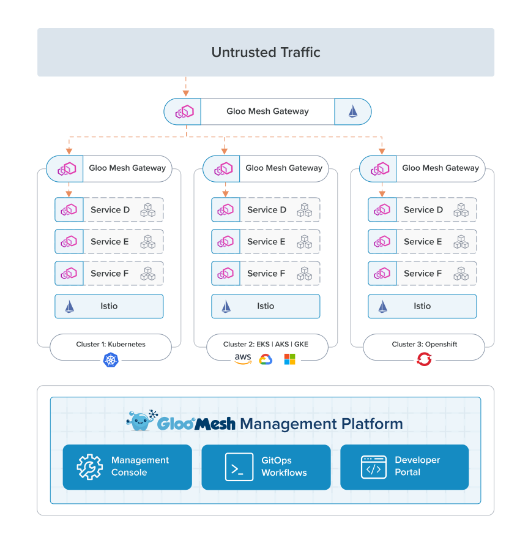
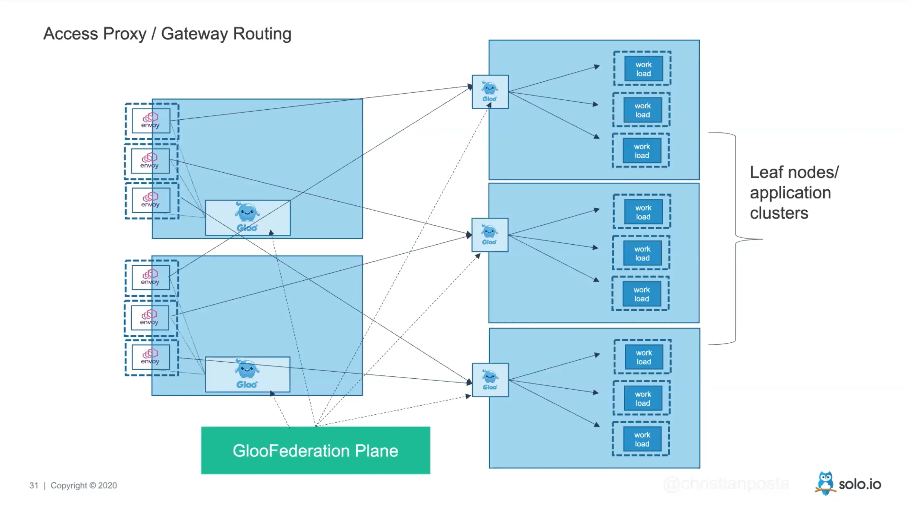
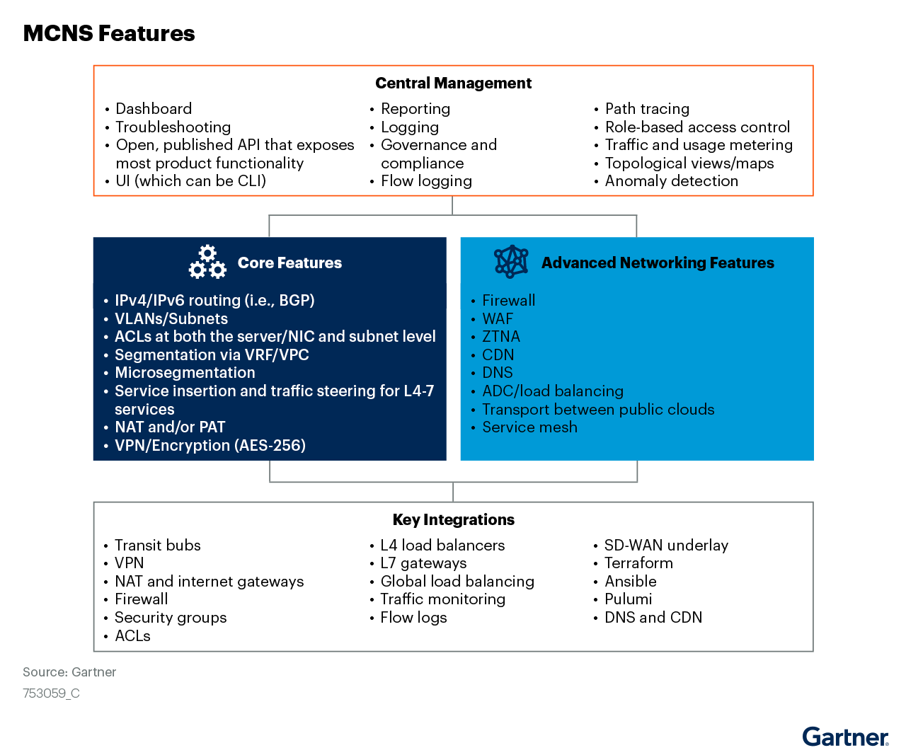

# 多云网络 - MultiCloud Networking Software - MCNS

几乎所有的云厂商都直接提供了自家的 L4/L7 层负载均衡服务，而且提供的 API 各有区别。
此外市场上也有若干开源或闭源的 L4/L7 层负载均衡。

那么是用开源组件自建负载均衡合适，还是应该直接使用云厂商提供的负载均衡服务，还是选择第三方厂商的负载均衡服务？
如果考虑到迁移到多云的可能性，又该如何选择负载均衡服务呢？
还是说我们应该更进一步，直接使用第三方云服务商提供的跨云网络方案，打通多个云服务商的内网？

本文的主要目的就是回答这些问题。

最理想的情况，当然是一套多云服务组件，能够完全屏蔽掉底层云服务商之间的区别，使我们的应用原生跨云，可以很方便地跨云管理、跨云调度。
但是理想的场景不一定符合当前的实际状况。

## DNS 负载均衡

许多 DNS 服务商都提供按地域的 DNS 就近解析、DNS 加权负载均衡等功能，比如 Route53，可以使用这些在 DNS 层实现多 IP 之间的负载均衡。

## L4 层负载均衡

L4 层负载均衡的配置参数很少，可替换性很高。

在公有云上，我目前认为最佳方案是直接使用各云服务商提供的 L4 层负载均衡服务（如 AWS NLB），没必要自建或者使用第三方服务。

但是某些情况下，开源方案相比自建方案确实会有些优势，比如新特性或者更低的成本，因此也可以看看如下开源方案：

- https://github.com/acassen/keepalived
  - 基于 VRRP 实现 VIP 的高可用，基于 IPVS 实现 L4 负载均衡
  - 是最常用的自建 L4 负载均衡方案，在云上自行搭建 keepalived 也是有案例可询的，值得考虑。
- https://github.com/facebookincubator/katran
  - Facebook 开源的一个基于 BPF 跟 XDP 的高性能 L4 负载均衡
- https://www.haproxy.com/blog/haproxy-on-aws-best-practices-part-3/
  - haproxy 算是比较传统的 L4 负载均衡
- https://github.com/iqiyi/dpvs
  - 爱奇艺开源的基于 DPDK 与 LVS 的 L4 负载均衡，但是项目不活跃了

## L7 层负载均衡 - API 网关

我们使用 L7 负载均衡（API 网关）的主要目的，通常是如下几个：

- 负载均衡相关能力：负载均衡、流量切分、流量镜像、限流限并发
- 监控：按 Host/Path 等纬度划分的状态码、延时指标监控
- 访问日志：统一收集好访问日志后，可使用 SQL 对全局流量的 Host/Path/Headers/Params 等进行深度分析

最简单的方案仍然是直接使用云服务商提供的 L7 层负载均衡服务（如 AWS ALB）。

但是各云服务商的 L7 层负载均衡的 API 都有较大区别，如果依赖太深，会存在被云服务商绑定的风险，多云环境下维护多套不同的负载均衡器也比较麻烦。
为了避免被云服务商绑定或者为了在多云上拥有统一的网关层使用体验，可以考虑使用开源组件自建 L7 负载均衡。

自建 L7 负载均衡的部署方案有两种，一是前端直接使用云服务商的 L4 负载均衡作为代理，相关文档：

- [Active-Active HA for NGINX Plus on AWS Using AWS Network Load Balancer](https://docs.nginx.com/nginx/deployment-guides/amazon-web-services/high-availability-network-load-balancer/)
  - Nginx 官方提供的在 AWS 上使用 AWS NLB + Nginx 的部署方案

另一个方案就是跟裸机部署一样，使用 keedalived 做高可用，相关文档：

- [Active-Passive HA for NGINX Plus on AWS Using Elastic IP Addresses](https://docs.nginx.com/nginx/deployment-guides/amazon-web-services/high-availability-keepalived/)
  - Nginx 官方也提供的在 AWS 上使用 keepalived + Nginx 的部署方案

你可以在 Nginx 官方文档中看到其他云服务商的部署方案。

### API 网关选型

>https://landscape.cncf.io/card-mode?category=api-gateway&grouping=category

开源的 Nginx 在很长一段时间内都是 L7 负载均衡领域的王者，但是随着云计算的发展，企业对 API 网关的需求越来越强烈，开源 Nginx 本身渐渐无法满足需求。

最大的问题是 Nginx 的配置比较复杂，而且不够动态。而新一代 API 网关则瞄准了这一需求，提供基于 API 的动态配置方式，内置网关常用的所有能力，赢得了许多用户的喜爱，下面先列举一下当前市面上有点名气的 API 网关。

基于 Envoy 实现的 API 网关：

- Istio IngressGateway
  - 我司当前使用的方案
- https://github.com/projectcontour/contour
- https://github.com/emissary-ingress/emissary

基于 Ngninx/Openresty 实现的 API 网关：

- Kong：国外老牌项目，部分关键插件是收费的。
- APISIX：国产项目，完全开源，借鉴了 Kong 的方案，但是官方宣称性能更好，架构更优。

其他 API 网关：

- github.com/megaease/easegress
- https://github.com/apioak/apioak
- https://github.com/luraproject/lura
- https://github.com/TykTechnologies/tyk
- https://github.com/alibaba/Sentinel

接下来对上述网关做一个对比分析，考虑下应该选择哪个，又该如何落地。

### Kubernetes 多集群网关

比较理想的情况仍然是，多地域多可用区，每个可用区一个集群。地域间使用 DNS 智能解析到最近的网关，通过网关在多集群之间实现流量的分发。
然后所有服务的部署、网关的配置，都由一个全局的控制面来处理。

网关这一层，最佳的配置方式应该是 K8s 社区新推出的 Gateway API，目前包括 Istio 在内的众多 API 网关都已经提供了（或正在开发） Gateway API 的支持。

#### 1. Solo Mesh

>https://www.solo.io/products/gloo-mesh/

Gloo Mesh 是一个兼容 Istio 的集群网关方案，它的架构实际上可以简单解释为「双层网关」，示意图如下：

#### 2. Google Multi-cluster Gateway

- [The Kubernetes Gateway API: Multi-cluster Gateways - Google - 2021](https://www.youtube.com/watch?v=NGsHFi276NE)
  - [GCP 提供多集群网关](https://cloud.google.com/kubernetes-engine/docs/how-to/deploying-multi-cluster-gateways)的能力，多个集群的 Pod 可以共享一个 Gateway

Google Multi-cluster Gateway 是一个单层 Gateway 的方案，这使它性能更高，而且相比双层 Gateway 它的跨区流量比例会更小，此外它还支持通用的基于 Kubernetes CRD 的配置方式。

但是有个缺点：仅适用于 Google Cloud

#### 3. karmada

- https://github.com/karmada-io/karmada

karmada 跟 Google 闭源的 Multi-cluster Gateway 一样，都是基于 Kubernetes Federation 衍生出来的方案，使用方法基本一致。

但是 karmada 默认只提供跨集群 Service 能力，新补充的 MultiClusterIngress 感觉还不太稳定，建议再观望观望。

此外 karmada 的 Ingress 方案有可能会导致跨区流量。

#### 3. kubevela cluster gateway

- https://github.com/oam-dev/cluster-gateway

思路上看着是单层网关，部署在单独的 K8s 集群，但是 stars 数还太少，可以研究下，但是稳定性或许难以保证。

## 单云多集群网关架构

在国外的云服务上设计网络架构时，需要重点考虑的一点是——**跨区流量成本**。
在四层负载均衡中，如果设计为在所有 upstream 上进行负载均衡，肯定会产生响应比例的跨区流量成本。
而如果设计为仅在各可用区内分别进行负载均衡，那就还需要在**每个可用区内单独做高可用**（K8s 的强项），并且还得具备（在部分可用区故障时）**屏蔽部分可用区的能力**（直接在 L4 负载均衡上关闭掉某个区，DNS 中去掉该区 LB 的解析）。

我当前认为，一个比较理想的单云多集群网关架构，从外往内应该如下：

- DNS 解析
- L4 负载均衡：keepalived 或者 AWS NLB，用于实现自建 L7 负载均衡集群的高可用
- 自建 API 网关：使用 APISIX/Kong/Envoy 等开源方案自建 API 网关，用于在多集群间实现更复杂的流量分配操作。
  - 从方便维护的角度讲，这个网关最好也部署在一个 K8s 集群内，每个可用区各一个 Deployment + HPA，使用 OD 节点组。
  - 外部加一层 API 网关的目的是，在多集群之间根据 L7 层参数进行流量分配。比如服务 A 仅部署在了集群 A，就可以根据 host/path 匹配，仅将该服务的请求发送到集群 A
  - 外部这层 API 网关是必要的，因为通常来讲不同的服务有不同的需求，多集群很难做到完全等价。对于许多的非核心服务而言，把它们部署在所有集群上代价有些太高了。
- K8s 内 API 网关：用于为 K8s 内部服务提供一个流量入口，实现集群内的流量分配操作。
  - 这里的问题在于，两个 API 网关分属不同 K8s 集群，外部 API 网关如何做到自动发现 K8s 内的 API 网关实例呢？

如果是这样组网，是不是直接使用 Istio 的多集群服务网格，或者 karmada/kubevela 的多集群网关，反而是更好的方案呢？

待继续研究。

## 多云网络市场分析

针对多云网络市场，目前也有多家厂商在这个领域竞争，当前（2022-04）主要有如下几家（按字母顺序排列）：

- [Alkira Cloud Networking](https://www.alkira.com/cloud-networking/)
  - Single and multi-cloud networking should be as simple as any other cloud service.
- [Arrcus Multi-Cloud Networking](https://arrcus.com/solutions/multi-cloud/)
  - onsisting of ArcEdge, as a secure data plane software and ArcOrchestrator dramatically shortens multi-cloud networking set up time from days to hours. 
  - 使用 Terraform 自动化部署多云网络
- [Arista Data-Driven Cloud Networking](https://www.arista.com/en/solutions/cloud-networking)
  - an open approach to cloud networking around a single consistent software platform, the Arista EOS® network stack, and network data lake architecture (NetDL™), with the application of artificial intelligence and machine learning (AI/ML) to automation and security challenges.
- [Aviatrix Cloud Networking Platform](https://aviatrix.com/cloud-network-platform/#multi-cloud-architecture/)
  - brings multi-cloud networking, security, and operational visibility capabilities that go beyond what any cloud service provider offers. Aviatrix software leverages public cloud provider APIs to interact with and directly program native cloud networking constructs, abstracting the unique complexities of each cloud to form one network data plane.
  - 使用 Terraform/Ansible 自动化部署多云网络
- [Cohesive VNS3](https://www.cohesive.net/)
  - Encrypted Overlay Network
  - Whether using a single cloud service provider, multiple clouds, or hybrid cloud, the VNS3 Network Platform provides the connectivity and security you need with better pricing, better support, and better visibility.
- [Cisco Cloud ACI](https://www.cisco.com/c/en/us/solutions/data-center-virtualization/application-centric-infrastructure/cloud-aci.html)
  - Automated network connectivity, consistent policy management, and simplified ops for multicloud.
- [F5 Distributed Cloud Platform](https://www.f5.com/cloud/products/platform-overview)
  - delivers improved functionality, advanced security controls, and more simplified operations than native services from cloud providers.
- [Prosimo](https://prosimo.io/)
  - One platform that integrates cloud networking, performance, security, observability, driven by data
- [VMware Avi](https://avinetworks.com/)
  - The Multi-Cloud Application Services Platform
- [VMware NSX Cloud](https://www.vmware.com/products/nsx-cloud.html)
  - Deliver consistent networking and security for your applications running natively in public clouds with NSX Cloud.

其中有的产品会使用 overlay 网络完全屏蔽各云服务商底层的网络差异，但是代价是性能更差；也有的产品直接编排云服务商原生的网络能力实现跨云。

MCNS 提供所有核心网络能力，底层能力如路由，高级能力如 L4/L7 服务（内容分发网络 CDN，ADC、防火墙），以及其他关键的能力集成，比如 terraform/pulumi/ansible 等云环境配置管理与自动化运维工具。如下图所示：

驱动用户选择多云网络方案而不是直接使用各云服务商原生网络的原因在于，直接使用原生网络方案存在如下痛点：

- 配置太过繁琐：仅仅为了做一点微小的改动，比如说改下 ACL 规则，我就需要打开不同云服务商的 28 个浏览器页面，并且做一堆的配置变更。
- 带宽限制：通过 VPN 直接连接多云，通常会受限于 VPN 的带宽
- 统一网络堆栈：希望能够在统一的面板上管理所有云上的网络资源
- 高级网络路由：大部分云服务商提供的专有网络 VPC，都不支持 BGP 协议
- 各云服务商的功能、设计思路不一致，导致多云环境的运维、故障排查困难。

其他多云网络方案：

- [多云管理与 CloudFlare](https://www.cloudflare.com/zh-cn/learning/cloud/what-is-multicloud-management/)
- [F5’s Multi-Cloud Networking Strategy and the Gartner 2021 Cool Vendors in Cloud Computing Report](https://www.f5.com/company/blog/multi-cloud-gartner-cool-vendor-cloud-computing-report)
- [Market Guide for Multicloud Networking Software](https://aviatrix.com/gartner-multicloud-networking-software-market-guide/)
  - [Multicloud Networking Software (MCNS)](https://blogs.gartner.com/andrew-lerner/2022/04/21/multicloud-networking-software-mcns/)

总的来说，多云网络目前还处于早期发展阶段，overlay 的网络彻底屏蔽了各云服务商的网络差异，而 underlay 网络方案的配置复杂性很难避免。
目前还是先观望观望吧，不急于作出选择，毕竟我目前接触到的场景，还没复杂到必须选择一个多云网络架构，当前的架构优化优化，缝缝补补又能顶三年 emmmm
