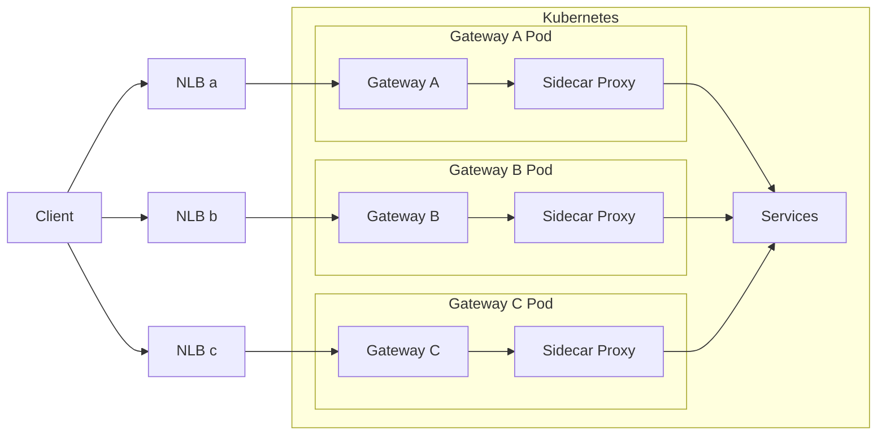

# 跨区流量处理方案

## 不同云服务商的 region/zone

相关文档：

- [AWS - Regions and Availability Zones](https://aws.amazon.com/about-aws/global-infrastructure/regions_az/)
- [腾讯云 - 地域与可用区](https://cloud.tencent.com/document/product/213/6091)

简单的说，一个地域 Region，就是一个地理位置。而一个可用区，就是该地理位置的一个物理数据中心。
同一地域的多个可用区，分别使用不同的电力、接入网，保证可用区间故障相互隔离（大型灾害或大型电力故障除外），不出现故障扩散。

同一地域的多个可用区之间，通过超高吞吐量、极低延时的专用网络连接。

国内的云服务商基本都是免跨区（Zone）流量费的，而国外的 AWS/GCP/Azure 等云服务商都会收跨区流量费。

所有的云服务商都会收跨域（Region）流量费。

## AWS/GCP 等云服务环境下如何避免跨区流量费

对于使用 Kubernetes 搭建的云服务系统，可以考虑使用如下方案：

- 在每个 Zone 创建一个 Kubernetes 集群，集群内部署一套完整的线上服务，实现服务间调用不跨区。
  - 也可以只创建一个跨可用区的 Kubernetes 集群，通过 Istio 实现可用区的隔离，但是这样做隔离性不够强，可能会有问题，待调研。
- 对于数据库等中间件，可以在每个 Zone 创建一个比较小的读副本，通过环境变量等方式控制服务参数，使它只从当前 Zone 的副本读数据，实现仅在 Zone 内读数据。
- 在外部通过 LoadBalancer/DNS 实现多个可用区之间的负载均衡。

如果暂时不太想搞多集群方案，在 AWS 上也有折中的优化措施，就是改用 L4 的 NLB 或者自建 keepalived 作为对外的入口网关，然后将这个 L4 网关与集群内的 Gateway 都按可用区进行拆分以避免跨区流量，架构如下：

这样就只有服务间调用 `Services --> Services`，以及 `Gateway --> Services` 这两种情况才会产生跨区流量了，网关层跟跨区流量成本都会好一些。

而如果上述方案对你而言不可行，还有中策可用：

- 尽量把服务跟中间件部署在同一可用区，一定程度上优先访问可用区内的其他服务（中间件）
  - Kubernetes: 尽量将有调用关系的 Pod/中间件 调度到同一可用区，或者多可用区均衡调度
  - Kubernetes/Istio: Zone Aware LoadBalancing，优先访问当前可用区内的服务，但如果未为每个可用区创建不同的 Deployment+HPA，可能会造成可用区之间的负载不均衡。
- 尽量缩减跨区流量
  - 使用 gRPC 等二进制消息格式+多路复用的协议（效果立竿见影）
  - 服务间调用的数据使用 gzip 等算法压缩
  - 往数据库存的 json 等数据，也可以在客户端压缩下，取出来再解压
  - 选择使用不收跨区流量费用的云服务，如 AWS 的 S3/DynamoDB 等

