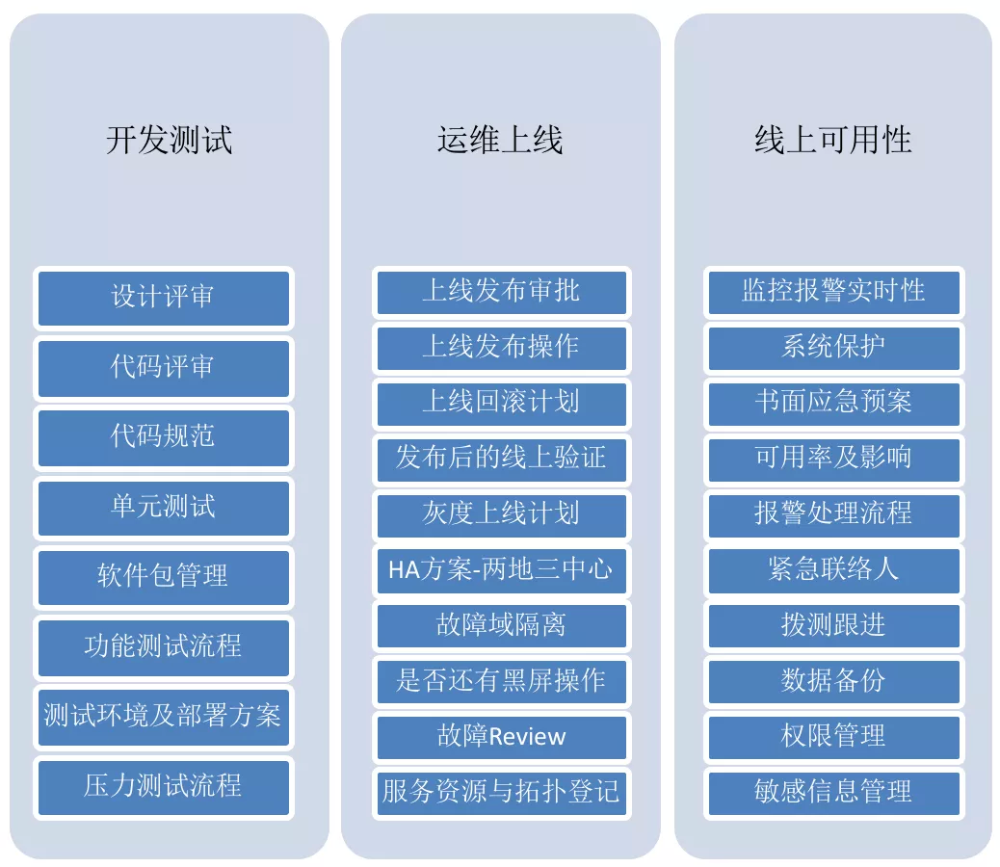

# DevOps Platform / AIOps Platform

DevOps 平台，以及它的进化版：AIOps 平台。

AIOps 因为和 telemetry 关系更大，目前资料都放在 [telemetry](../telemetry/) 文件夹中。

## 参考文档

因为目前参考文档价值更高，放在前面：

- [基于微服务成熟度模型的高可用优化实践 - 爱奇艺技术团队](https://mp.weixin.qq.com/s?__biz=MzI0MjczMjM2NA==&mid=2247488105&idx=1&sn=d988f52e734dedbe5922fd0cbbd386a4)
- 腾讯-蓝鲸赋能应用运维：这是腾讯蓝鲸的一份演讲 PPT，我就放在当前文件夹下。它从宏观上介绍了一个 DevOps 平台的全貌。

## 开源产品

腾讯的蓝鲸智云开源了它们整个平台的部分组件，值得参考：

- [蓝鲸 - 持续集成平台](https://github.com/Tencent/bk-ci)
- [蓝鲸 - 配置平台](https://github.com/Tencent/bk-cmdb): 资产及应用的企业级配置管理平台
- [蓝鲸 - 标准运维平台](https://github.com/Tencent/bk-sops): 通过可视化的图形界面进行任务流程编排和执行的系统

## 服务端应用开发、上线、维护的完整流程

>客户端(如手机 APP)的流程也类似，但是没有这么复杂，要更简单些。

请看图：

上图可总结为如下流程：

1. 「持续集成」：这包含了软件包的设计、编写、单元测试和快速集成。
2. 功能测试/压力测试：这是一个**通宵（很长时间）的自动化流程**，开发测试人员在会第二天早上检查测试报告，确定是否可以发布。
   1. 这是对一整套微服务体系进行部署测试，为了保证覆盖率，肯定会有大量的用例。因此不可避免的时间会很长。
3. 发布上线：这里才是「持续部署」的领域。
   1. 为了可靠性，通常我们不会允许全自动的持续部署。而是需要「审批」-「灰度发布」-「线上验证」一整套流程。任何一步出现问题，都需要从头重新来过。
   2. 其中「审批」是人工设置的一个检查点（障碍），因为「不放心」。
   3. 如果我们的整套流程都非常可靠，测试也非常全面，可以尝试去掉「审批」这个人工检查点，让整个流程全自动化。
4. 线上可用性维护(SRE)：监控告警，故障自愈，报警处理流程等等。

基于上面这套流程，我们的发布速度，最快只能达到每天一次。主要是因为「功能测试/压力测试」这部分非常耗费时间。

听说 Netflix 的微服务体系一天能发布上千次，我想他们肯定有更高效的测试方案。
比如更新哪个微服务，就只需要测试这个微服务，而不需要对整套微服务体系做完整测试，这样就能节约大量时间。

这要求我们每个微服务的测试都必须非常全面！测试结果也必须可靠，这样才能保证只要通过了测试，这个微服务就可以上线。

从另一方面讲，因为微服务上线后出问题，往往是很难避免的，因此我们还得要求发布系统要非常高效，能很快速的进行发布或回滚。
线上验证和监控告警都必须要敏捷全面，还得有完善的报警处理流程。

总的来说，一套能支撑一天上千次发布的「应用 DevOps 平台」（或者叫研发运营一体化平台），涉及的东西非常多。
