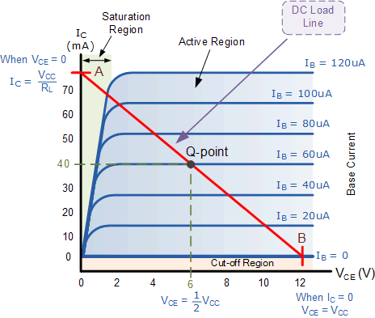
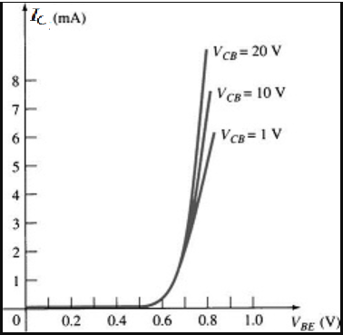
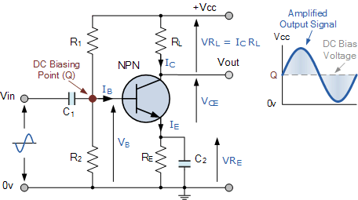

# 电子工程 Electrical Engineering

## 一、电子电路基础知识

>建议挨个 Google + 问 ChatGPT

推荐：

- [纵横向导 - 电路入门](https://rmxd.gitee.io/guide/elec_start/)
  - 内容更详细一点，而且多采用类比的方法讲解，很适合零基础入门
- [The Amazing World of Electronics](https://elamazing.com/)
  - 有些很不错的文章跟配图

看完上面的文章后，再随着玩得越来越深入，可能会陆续了解这些内容：

- 什么是开发版，以及如何使用
- 什么是 TTL 串口与串口驱动，以及如何使用
- 什么是 GPIO 引脚，以及开发版的引脚各有什么功能
- 如何使用 USB 转 TTL 串口版给 ESP32/ESP8266 刷固件
- 如何使用万用表测电压、电流、电阻
  - （N 年前学这玩意儿时用的是最简单易懂的物理指针表，但是实际显然是电子的用着更方便）
  - 回忆下用法：首先调到合适档位，然后测电流要串联到电路中、测电压要与被测器件并联、测电阻直接接在被测器件两端即可。
  - 对于手动量程万用表（如 DT-9205A），它的显示单位为量程名字末尾非数字部分。
    - 比如电阻 200 量程的显示单位就为 Ω；2K/20K/200K 这三个量程的显示单位都为 KΩ；2M/20M/200M 的显示单位都为 MΩ
    - 对于电流/电压/电容也是一样。
- 什么元件需要防静电，以及有线防静电手环/台垫
- 如何读色环电阻的阻值？（不会读不如直接万用表走起...）

烧完智能家居后又想烧智能小车、机械臂，又在淘宝上下单了（如果 ESP32 不好用就改用我闲置的树莓派 4B）：

- 4 自由度木板机械臂 + 4 个 SG90 舵机
- 智能小车底盘（四驱 + 双层）
- 三轴加速度传感器
- 超声波测距传感器
- 双轴摇杆
- L9110S 四路直流电机驱动板

>等智能小车烧完，下一步估计得是烧 PCB 版设计、3D 建模打印、机器人、飞控穿越机了。

案例：

- [[插件集成] HA自带的微软TTS引擎的全面改进威力加强版](https://bbs.hassbian.com/thread-13480-1-3.html)
- 其他在淘宝 B 站上看一些 Makers 做的项目
  - LED 风扇全息显示器
  - 自制激光投影仪
  - 超声波驻波悬浮摆件
  - 自平衡方块（动量惯性轮）
  - 等等

### 0. 常见基础公式

1. 欧姆定律： $U = IR$
   1. 电压 U 单位伏特 Volt，符号 $V$
   2. 电流 I 单位安培 Ampere，符号 $A$
   3. 电阻 R 单位欧姆 Ohm，符号 $\Omega$
2. 电功率公式： $p= UI$
   1. 功率 p 单位瓦特 Watt，符号 $W$，等同于 $V \cdot A$ 的缩写
3. 电能公式： $w = pT$
   1. 其中 p 为电功率，单位前面说了就是 Watt
   2. T 为时间，单位秒 Second
   3. $w$ 电能的单位为焦耳 joule，等同于 $V \cdot A \cdot s$
   4. 常见的电池通常会使用 $mA \cdot h$ 或者 $w \cdot h$ 来标记其电能容量。
      1. $mA \cdot h$ 乘上电压再转换下电流跟时间的单位为 A 跟 s，就得到焦耳数
      2. $w \cdot h$ 直接乘 3600（1 小时的秒数）就得到焦耳数
4. 电容量公式： $C = Q/U$
   1. 电容量 C 单位为法拉 Farad，符号为 $F$
   2. 带电量 Q 的单位为库仑 Coulomb，符号为 $C$
5. 库仑的定义： $1C = 1A \cdot s$
   1. 1 库仑即 $6.24146 \times 10^{18}$ 个电子所带的电荷量
6. 电感 TODO

### 1. 常用电子元件介绍

常见电子元器件：

- 电阻
- 二极管 Diode
  - 发光二极管
  - 整流二极管
  - 稳压二极管
- 三极管
- MOSFET 场效应管
  - power converter 电压转换器
    - 整流器（rectifier）、逆变器（inverter）、斩波器（chopper）及变频驱动器（VFD）
- 电容
  - 电解电容
  - 瓷片电容
  - 独石电容
- 晶振

#### 1.1 二极管 Diode

>https://learn.sparkfun.com/tutorials/diodes

二极管是一种**只允许电流由单一方向流过**，具有两个电极的元件，是现代电子产业的基石。
可类比水流中的单向阀门，水只能从一端流向另一端，而不能逆流。

最初的二极管是真空电子二极管，很大、需要预热、功耗大，易破碎。
后来美国人使用半导体材料发明了晶体二极管（或者叫半导体二极管）。
目前常用的二极管都是晶体二极管，主要使用硅或者锗这类半导体材料。

晶体二极管的核心是 PN 结（p–n junction），要了解  PN 结，需要先介绍半导体的几个概念：

- 空穴：又称 Electron hole，物理学中指原子的共价键上流失一个电子，最后在共价键上留下的空位。
- 载流子：半导体中有两种载流子，即价带中带正电的空穴，和导带中带负电的电子。
- P 型半导体：P 表示 Positive，指以带正电的空穴导电为主的半导体，也叫空穴半导体。
  - 在纯净的硅晶体中掺入三价元素（如硼），使之取代晶格中硅原子的位置，就形成P型半导体。
- N 型半导体：N 表示 Negative，指自由电子浓度远大于空穴浓度的杂质半导体。
  - 例如，含有适量五价元素砷、磷、锑等的锗或硅等半导体。

懂了上面这些后，让我们考虑在一个 N 型半导体跟 P 型半导体形成的 PN 结中，电子显然只能从 N 极流向 P 极，因为只有 N 极才有足够的电子。相反电流只能从 P 级流向 N 极，因为只有 P 级才有足够的空穴。

如果电流要反向流动，那 PN 结的 P 极的电子会更多，而 N 级的空穴也会更多，电势差会更大，显然就会非常费劲。

二极管在导通状态下二示意图如下，其中也展示了二极管对应的符号与真实二极管的结构（带环的一为其 N 极）：

电阻拥有线性的伏安特性曲线，遵从欧姆定律。而二极管则完全不同，它伏安特性曲线（Current-Voltage Graph）如下：

几个主要特征与相关名词介绍：

>更详细的文章：[PN Junction Diode](https://elamazing.com/2021/04/13/pn-junction-diode/)

- 正向压降 Forward Voltage: 指使电流能够导通的最小电压 $V_F$
  - 「正向压降」被用于克服二极管的内部电场了，所以在电流通过二极管后，电压需要减去这个电压，这也是中文名「正向压降」的由来。
    - 硅二极管的正向压降通常为 0.6V - 1V，锗二极管的正向压降通常为 0.3V
  - 根据伏安特性曲线，实际上随着电流的变化，「正向压降」也是有小幅波动的，不过计算时一般都认为它是固定值。
- 击穿电压 Breakdown Voltage: 指使电流能否反向导通的最小电压，从图中标识看，显然它远大于「正向压降」。
    - 当电流能经过二极管反向导通时，我们称二极管被击穿（Breakdown）

二极管依据其设计目标，分类了许多不同类别：

- 普通二极管
- 整流器(rectifier) / 功率二极管（power diode）
  - 依靠二极管只能单向导通的原理，可以使用它将交流电变成直流电。
  - 能承受较大的正向电流和较高的反向电压
- 发光二极管（Light-Emitting Diodes, LEDs）
  - LED 的正向压降取决于它的颜色，而且比较固定，通常红色约为 1.6V，绿色有 2V 和 3V 两种，黄色和橙色约为 2.2V，蓝色约为 3.2V
- 稳压二极管
  - 利用二极管在反向击穿状态，其电流可在很大范围内变化而电压基本不变的现象，制成的起稳压作用的二极管。
- 开关二极管
  - 能够快速由导通变为截止或由截止变为导通的一种二极管。
- 检波二极管
  - TODO
- 阻尼二极管
  - 具有较低有电压降和较高的工作频率，且能承受较高的反向击穿电压和较大的峰值电流。

还有二极管堆组：

- 整流桥堆(半桥、全桥)
  - 菱形联接

等等

#### 1.2 三极管 triode / bipolar transistor

三极管即双极型晶体管，缩写 BJT，前面介绍了二极管结构为单个 PN 结，而三极管的结构则为 PNP 或者 NPN 结构，**具有电流放大作用**，是电子电路的核心元件之一。

它的工作方式就像是一个一个液压阀门，通过小电流来顶开中间的通路，使大电流得以通过，一个 NPN 型放大器电路的示意图如下：

b 与 e 之间的电压形成一个小电流，这个小电流越大，c 与 e 之间的电阻就越小。

就像是如下液压阀门，b 处的水压越大，液压阀门被推得越开，c 与 e 之间的水流就越大：

三极管不是凭空把电放大了，而是说： 小的电信号（小水流）把另一个通路的大电流的阀门打开了，后面的器件能够感受到这个大电流， 所以是放大了。对电来说 实际有两个电源供电的 一个是小电源（小信号、信号源） 一个是大电源。

咱们的收音机，实际就是天线，接收到空气中的小电流，你可以理解为毛毛雨。

这个毛毛雨到了三极管的一个脚上打开阀门， 电池供电通过另外两个脚流动，再打开一个后面的三极管， 一级级的这样不断打开，一般收音机最早的时候是三管收音机、六管收音机，就是这么个意思一直到这个水流大到能够推动喇叭就发声了。

一个极简三级放大收音机电路：

两种三极管的符号与识别：

三个电极介绍：

- C: 即 Collector 集电极
- B: 即 Base 基极
- E: 即 Emitter 发射极

可以看到 NPN 跟 PNP 三极管最大的区别，是在于电流流向：

- NPN 的 Base 基极是 P 对应正极，电流从 B 与 C 极 流向 E 极
- PNP 的 Base 基极是 N 对应负极，电流从 E 极流向 B 与 C 两个电极

根据 B 极电流 $I_B$ 的变化，$V_{CE}$ 的变化曲线如图：

可以看到在 $I_B$ 一定的情况下，不论 $V_{CE}$ 在 2v 以上如何变化，$I_C$ 的电流都几乎是恒定的。换个角度看电压在 2v - 12v 之间时，$I_B$ 与 $I_{C}$ 几乎是完全的线性关系，不受电压波动的影响。

>注意 12v 以上只是没有画出来，假使这个三极管最多只能承受 12V 电压，那更高的电压会击穿它，你就能看到三极管冒火花了...

$ \frac{I_C}{I_B}$ 之间的比率（常数）被称做三极管的电流增益（Current Gain），一般使用 $\beta$ 表示。

因为实际场景中 $I_B$ 不太好判断，通常都是直接调整 $V_{BE}$，因此我们再换个角度，对比下 $I_C$ 与 $V_{BE}$：

可以看到：

1. 不论 $V_{CE}$ 在 1v - 20V 如何变化，$I_C$ 的电流变化都很小。
2. $V_{BE}$ 需要一个启动电压，大约在 0.7V 左右，低于 0.7V 时$I_C$ 的电流一直非常小。
3. 在 $V_{BE}$ 超过 0.7V 后，任何此电压的小变化，都会导致 $I_C$ 的剧烈变化。

一个常见的单状态 NPN 放大器电路如下：

可以注意到，输入 $V_{in}$是一个很小的交流信号，过来之前加了一个电容隔绝掉其中参杂的直流信号。

其次因为 $V_{BE}$ 需要一个启动电压才能进入电流放大的工作区间，这里通过 $R1$ 与 $R2$ 为 $V_{BE}$ 提供了一个启动电压 DC Biasing Point.

#### 1.3 MOSFET 金属氧化物场效应晶体管

>MOSFET 与三极管的区别与选用：https://www.eet-china.com/mp/a17394.html

>CMOS 集成电路工艺 - 百科: https://www.zgbk.com/ecph/words?SiteID=1&ID=124559&Type=bkzyb

**MOSFET 晶体管是电压控制元件，而双极型晶体管（三极管）是电流控制元件**。

在只允许从取较少电流的情况下，应选用场效应管；而在信号电压较低，又允许从信号源取较多电流的条件下，应选用双极晶体管。

场效应管能在很小电流和很低电压的条件下工作，功耗低，而且可以很方便地把很多场效应管集成在一块硅片上，因此场效应管在大规模集成电路中得到了广泛的应用。目前主流的数字集成电路，包括 CPU/GPU/RAM，基本都是通过光刻制造的 CMOS 集成电路（Complementary Metal-Oxide-Semiconductor Integrated Circuit）

#### 1.4 电容 Capacitor

电容是电能的容器，里面存储的是电荷，电容在电路中是储能、缓冲、减压、过滤器件。。

水要通过池塘、湖泊，首先需要灌满它才能过得去。所以这部分水（电能）可以被这些容器保存下来，这是**电容的储能作用**，另外很明显，无论前面的水流多么湍急，到了湖泊就要先灌满它，湖泊开口再向下游流水，自然流水就缓慢一些，所以它**也有缓冲的作用**。大波浪到了湖泊变平稳，实际变成了小波浪，波的形状都变了，这就是**过滤的作用，只允许特定的波通过**。

再回顾下电容相关的公式：

1. 电容量公式： $C = Q/U$
   1. 电容量 C 单位为法拉 Farad，符号为 $F$
   2. 带电量 Q 的单位为库仑 Coulomb，符号为 $C$
2. 库仑的定义： $1C = 1A \cdot s$
   1. 1 库仑即 $6.24146 \times 10^{18}$ 个电子所带的电荷量

电容的类型：

- 瓷片电容
  - 用陶瓷材料作介质，在陶瓷表面涂覆一层金属（银）薄膜，再经高温烧结后作为电极而成。
  - 用途：通常用于高稳定振荡回路中，作为回路、旁路电容器及垫整电容器。但仅限于在工作频率较低的回路中作旁路或隔直流用，或对稳定性和损耗要求不高的场合〈包括高频在内〉。瓷片电容不宜使用在脉冲电路中，因为它们易于被脉冲电压击穿。
- 铝电解电容（有极性）
  - 有极性铝电解电容器是将附有氧化膜的铝箔（正极）和浸有电解液的衬垫纸，与阴极（负极）箔叠片一起卷绕而成。
  - **优点**: 容量范围大，一般为1~10 000 μF，额定工作电压范围为6.3 V~450 V。
  - **缺点**: 介质损耗、容量误差大（最大允许偏差+100%、–20%）耐高温性较差，存放时间长容易失效。
  - **用途**: 通常在直流电源电路或中、低频电路中起滤波、退耦、信号耦合及时间常数设定、隔直流等作用。
  - 注意：因其具有极性，不能用于交流电路。
- 独石电容
  - 独石电容是用钛酸钡为主的陶瓷材料烧结制成的多层叠片状超小型电容器。
  - **优点**: 性能可靠、耐高温、耐潮湿、容量大（容量范围1 pF ~ 1 μF）、漏电流小等
  - **缺点**: 工作电压低（耐压低于100 V）
  - **用途**: 广泛应用于谐振、旁路、耦合、滤波等。 常用的有CT4 （低频） 、CT42（低频）；CC4（高频）、CC42（高频）等系列。
- 钽电解电容
  - 有两种制作工艺：
    - 箔式钽电解电容器：内部采用卷绕芯子,负极为液体电解质，介质为氧化钽
    - 粉烧结式： 阳极（正极）用颗粒很细的钽粉压块后烧结而成
  - **优点**: 介质损耗小、频率特性好、耐高温、漏电流小。
  - **缺点**: 生产成本高、耐压低
  - **用途**: 广泛应用于通信、航天、军工及家用电器上各种中 、低频电路和时间常数设置电路中。
- 等等

#### 1.5 电感 Inductance

「电磁感应（Electromagnetic induction）」我们都学过，它是指放在变化磁通量中的导体，会产生电动势。 此电动势称为感应电动势或感生电动势，若將此導體閉合成一迴路，则该电动势会驱使电子流动，形成感应电流（感生电流）。
**简单的说就是磁场变化能产生电能，电流变化也会形成磁场**。

电磁感应最为人所知的应用应该就是「发电机」、「电动马达」跟「变压器」了。「发电机」通过电磁感应将机械能转换为电能，而「电动马达」刚好相反，它通过电磁感应将电能转换为机械能。
这个转换实际上都是依靠磁场与「电磁感应」实现的。

而我们这里提的电感这种元器件，其核心原理是楞次定律（Lenz's law）：

>由于磁通量的改变而产生的感应电流，此电流的流向为抗拒磁通量改变的方向。

将楞次定律应用在闭合回路的自感效应中，得到的结论是：

>电路上所诱导出的电动势的方向，总是使得它所驱动的电流，会阻碍原先产生它（即电动势）的磁通量之变化。

具体而言，**对于「电感」，当电流增加时它会将能量以磁场的形式暂时存储起来，等到电流减小时它又会将磁场的能量释放出来，这会产生抵抗电流变化的效果**。

电感并不损耗能量，它只是临时将电流存储起来，待会儿再释放出来而已（这叫什么？削峰填谷，平滑算法）。

电感的结构通常是漆包铜线缠绕在一个永磁体上，因为需要有电流的变化才能工作，通常仅应用在交流电领域。

#### 1.6 电阻

>足够深入的分析：[电阻的定义到底是什么？](https://www.zhihu.com/question/68567332)

我们对电阻最直观的理解，是中学时学过的：

$$R =  \frac{V}{I}$$

但是在简单的含有电阻 R + 一个电感或电容的直流电路中，电流是随时间变化的，并在最终达到一个稳态。

这时根据上面的公式计算，因为电压是固定的，我们发现电路中电阻 R 的阻值实际是随时间变化的。

这个问题在直流电路中并不明显，因为电路最终仍然会达到稳态，这时电阻就跟它的标称电阻差距不大了。

但是在交流电路中，因为电流始终是在震荡的，这个问题就会变得相当明显，以至于无法简单地使用「电阻」来表达一个电阻器的特性，为此引入了一个新概念叫「阻抗」。

>在具有电阻、电感和电容的电路里，对电路中的电流所起的阻碍作用叫做阻抗。阻抗常用Z表示，是一个复数，实部称为电阻，虚部称为电抗，其中电容在电路中对交流电所起的阻碍作用称为容抗 ,电感在电路中对交流电所起的阻碍作用称为感抗，电容和电感在电路中对交流电引起的阻碍作用总称为阻抗。 阻抗的单位是欧姆。阻抗的概念不仅存在于电路中，在力学的振动系统中也有涉及。

如果仔细看看你买过的耳机的相关参数，会发现它就包含一个「阻抗」参数，知乎上就有相关讨论 [耳机是不是阻抗越高越好？](https://www.zhihu.com/question/22519059).

对电阻更精确的理解是：电阻是电压对电流的变化率，它不一定是一个静态值（也就是说可能是非线性的，比如二极管的伏安特性曲线就不是直线）。

#### 1.7 地

电路中每个器件上有电能量集聚，形成电势差，就相当于物体的高度差。
假设没有一个参考基准点，就没法测量这个电势差了，因此规定电路的某个点就是作为基准面，也就是地（GND/Ground）了。

地/GND 并不需要是真正的地面，对于我主要关注的弱电电路板而言，电路的负极就是地。

同理可推出，如果需要将同一个电路板同时接入多的源电路，则必须将这多个电路版的负极连接在一起，这样它们的「GND」参考基准点才是一致的！

弱电领域另外一个常见的接地应该就是静电接地了，这是为了确保人体/工作台与地面的电势差为零，避免工作时把

#### 1.8 晶振 (Xtal) 与振荡电路

>[秒懂单片机晶振电路原理](https://zhuanlan.zhihu.com/p/72583737)

石英晶体或晶振，是利用石英晶体（又称水晶）的压电效应，用来产生高精度振荡频率的一种电子器件，属于被动器件（无源源件）。

晶体是指其中的原子、分子、或离子以规则、重复的模式朝各方向延伸的一种固体。
晶体与几乎所有的弹性物质都具有自然共振频率，透过适当的传感器可加以利用。

石英晶体的优点是在温度变化时，影响震荡频率的弹性系数与尺寸变化轻微，因而在频率特性上表现稳定。

石英晶体谐振器的原理：

- 石英晶体上的电极对一颗被适当切割并安置的石英晶体施以电场时，晶体会产生形变。这与晶体受压力产生电势的现象刚好相反，因此被称做**逆压电效应**。
- 当外加电场移除时，石英晶体又会恢复原状并发出电场，因而在电极上产生电压，这是我们熟知的**压电效应**。
- **逆压电效应** + **压电效应** 这两个特性造成石英晶体在电路中的行为，类似于某种电感器、电容器、与电阻器所组合成的 RLC 电路。组合中的电感电容谐振频率则反映了石英晶体的实体共振频率。
- 当外加交变电压的频率与晶片的固有频率（决定于晶片的尺寸与切割方法）相等时，机械振动的幅度将急剧增加，这种现象称为**压电谐振**。

可能有些初学者会对晶振的频率感到奇怪，12M、24M 之类的晶振较好理解，选用如 11.0592MHZ 的晶振给人一种奇怪的感觉，这个问题解释起来比较麻烦，如果初学者在练习串口编程的时候就会对此有所理解，这种晶振主要是可以方便和精确的设计串口或其它异步通讯时的波特率。

#### 1.9 单片机的下拉电阻与上拉电阻

不好解释，直接看视频吧：

- [上拉电阻的通俗解释](https://www.bilibili.com/video/BV1W34y1579U/)
- [下拉电阻的通俗解释](https://www.bilibili.com/video/BV1ZU4y1Q7eo/)

#### 1.10 静电破坏与防静电

>https://zhuanlan.zhihu.com/p/570713171

通常人体感应的静电电压在2-4KV以上，通常是人体轻微运动或与绝缘摩擦引起的。

这么高的电压，足够击穿很多电子元件了。所以电子厂都会强制员工穿戴防静电装置。

个人用的话，据朋友介绍效果最好的方法是：穿拖鞋，并且一只脚踩地上。

另外一个方法是买有线静电手环，然后接地。接地线可以夹在金属窗框、水笼头等部件上。

### 2. 常见电路计算方式

### 2.1 如何选用正确的电阻？

这需要使用到我们中学学过的物理学欧姆定律公式：

$$V =  I \cdot R$$

首先针对电子电路领域的 hello world，即发光二极管 + 电阻：

我们可以根据 LED 灯的最大电流来估算电阻值，根据欧姆定律有

$$R = \frac{V}{I}$$

普通发光二极管的正常工作电流通常为 $2 \text{mA}$ ~ $20 \text{mA}$，电流越大它就越亮，正向压降有好几种，假设我们的为 $3.3V$。

因此电路允许的最大电流为 $0.02 \text{A}$，如果电源电压为 3.7V，那电阻得到的电压大概为 $0.4 \text{V}$，这样可计算得到 $R$ 为 $20 \Omega$.

发光二极管在正常工作状态几乎没有电阻，因此可以直接将上面计算出的结果当作串联电阻的阻值。

因此为了使发光二极管正常工作，串联电阻应该略大于 $25 \Omega$.

### 2.2 电路分析中的两个重要定律

- KAL 基尔霍夫电流定律：所有进入某节点的电流的总和等于所有离开这节点的电流的总和
- KVL 基尔霍夫电压定律：沿着闭合回路所有元件两端的电势差（电压）的代数和等于零

这两个定律感觉通过「能量守恒」去理解，会显得很直观，不论是电流还是电压，都不会无中生有，在整个电路上它始终是守恒的。

KVL + 节点电压法是分析电路的一种有效手段。

### 2.3 隔直通交与隔交通直

上面这个是常见的简单特性描述，但是不够准确，准确的说：

- 电容是隔断不变的电信号，通过变化的电信号。
- 电感是阻碍变化的电信号，通过不变的电信号。

显然直流电的电流也是可以变化的，比如刚过了整流桥的直流电就是一个脉动信号。

### 2.4 交直流叠加信号

交流信号就很好，很真实，为什么还要有交流直流叠加信号，到最后还要把直流信号去掉，只保留交流信号，多麻烦。这是因为，任何器件如果想打开或者处于一定状态，多少都需要一定的能量驱动的，如果这个能量不足，让器件处于不稳定的状态，我们还原不了真实的信号，所以三极管放大加上静态偏置，实际上就是为了让他先工作在临近放大区，再来交流信号才能正确还原。

所谓的静态偏置，实际上就是挂上个电阻先给这个三极管的某个引脚加上直流电。再来的交流信号与直流叠加变成交直流混叠信号，来驱动三极管的b极。

犹如大坝的开口在5米处，但是交流信号（变化的信号）只有1米的波动，所以先把水位抬高到5米，这个波动才能送过去。

现在信号放大电路大部分被运算放大器替代，两个运放之间有一个隔直电容，这是因为运放不需要这种类似三极管的偏置，它不需要抬高水位，本身它建立的条件就是你来波动我就能正常反馈到后级，你这个时候如果叠加了直流信号，反而出问题了，因为你把水位抬高了，比较低的信号不能正常反馈到后级被这个直流信号掩盖了。

## 二、电子电路工具套装介绍

玩硬件的话，工具套装是必不可少的，最先遇到的场景就是——很多的传感器都需要自己焊接排针。

- 万用电表 Multimeter
- 电烙铁 Soldering Iron
- 面包板 Breadboard
- 玻纤洞洞板 Stripboard / Perfboard
- 示波器 Oscilloscope
  - 这个超贵，入门阶段玩不上也玩不起

电子元器件又主要分类两类：

- 插式元器件
  - 传统电子元器件，都带有较长引脚，PCB 版需要为引脚预留通孔。
  - 相关技术：through-hole technology
- 片式元器件 SMD (surface-mount device)
  - 一种新型元器件，比插式元器件要小很多，而且 PCB 板不需要预留插孔，更节省材料跟空间，广泛应用在各种小型化电子设备中。
  - 相关技术：(SMT) Surface-mount technology
  - 相关设备：激光打印钢网、贴片机（巨贵）

### 1. 电烙铁篇

电烙铁主要考虑的是升温速度跟温度保持能力，便宜的电烙铁基本都有升温慢、焊接中途易失温等毛病。
目前总结的电烙铁信息如下：

- 便携电烙铁：入门级别推荐
  - 优**缺点**: 便携、价格低。但是升温相对焊台要慢一些，温控相对不够精确，而且无自动休眠，空烧烙铁头容易氧化，再有就是它没有接地不防经典，焊接精密元件比较危险。
  - 貌似主要推荐广东黄花 907 电烙铁，淘宝官方店买个刀头的 54 大洋
- 焊台：进阶推荐，也可考虑一步到位...
  - 优**缺点**: 发热很快、热容相对较大，自动休眠不会空烧、还有过流保护、单片机稳定温控。缺点是要贵一些，另外相对没那么便携。
  - 相关流行产品
    - [白菜白光 T12 恒温焊台](https://hackmd.io/@openlabtaipei/SyfdnAPtU)，最早是网友基于日本白光公司 T12 烙铁头（日本工厂到期强制报废的洋垃圾）配上自制恒温控制电路完成的 DIY 焊台，因为相对高端焊台相当便宜所以冠以「白菜」之名。
      - 淘宝上相关产品都是个人 DIY，品控与安全性难以保证，新手不建议烧这个。
      - 淘宝上白菜白光 T12 的价格有点高，口碑好点的雪驹电子卖 168 大洋
- 二合一焊台：焊台自带热风枪 + 高频电烙铁两件套，高手必备（一般拆机才会用到热风枪）
  - 高频电烙铁使用的是跟电磁炉一样的高频涡流发热原理，电烙铁头自身发热，不需要任何发热芯，发热很快、热容大、烙铁头更换便宜。高端烙铁头都是高频的。
  - 反正就很高级也很贵啦。我现阶段买了它也是浪费钱，所以没了解具体型号啥的了
- 恒温加热台：配上锡膏跟镊子，可以直接用来焊 PCB 贴片板子。也可用于拆焊，非常方便。
  - 也不贵，最便宜的是鹿仙子 PTC 发热板，400W 配支架才卖 16 块钱，不过这个没温控加热时间不能过长（40s 以内？），过长板子就完蛋了。
  - 长期用的话，好一点的包边恒温加热台也就在 100 上下。
  - 貌似这个加热台跟热风枪二选一即可，功能都差不多。但是加热台好像只适合焊接单面 PCB 板子，双面的另一面元件可能会脱落？

关于电烙铁头，貌似刀头是最推荐的，因为它用途最广泛，热容大，基本适用所有场景。

电烙铁，我最后买的第一把电烙铁是网友 DIY 的「L245 焊笔 玫瑰金」，铝合金 CNC 切割工艺，Type-C 供电，最高支持到 PD 120W，颜值很高，口碑也很好，价格是 148 大洋（目前发现的**缺点**: 得用 JBC245 的烙铁头，这个头很贵，不知道使用寿命如何）。

#### 电烙铁的使用与保养

>参考：http://www.cxg.cn/newshow1346.html

毕竟买的是 150 一把的焊笔，C245 这个烙铁头也不便宜，直接当耗材随便折腾就太浪费了。有必要搞清楚怎么使用与保养电烙铁：

- 焊接作业前，先为高温海绵加水湿润，再挤掉部分水分。
  - 如果使用非湿润的清洁海绵，会使烙铁头受损氧化，导致不沾锡。
- 焊接作业中，每次都先在高温海绵上擦干净焊咀上的旧锡，再进行焊接。
  - 中途不使用时，如果无自动休眠功能，可以手动将温度调低至 200 度以下，避免空烧。空烧会降低焊咀寿命。
- 焊接完毕后，将温度调至约 250 摄氏度，使用湿润的高温海绵清洁烙铁头，最后将烙铁头加上一层新锡作保护，这样可以保护焊咀和空气隔离，焊咀不会氧化变黑。
- 焊咀已经氧化、不沾锡时应如何处理
  - 先把温度调到 300 摄氏度，用清洁海绵清理焊咀，并检查焊咀状况。
  - 如果焊咀的镀锡层部分含有黑色氧化物时，可镀上新锡层，再用清洁海绵抹净焊咀。如此重复清理，直到彻底去除氧化物，然后在镀上新锡层。
    - 将温度调至 200 摄氏度左右貌似比较容易上锡，不易聚成球。
    - 实测上锡再用海绵抹除，每次都能摸走一些黑色氧化物，非常有效。不过要清理干净还是需要一些耐心。
  - 如果焊咀变形或穿孔，必须替换新咀。
- 其他注意事项
  - 勿大力焊接：只要让烙铁头充分接触焊点，热量就可传递，无需大力焊接。
  - 尽量低温焊接：高温焊接会加速烙铁头氧化，降低烙铁头使用寿命。如烙铁头温度超过470℃，它的氧化速度是380℃的两倍。
  - 经常保持烙铁头上锡：这可以减低烙铁头的氧化机会，使烙铁头更耐用。
  - 保持烙铁头清洁与及时清理氧化物
  - 小心放入烙铁架：如果焊咀接触到烙铁架无法自动休眠，长时间空烧将会毁掉焊咀。
  - 选用活性低的助焊剂：最便宜的就是松香，更好一点的是无铅无酸无卤素助焊剂。

#### 焊锡丝在焊接过程中为什么会爆锡？

>https://zhuanlan.zhihu.com/p/584316437

建议直接看上面的文章，可能的原因大概是：

1. 受潮
2. 焊锡丝混有杂质，或者助焊剂含量过高
3. 焊接操作时手上有汗或是洗过手后手没有完全干就开始焊接
4. 烙铁温度过高

我最近买的两卷焊锡丝就有爆锡的问题，烙铁温度是设的很常规的 320 度甚至更低的 290 度，现在怀疑是不是这个无铅焊锡丝有问题。

#### 如何拆焊

- 温度必须要高，起码 350 以上
- 烙铁尖必须留点锡在上面。如果烙铁尖不挂锡，焊接的时候会发现即使温度高，电路板的焊锡也很难融化
- 另一个方式是先加点有铅锡丝降低焊锡熔点，然后再用吸锡器或吸锡带来吸。
- 如果用吸锡器，发现不撤烙铁头直接把吸锡器怼上去，效果是最好的
- 如果使用的是吸锡带，温度就必须更高，估计至少得 380 甚至更高
  - 因为吸锡带一般是纯铜，导热性能很好。一般 320 度就很容易熔的锡，上了吸锡带后热量全被吸锡带传导走了，温度不高根本融化不了。

或者最简单的，直接上热风枪。

### 2. 其他焊接工具

焊材（建议买贵一点的，出问题少，更省心）：

- 焊丝：最常见的焊材，不过稍微要求一点焊接技术，可能需要大约半个小时熟悉下
  - 常用 0.8mm 跟 1.0mm 的锡丝
  - 个人玩建议买无铅的，虽然贵点熔点高一点，但更环保，对身体也好。
- 锡膏：新型焊接材料，由焊锡粉、助焊剂以及其它的表面活性剂等混合成的膏状物。
  - 对于常用焊接场景，可以直接抹上锡膏，然后用热风枪一吹，或者用烙铁刀头拖焊，或者直接上发热板 / 恒温加热台，据说非常简单好用。
  - 最常用的场景是复杂 PCB 板子，直接用定制的钢丝网覆盖 PCB 板子刷上锡膏、直接就把触点都刷上了，然后再用镊子手工贴上贴片元器件。不过这个有难度...已经是高手玩法了。最省心是花钱直接找 PCB 厂子给打印 + 焊接（钞能力）。
  - 对于焊点不多的贴片，可以直接使用针筒式的锡膏挤上去，然后再用牙签或镊子去掉多余的锡膏，用镊子把贴片元件放上去（有点歪没事，加热时焊锡的张力会使它自动回正），最后直接上热风枪或加热台就能焊接 ok 了。
  - 同样，个人玩建议买无铅的，虽然贵点熔点高一点，但更环保，对身体也好。
- 高温海绵：一般买焊台都会送一片，感觉可以多备几片，经常清洁烙铁头的话还是很容易脏的。
- 铜丝球：同样是用于清洁烙铁头的，据说很好用，可以搞一个。
- 助焊剂 Flux：
  - 在焊接工艺中能帮助和促进焊接过程，同时具有保护作用、阻止氧化反应的化学物质。
  - 高纯度松香：便宜常用，一般焊个传感器跟普通 PCB 板子完全够用。
    - 不过焊完需要用酒精浸泡清洗，避免助焊剂碳化导致绝缘性能下降。
  - 无铅无卤无酸助焊剂：高端助焊剂，免洗
    - 无铅主要是为了环保，对身体好。
    - 因为卤素离子很难清洗干净，助焊剂残留将导致绝缘性能下降，因此免洗助焊剂必须得无卤素。
    - 无酸是为了避免助焊剂腐蚀电路板跟、引脚、烙铁头。

以及其他相关工具：

- 吸锡器：主要用于电器拆焊
  - 场景：一是焊错了或者锡多了，拆焊后重新焊接。二是拆焊其他电路
  - 这玩意儿一个便宜的才十多块，入门阶段买一个也行。不过也有说拿电烙铁热一下然后一磕，焊锡就自己掉下去了，自己玩不一定需要这玩意儿。
- 吸锡带：拿来清理表贴焊盘上的残锡。就是一卷细铜丝编制的带子，融化的锡容易被它吸走
  - 比吸锡器更便宜万用，可以考虑买一卷
- 热风枪：前面提过了，也是拆焊用的，当然用来吹热缩管也很好用。
  - 这个入门阶段买就有点浪费了，起码等用的到再考虑吧
- 硅胶垫
  - 焊台夹具：焊线焊板子都挺实用，相当于长出来四只手。而且相比放桌面，它的散热速度低很多，更难失温。
  - 尖嘴钳：焊接完一些非贴片元件，必须要把多余的引脚剪掉，尖嘴钳感觉挺需要的。
  - 维修工作台（耐高温硅胶垫）：淘宝上一二十块钱一块，可以保护桌子、方便放一些小元器件。
  - 切割垫：如果需要做一些切割，这个应该也很有用，看许多网友都有，不过我暂时没搞清楚自己是否需要。
  - 螺丝磁性收纳垫：其实跟焊接关系不大了，不过也列一下
- 螺丝刀 + 万能扳手 + 水口钳：这个好像跟焊接没啥关系，不过也可以列一下
  - 尤其是电动螺丝刀，刀头一定要买好一点的，并且最好是标准有替代品的。我以前用电动螺丝刀就遇到过刀头硬度不行被十字螺丝刀头磨平了的情况...
  - 水口钳推荐德力西
- 螺丝 + 螺母：螺丝刀跟扳手都有了，螺丝螺母不得买几套？
  - 其中有些特别的是自锁螺母，这种螺母自带尼龙自锁圈，即使没拧到位也能自锁。不过需要用比较大的力气才能拧进去，这是正常现象。
  - [螺母防松的六种基本方法，你知道几个？（动图）](https://zhuanlan.zhihu.com/p/107820259)
  - 螺丝的型号，DIY 中常用的，M3即螺絲外徑為 3mm, M4 即螺絲外徑為 4mm，同理 M5 即 5mm
    - 有時會註明螺絲牙距，如 M3x0.5，M4x0.70，M5x0.8，M6x1，但因為这是標準規範，通常不提
  - 对结构强度要求不高的场景，也可以自己用 3D 打印机打印螺丝螺母。
  - 螺丝更详细的中英术语对照：[螺絲規格與定義 - 緯丞螺絲](https://www.weicheng-screw.com.tw/news-detail-1432955.html)
- 游标卡尺 + 卷尺：最简单的是买数字的，不需要费心思读数...也推荐德力西的
- 3D 打印机：可以打印出各种所需外壳，反正忍不住手就下单了
- 激光打印/切割机：还没买...

## 2. 如何学习电子电路

再有就是可以买一些入门的焊接套件练练手，我在淘宝「电子爱好者之家」上买了几个焊接套件，如指尖陀螺、5V 升 12V 升压板、LED 灯摇摇棒、十二个实验洞洞板套件、高压发生器等。

边玩边学习相关知识是最有意思的，玩到一定阶段后，可以再考虑补一补基础知识如《模拟和数字电子电路基础》，并结合 Multisim（元器件仿真）、Proteus（单片机仿真）等仿真软件同步学习。

如果还要继续烧下去，那就是示波器、稳压电源、3D 打印机，甚至频谱分析仪了，还有看到直接买贴片机的大佬，这都不是我等凡人现在该考虑的事...

## 三、进阶 - PCB 打版 + 3D 打印

PCB 即 Printed Circuit Board，直译是「打印电路板」。
面包板仅适合原型设计或者自己玩，但是要做高集成度的非玩具产品，就必须得上 PCB 了。

PCB 板子的设计与打印（俗称打版）会是更进阶的内容，不过低烧阶段可以直接靠面包板做测试原型，靠玻纤洞洞板 + 焊接电路做些成品出来玩玩。

提前收藏下一个开源硬件平台 [立创开源硬件平台](https://oshwhub.com/)，视发烧程度后面可能会搞上....

## 四、ESPHome 篇

我就是从 ESPHome 开始入门电子电路的。

我从入坑开始，随着我慢慢熟悉电子电路，陆续在多个淘宝店买了许多相关组件，罗列如下：

- 各种传感器：光敏、粉尘、空气质量、人体红外感应、红外发射接收、霍尔磁力、光强度、温湿度、液晶显示屏（单色/全彩）、麦克风等等
  - 注意家里没电烙铁的纯新手（比如我），一定注意买已经焊接好引脚的传感器，否则就得考虑买电烙铁了（要多花百来块钱，如果确定长期玩，可以入手）。
- ESP32 开发版（ESP32-WROOM-32 模组）
- ESP32-C3 开发版
  - ESP32-C3-MINI-1 模组，开发版型号为 `esp32-c3-devkitm-1`
  - 这个板子比较新，引脚也偏少，esphome 生态中一些模块直接用在它上面会报错，需要魔改。
- ESP8266 开发版（型号 `esp01_1m`）
- ESP-12F mini D1 开发版
  - 核心是 ESP8266，不过它只有 16 个引脚，不带 USB 转 TTL 芯片，但是相对小很多。
- ESP-01S 无线模块 + 2 个 Relay 继电器模块
  - 核心也是 ESP8266 但是只引出了 8 个针脚，适合用在智能插座等场景
- ESP32-CAM 开发版 + OV2640 摄像头
- USB 转 TTL 串口小板 + microUSB 连接线
- MB-102 830 孔面包板 * 2 + 400 孔面包板 * 4 + 面包板专用电源 * 4
- 面包线一盒（840 根） + 母对母杜邦线 40P（即 40 根） + 母对公杜邦线 40P + 热缩管一盒
- 10 格零件盒 + 大号 8 格零件盒
- 防静电手环（冬天玩电子设备必备）
  - 液晶屏之类的零件很容易被静电搞坏
- USB 升压线（USB 5v 输入，DC 12v 输出）
- microUSB 数据线
- ESD10-15 镊子一套 6 个

