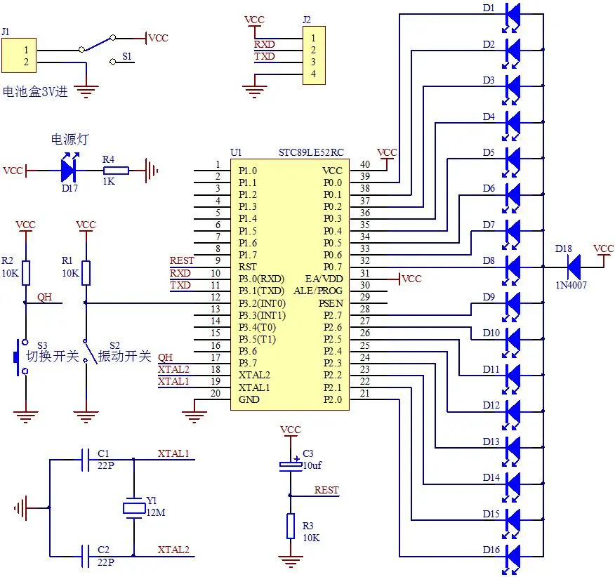

# 摇摇棒程序

## 编译上传相关

>国内广泛使用的 keli 是仅适用于 windows 的商业软件，而且比较丑，不过仅就 51 单片机而言，keli 的实际功能貌似要比 platformio 更成熟

>我因为已经很长时间只将 windows 当成游戏机使用，未安装也不打算在 windows 上安装任何开发环境，所以这里倾向于使用 Linux 系统能支持的环境，也就是 platformio，它底层用的是 sdcc

程序源码 `src/main.c` 来自电子爱好者之家，作为硬件初学者，我在 ChatGPT 的帮助下将源码从 keli 语法移植到了 platformio(sdcc)，记录下所做的修改：

1. `#include <AT89X52.h>` 改为小写的 `#include <at89x52.h>`
   1. 因为大写形式程序在 MacOS 上能正常编译，但是在 Linux 上会报错。我确认 sdcc 的 mcs-51 中该头文件名为小写，估计是因为 macos 大小写不敏感所以才能正常工作
2. 所有 keli 专有的 `unsigned char code` 类型，均使用标准的 `const unsigned char` 类型替换
3. `void interrupt_handler(void)  interrupt 0` 中断函数语法，需要将 `interrupt` 改为 `__interrupt`

以及踩过的 platformio 的坑：

- [platform-intel_mcs51/issues/47](https://github.com/platformio/platform-intel_mcs51/issues/47)
  - 程序编译完成后 upload 时会卡在 `Cycling power: done` 这一步，通过此 issue 中描述的方法，删除 `-a` 参数后手动执行 upload 命令，上传就成功了。

未解决的问题：

- vscode 无法正确识别 mcs-51 的一些特定宏，比如引脚宏 `D1` `D2` 等。暂时未解决，不过反正能用...

## 如何生成字模点阵

摇摇棒套件卖家提供的改字教程中，显示的点阵内容是通过一个 Windows 软件 PCtoLCD2022 生成的，找到几篇讲解字模的原理与生成方法的文章，有空读一读看：

- [fontDisplay](https://github.com/RuiminHuang/fontDisplay)

## 电路原理介绍

如图所示，单片机采用的是 STC89LE52RC。

电路图中，左上部分是电源电路，D17是电源指示灯，有电源输入且打开开关就能亮。

下来的是切换显示的按键，一开始置高电平，当按下按键P3.7就被下拉到低电平，单片机识别到低电平就切换显示下一个显示内容。

旁边的是震动开关电路，接在单片机外部中断0，也是开始置高电平，
震动开关设计的是当向右摇晃时，震动开关接通，就会产生一个下降沿的信号，强制进入中断程序延时，延时一段时间后开始显示画面，
调节好这个延时，就可以让显示的内容在摇晃两端的中间位置。

再下来是晶振电路和复位电路，作为单片机的最小系统使单片机正常运行程序，单片机上方是程序烧录引出电路。右边的是显示电路，所有LED负极接到了单片机10口，正极并联接到一个1N4007再接到电源正极，哪一个 IO 口输出低电平，对应的LED就会被点亮，输出高电平，就不亮。
1N4007 有 0.7V 的压降，用来防止电池电压过高烧坏低电压的 LED。

## 振荡器回路介绍

时钟是时序的基础，单片机本身就如同一个复杂的同步时序电路，为了保
证同步工作方式的实现，电路必须在脉冲信号的统一指挥下才能工作（如同军训时教官的口
令），按时序进行工作。

那么单片机内的时钟是如何产生的呢？有两种方式：

- 一种是内部振荡方式，只要接上两个电容和一个晶振即可，电容的大小影响着振荡器振荡的稳定性和起振的快速性，通常选择 10-30pF 的相等的两个瓷片电容，另外在设计电路时晶振和电容应可能的靠近芯片，以减少 PCB 板的分布电容，保证
振荡器工作的稳定性，提高系统的抗干扰能力。

- 另一种是外部振荡方式，采用外部振荡方式时需在 XTL2 上加外部时钟信号，XTL1 接地。此种方式应用于系统由多片单片机组成，为了保证各单片机之间时钟信号的同步，就应当引入唯一的公用的外部脉冲信号作为各单片机的振荡脉冲。

前面摇摇棒电路的左下角部分，就是振荡器回路，可以看到它使用的是「内部振荡方式」。

## 摇摇棒原理介绍

显示的原理跟点阵显示原理一样，利用的是人眼的视觉暂留特性。

接下来简单解释一下它是如何能够显示 “摇摇棒！”的。

16个LED排成一列相当于上图点阵中的每一列，向右摇晃时震动开关接通进入中断延时一定的时间后，开始进行显示。

先点亮从上往下数的第5和第10这两个LED，延时点亮几毫秒，这时摇摇棒也晃动到了相当于点阵中的第二列的位置，熄灭刚才的LED，点亮第5、第10和第15这三个LED，跟第一列的一样，也是延时点亮几毫秒。

然后摇摇棒也晃动到了相当于点阵中的第三列的位置，熄灭刚才的LED，再点亮第5、第9和第16这三个LED，也是延时熄灭就是按照这样的操作依次显示完16列。

由于人眼的视觉暂留特性，即LED熄灭了之后，在0.1秒左右的时间里，我们看到的依然是点亮的。
这样也就稳定的显示了第一个“摇”字，延时一段时间，让字与字之间有一定的间隙，同样的原理再显示第二个“摇”、第三个“棒”字和第四个感吸号.

## 效果

测试发现因为摇晃频率远没有原理相同的「全息风扇」那么高，需要在黑暗环境下才有比较明显的效果。

## 后续

我有点想试试给它加一个电机自动旋转，做成全息风扇玩玩。

## 参考资料

keli 移植到 sdcc 的参考资料：

- [keil2sdcc](https://github.com/ywaby/keil2sdcc)
- [还在用Keil做51单片机开发吗？快来试试开源的SDCC吧](https://zhuanlan.zhihu.com/p/443436222)

51 单片机教程：

- [Linux下C51开发教程](https://github.com/JackeyLea/C51): 对应的知乎专栏为 [Linux下单片机开发：从入门到放弃](https://www.zhihu.com/column/c_1183488323446931456)
