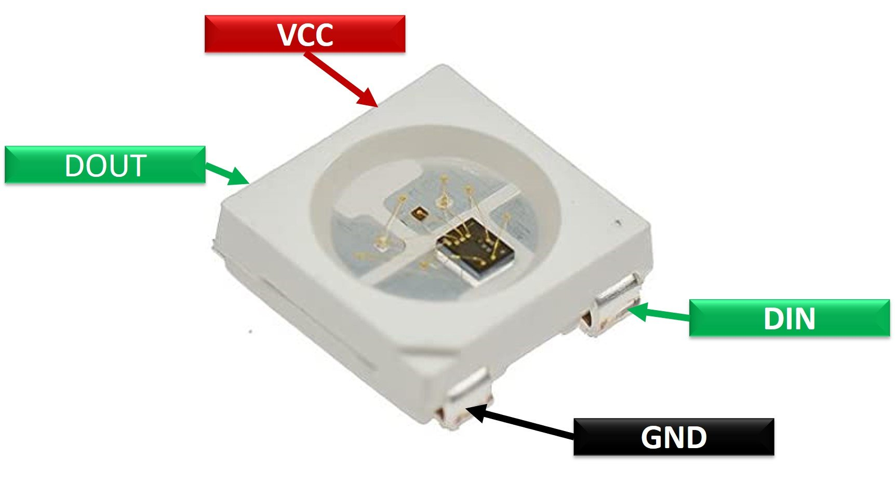
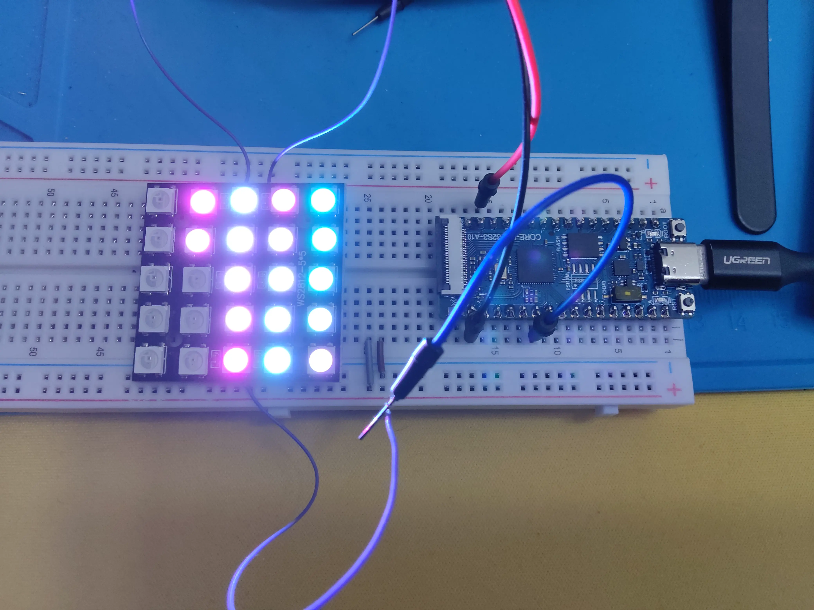

# WS2812B RGB 彩色灯带控制

## WS2812B 原理

讲程序前先简单介绍下 WS2812 可编程灯带这个玩意儿，它是由许多 LED 灯**串联**而成，也**可任意裁剪、拼接**，并且通过一个 GPIO 引脚就可以单独控制其中串联的任何一颗 LED 的色彩，也就是说灯带上所有串联的 LED 都是可索引的。

比如如下这种条式 WS2812B 灯带，还特意在每个可裁切的位置做了标记：


那它是如何实现这么神奇的功能的呢？如何通过一个引脚就索引并控制所有的 LED 灯，并且使其还可随意裁剪、拼接？

实际上这全靠它内部一颗很小的 IC 芯片，单颗 WS2812B 灯珠的结构如下：



可以看到除了直流输入（DIN）与接地（GND）外，它还多了两个特殊引脚：**DIN** 与 **DOUT**，这两个引脚就是关键。

单片机 GPIO 口的输出一连串信号时，是这样产生效果的：

- 首先因为 DIN 没有输入，那 DOUT 也不会有输出，这时所有 LED 都维持在初始状态（熄灭）。
- 单片机按 WS2812B 要求的编码方式将每个 LED 的 RGB 颜色编码为 24bits，并依次将所有 LED 的信号通过 GPIO 口输出。因为这种特性，单片机每次都必须全量输出所有 LED 的 RGB 编码。
- 信号首先进入串联灯带中第一个 LED 的 DIN 引脚，它的 IC 会读取其中最前面 24bits 用于设置它自己的色彩，然后将后续的信号从 DOUT 发出去。
- 第二颗 LED 从它的 DIN 中读到信号，再取出其中 24bits 用于设置自己的色彩，然后将剩下的信号从 DOUT 发出。
- 依此类推。
- 信号发送完毕后，单片机的 GPIO 口必须置低点平超过一定时间，表示 RESET，指示信号发送完毕。这时所有 LED 会维持它最后一次被设置的色彩不变。

WS2812B 的数据手册 [WS2812B-2020 - Intelligent control LED](https://www.mouser.com/pdfDocs/WS2812B-2020_V10_EN_181106150240761.pdf) 详细说明了上述原理，可供参考。


## 来写个流水灯吧

首先创建项目，并添加必要的依赖库：

```shell
# 创建项目
idf.py create-project ws2812_led
cd ws2812_led

# 添加乐鑫的 `led_strip` 组件库，它封装了对 WS2812B 的信号控制，提供了简易 API
idf.py add-dependency led_strip
```

然后修改 `main` 中的 c 主程序文件，代码内容如下（通知一个 5 * 5 的 WS2812 模块显示流水灯效果）：

```c
#include <stdio.h>
#include "freertos/FreeRTOS.h"
#include "freertos/task.h"
#include "driver/gpio.h"
#include "esp_log.h"
#include "led_strip.h"
#include "sdkconfig.h"

// 控制 WS2812 灯带的引脚编号
#define WS2812_GPIO_PIN 5

static const char *TAG = "ws2812_rgb_strip";

static led_strip_handle_t led_strip;

static void blink_led(void)
{
    // 实现流水灯效果
    for(int row = 0; row < 5; row++) {
        for (int col = 0; col < 5; col++ ) {
            /* Set the LED pixel using RGB from 0 (0%) to 255 (100%) for each color */
            led_strip_set_pixel(led_strip, row * 5 + col, row * 20 + 10, col * 20 + 10, row * 10 +  col * 10 + 10);
            vTaskDelay(100 / portTICK_PERIOD_MS);
            /* Refresh the strip to send data */
            led_strip_refresh(led_strip);
        }
    }

    vTaskDelay(1000 / portTICK_PERIOD_MS);
    led_strip_clear(led_strip);
}

static void configure_led(void)
{
    ESP_LOGI(TAG, "Example configured to blink addressable LEDs!");
    /* LED strip initialization with the GPIO and pixels number*/
    led_strip_config_t strip_config = {
        .strip_gpio_num = WS2812_GPIO_PIN,  // 通过这个 GPIO 引脚控制所有的可编程 LED 灯
        .max_leds = 25, // LED 灯的数量，我的灯带有 25 个 LED，所以这里填 25
        .led_model = LED_MODEL_WS2812, // 灯带模式，选择 WS2812 即可
    };
    led_strip_rmt_config_t rmt_config = {
        .resolution_hz = 10 * 1000 * 1000, // 10MHz
    };
    ESP_ERROR_CHECK(led_strip_new_rmt_device(&strip_config, &rmt_config, &led_strip));
    /* Set all LED off to clear all pixels */
    led_strip_clear(led_strip);
}

void app_main(void)
{

    /* Configure the peripheral according to the LED type */
    configure_led();

    while (1) {
        blink_led();
    }
}
```

然后再将线接好，灯带直接接 3.3v 直流电源即可，灯带的 DIN 接 ESP32 的 GPIO5 引脚即可。

接好线后直接编译上传，就能看到流水灯效果：

```shell
idf.py flash monitor
```




## 给灯带 Duang~ 加点特技

那么单纯的流水灯还没那么有意思哈，得加点特技。

[WLED](https://github.com/Aircoookie/WLED) 是一个相当流行的 WS2812B 灯带控制库，官方表示有超过 100 种特效，这不得试玩一下！
