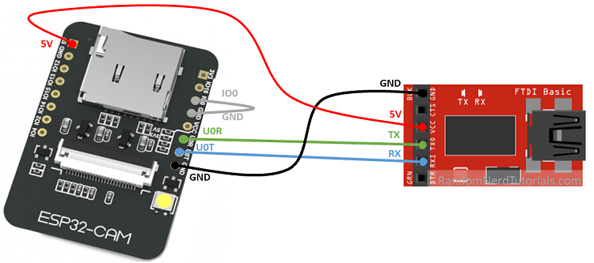

# 玩耍 ESP32-CAM 模块

## 引脚定义

根据 [ESP32-CAM AI-Thinker Pinout Guide: GPIOs Usage Explained](https://randomnerdtutorials.com/esp32-cam-ai-thinker-pinout/)，ESP32-CAM 开发版的引脚定义如下：


该文档还建议使用 5V 供电，因为很多人反馈 3.3V 供电会有问题。

## 固件烧录

根据 [How to Program / Upload Code to ESP32-CAM AI-Thinker (Arduino IDE)](https://randomnerdtutorials.com/program-upload-code-esp32-cam/) 介绍，接线方式如下：



1. 首先需要将 IO0 接地，这样就将 ESP32 切换到烧录模式
2. U0R 与 U0T 是串口引脚，这里用其烧录固件
3. 5V 与 GND 也接好

## 开发环境

那首先肯定是用官方的 [espressif/esp32-camera](https://github.com/espressif/esp32-camera) 进行开发。

我首先测试了一波用 platformio + esp-idf 开发，发现一堆的坑，这个组合千万别选用。

然后就改用纯 esp-idf，发现相当丝滑，官方 example 编译一次通过。

首先创建项目，并添加必要的依赖库：

```shell
# 创建项目
idf.py create-project learn-esp32cam
cd learn-esp32cam

# 添加乐鑫的 `esp32-camera` 组件库
idf.py add-dependency esp32-camera
```

然后修改 `main` 中的 c 主程序文件，从 esp32-camera 的 example 中将 `main.c` 的内容 COPY 过来，并根据需要进行修改。

改完后编译，上传，就可以玩耍了。

>TODO 我买的便宜 ESP32-CAM 模块偷工减料，有些空焊，而且根本没法烧录...现在卡在烧录这一步了，之后新模块到了再说...

