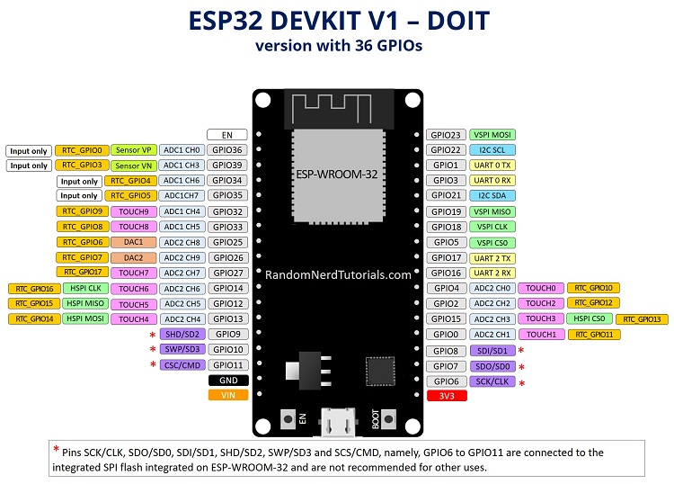
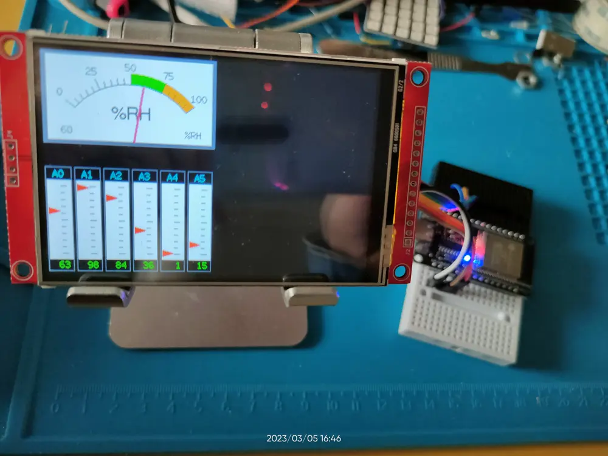
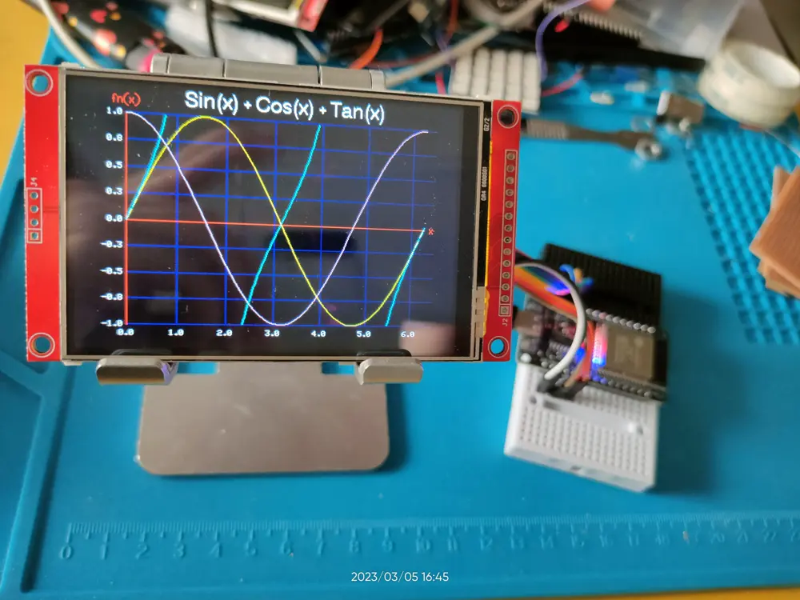

# LCD 液晶显示屏

我手上有这几块 LCD 显示屏：

- LCD 液晶显示屏：0.96 寸，128 * 64，使用 I2C 协议，四个引脚，驱动 IC 为 SSD1315
- TFT SPI 显示屏
  - [2.8 寸，320 * 240，使用 4 数据线 SPI 协议，驱动 IC 为 ILI9341](http://www.lcdwiki.com/2.8inch_SPI_Module_ILI9341_SKU:MSP2807)
  - [3.5 寸电阻触摸屏，480 * 320，同样是 SPI 协议，驱动 IC 为 ILI9488](http://www.lcdwiki.com/3.5inch_SPI_Module_ILI9488_SKU:MSP3520)

一番查询，找到如下几个 stars 数较高的显示屏驱动库：

- [Bodmer/TFT_eSPI](https://github.com/Bodmer/TFT_eSPI): 一个基于 Arudino 框架的 tft 显示屏驱动，支持 STM32/ESP32 等多种芯片。
- [lv_port_esp32](https://github.com/lvgl/lv_port_esp32): 一个 MCU 图形库，官方就提供 esp32 的兼容层，但是目前仅支持到 esp-idf v4。


## 程序

以 [Bodmer/TFT_eSPI](https://github.com/Bodmer/TFT_eSPI) 为例，我们将其与 platformio + arduino 框架一起使用，根据其官方文档 [Bodmer/TFT_eSPI/docs/PlatformIO](https://github.com/Bodmer/TFT_eSPI/tree/master/docs/PlatformIO)，首先在项目中添加配置文件：

首先点击 PlatformIO 侧栏的 `PlatformIO Core CLI` 进入 shell 执行如下命令创建项目：

```shell
pio project init --ide=vscode -d tft_esp32_arduino
```

这条命令会创建一个空项目，并配置好 vscode 插件相关配置。


创建完成后使用如下内容覆盖 `platformio.ini` 的配置：

```ini
[env:esp32dev]
platform = espressif32
board = esp32dev
framework = arduino
lib_deps =
  bodmer/TFT_eSPI@^2.5.0
  Bodmer/TFT_eWidget@^0.0.5
monitor_speed = 115200
build_flags =
  -Os
  -DCORE_DEBUG_LEVEL=ARDUHAL_LOG_LEVEL_DEBUG
  -DUSER_SETUP_LOADED=1
  
  ; Define the TFT driver, pins etc here:
  ; 显示屏驱动要对得上
  -DILI9488_DRIVER=1
  # 宽度与高度
  -DTFT_WIDTH=480
  -DTFT_HEIGHT=320
  # SPI 引脚的接线方式，
  -DTFT_MISO=12
  -DTFT_MOSI=13
  -DTFT_SCLK=14
  -DTFT_CS=15
  -DTFT_DC=4
  -DTFT_RST=2
  # 背光
  -DTFT_BL=27
  # 触摸，暂时不用
  ;-DTOUCH_CS=22
  -DLOAD_GLCD=1
  # 其他配置
  -DLOAD_FONT2=1
  -DLOAD_FONT4=1
  -DLOAD_FONT6=1
  -DLOAD_FONT7=1
  -DLOAD_FONT8=1
  -DLOAD_GFXFF=1
  -DSMOOTH_FONT=1
  -DSPI_FREQUENCY=27000000
```

然后找下开发板的针脚定义，我搜到我的开发版引脚定义跟下图完全一致：



可以看到 ESP32 有两个 SPI 端口：HSPI 跟 VSPI，这里我们使用 HSPI，那么 MOSI/MISO/SCK 三个引脚的接线必须与上图的定义完全一致。
而其他引脚随便找个普通 GPIO 口接上就行。

线接好后，再按照你的接线方式修改前面的 `platformio.ini` 中的引脚配置，把数字改对，这样就完成配置啦，现在找几个 demo 跑跑看。

新建文件 `src/main.ino`，从如下文件夹中随便找个 demo copy 进去然后编译上传，看看效果：

- [Bodmer/TFT_eSPI - examples/480x320](https://github.com/Bodmer/TFT_eSPI/blob/master/examples/480%20x%20320)

示例：


