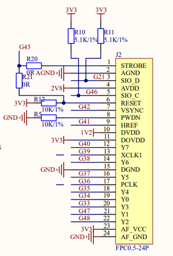

## 流媒体设备协议

常见的嵌入式显示屏、摄像头协议，主要有 SPI、DVP 跟 MIPI 三种。

而外接显示器协议，主要有目前主流的 HDMI 跟 DP，以及老一代的 DVI 与 VGA。

再有就是外接摄像头，貌似主要是使用 USB 接口，使用 UVC 协议。

这里主要介绍嵌入式领域的显示屏、摄像头协议。

SPI 是一个比较通用的标准协议，在嵌入式很多领域都用到了，嵌入式领域许多低分辨率的显示屏也会使用此种接
口，感觉这里没必要详细说明了。

DVP 是一个约定俗成的摄像头接口，不具有任何标准，它的特点是低成本、低功耗、低速率，适合低分辨率的摄像
头，比如嵌入式领域常用的 OV2640 摄像头。

常见的 DVP 接口有 24 个引脚，网上搜到的各种此接口的定义如下（使用 I2C 通信控制信号）：

| 引脚名称 | 描述                                      |
| -------- | ----------------------------------------- |
| D0-D7    | 8个数据引脚                               |
| D8-D11   | DVP接口扩展数据引脚，也可能叫 DATA0-DATA3 |
| VSYNC    | 帧同步信号                                |
| HREF     | 行同步信号                                |
| PCLK     | 像素时钟信号                              |
| XCLK     | 系统时钟信号                              |
| SDA      | I2C总线数据线                             |
| SCL      | I2C总线时钟线                             |
| DOUBT    | 摄像头输出数据引脚                        |
| RESET    | 复位引脚                                  |
| PWDN     | 电源管理引脚                              |
| CLK      | DVP接口时钟引脚                           |
| CMD      | DVP接口命令/数据控制引脚                  |

但是看合宙开发板、淘宝 OV2640 摄像头的接口定义，又不一样...搞不明白了，不管了。

而 MIPI 是 MIPI 联盟发起的为移动应用处理器制定的开放标准，使用差分串行传输，速度快，抗干扰。其目的是
把手机内部的接口如摄像头、显示屏接口、射频/基带接口等标准化，从而减少手机设计的复杂程度和增加设计灵
活性。MIPI并不是一个单一的接口或协议，而是包含了一套协议和标准，以满足各种子系统独特的要求。MIPI的标
准异常复杂，包含非常多的应用领域。

基于 MIPI 物理接口的协议有：

- CSI：摄像头接口。目前主流设备使用 CSI-2 协议，智能手机在切换到速度更快的 CSI-3 协议。
- DSI：显示屏接口

树莓派 4 的 Display 跟 Cemara 都是 MIPI 接口，我手上的 Maix III Axera Pi 也是用的 MIPI 接口。

详见 [MIPI自学笔记](https://zhuanlan.zhihu.com/p/92682047)

## 参考

- [MIPI自学笔记](https://zhuanlan.zhihu.com/p/92682047)
