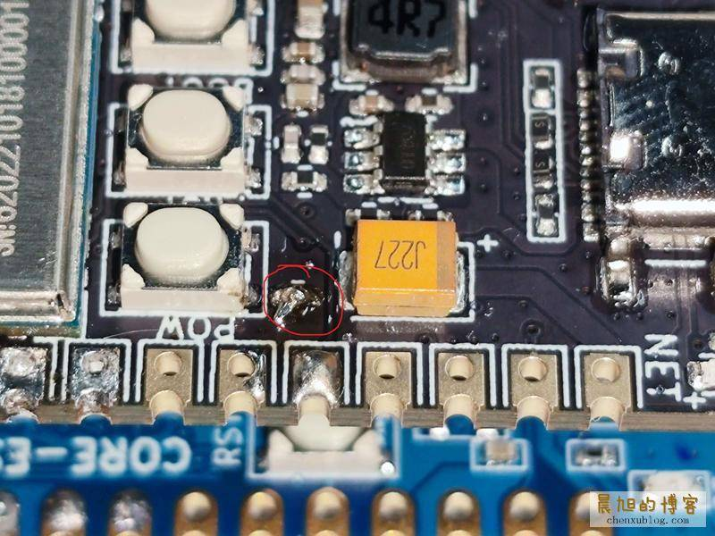

# LuatOS 合宙

合宙是国内一家专注于物联网领域的创新型企业，致力于为客户提供物联网解决方案，包括物联网平台、物联网模组、物联网应用等。
合宙的物联网平台LuatOS是一款基于Lua脚本的物联网操作系统，支持多种物联网模组，包括NB-IoT、LoRa、GPRS、WiFi、BLE等。
LuatOS 完全开源、文档完善，使用 Lua 脚本即可进行开发，它屏蔽了底层的硬件驱动细节，简化了物联网项目的开发难度从而受到市场追捧。

除了开源的 LuatOS 及其文档带来的便捷开发方法是其一大特点外，合宙的另一个特点是它家的东西真的便宜，还经常在自家商城搞各种 9.9 包邮的活动。

当然它也不是没缺点，对我而言 LuatOS 最大的缺点就是，各种工具都只支持 Windows 平台，解决方法是用 Windows 虚拟机进行开发...

## 我的合宙开发板/模组

- ESP32C3/ESP32S3: 合宙基于乐鑫芯片开发的开发版，物美价廉，支持 LuatOS 开发，当然也能用 ESP-IDF/Arduino 开发。
- Air32F103C8T6: STM32F103C8T6 的国产替代品，支持 LuatOS 开发，对 STM32 工具链的支持度不太清楚。
- [Air780E](https://wiki.luatos.com/chips/air780e/mcu.html)/[Air700E](https://doc.openluat.com/wiki/44?wiki_page_id=4730): 合宙基于移芯 EC618 的 LTE Cat.1 bis 通信模块，仅支持 4G 移动通信。
  - Air700E 评估板最近搞 9.9 拼团包邮活动，很香。

## Air780E/Air700E 玩耍记录

[Air780E](https://wiki.luatos.com/chips/air780e/mcu.html)/[Air700E](https://doc.openluat.com/wiki/44?wiki_page_id=4730) 都是用的移芯 EC618 芯片，用的 LuatOS 固件都是同一个，也就是说大部分代码与玩耍方法都是无缝兼容的，不过引脚有些区别，这个需要注意下。

开发方面建议按合宙官方文档，使用 LuatOS 进行开发。

### 如何开机

Aire780E 与 Air700E 默认都没有做自动开机，需要长按 Power 键 1.2S 才能完成开机（即 powerkey 引脚接地 1.2S）。如果你的开发板连接到电脑却没有显示串口，那 100% 是因为你没开机。

如果要做到跟 ESP32 等开发板一样自动开机，根据 [50元内自制短信转发器（Air780E+ESP32C3） - 晨旭](https://www.chenxublog.com/2022/10/28/19-9-sms-forwarding-air780e-esp32c3.html) 所言，只需要短接 powerkey 与橙色钽电容之间的两个空焊盘即可，如图：

### 如何烧录

参见官方文档

## LuatOS 学习路线

合宙官方的文档写得还是挺好的，可以直接参考它的指南：[开发教程 - LuatOS](https://wiki.luatos.com/boardGuide/index.html)

