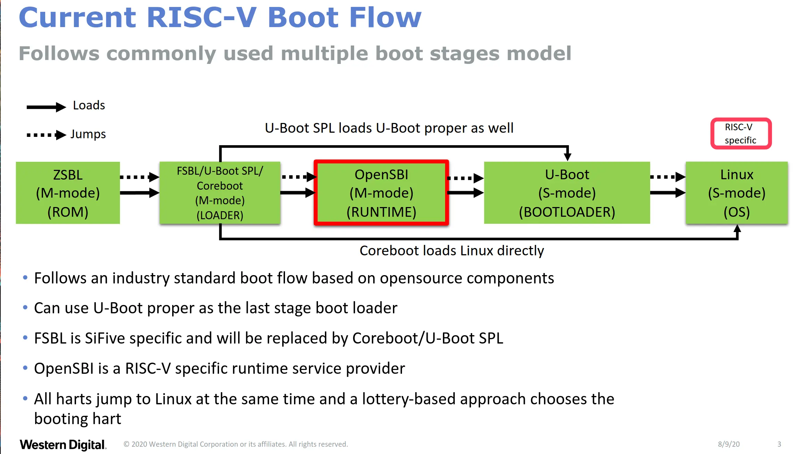
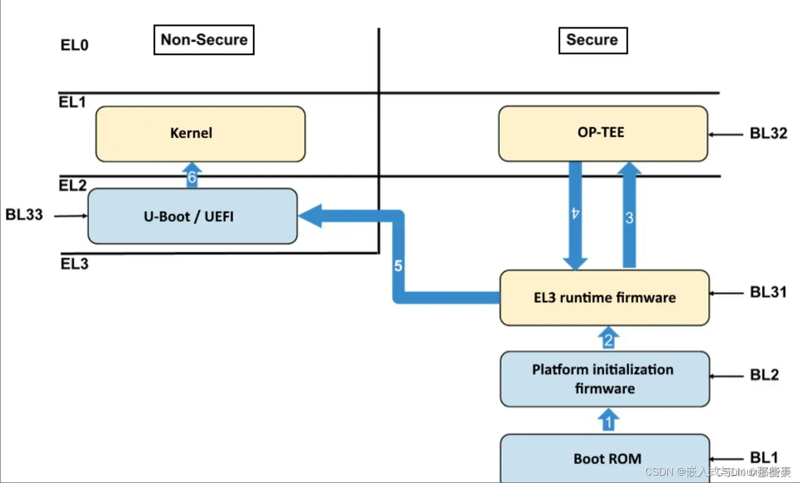

# RISCV Boot Flows

Linux 引导相关内容：

- vmlinux
- Image
- u-boot
  - u-boot spl
    - spl：Secondary Program Loader，二级加载器
  - u-boot proper
- opensbi

## RISCV 开发版当前的引导流程



## ARM64 开发版当前的引导流程



## u-boot，u-boot-spl，u-boot-tpl 的关系

对于一般嵌入式而言只需要一个 u-boot 作为 bootloader 即可，但是在小内存，或者有 atf 的情况下还可以有 spl，tpl:

- spl：Secondary Program Loader，二级加载器
- tpl：Tertiary Program Loader，三级加载器

出现 spl 和 tpl 的原因最开始是因为系统 sram 太小，rom 无法在 ddr 未初始化的情况下一次性把所有代码从 flash，emmc，usb 等搬运到 sram 中执行，也或者是 flash 太小，无法完整放下整个 u-boot 来进行片上执行。所以 u-boot 又定义了 spl 和 tpl，spl 和 tpl 走 u-boot 完全相同的 boot 流程，不过在 spl 和 tpl 中大多数驱动和功能被去除了，根据需要只保留一部分 spl 和 tpl 需要的功能，通过 CONFIG_SPL_BUILD 和 CONFIG_TPL_BUILD 控制；一般只用 spl 就足够了，spl 完成 ddr 初始化，并完成一些外设驱动初始化，比如 usb，emmc，以此从其他外围设备加载 u-boot，但是如果对于小系统 spl 还是太大了，则可以继续加入 tpl，tpl 只做 ddr 等的特定初始化保证代码体积极小，以此再次从指定位置加载 spl，spl 再去加载 u-boot。

从目前来看，spl 可以取代上图中 bl2 的位置，或者 bl1，根据具体厂商实现来决定，有一些芯片厂商会将 spl 固化在 rom 中，使其具有从 emmc，usb 等设备加载 u-boot 或者其他固件的能力。

## OpenSBI

OpenSBI 是 System call type interface layer between Firmware runtime, M-Mode
to Operating system, S-Mode.


### FW_DYNAMIC

- Pack the firmware with runtime accessible to the next level boot stage, fw_dynamic.bin
- Can be packable in U-Boot SPL, Coreboot

首先编译出 `fw_dynamib.bin`：

```
CROSS_COMPILE=riscv64-buildroot-linux-gnu- make PLATFORM=sifive/fu540
```

然后基于该文件构建 u-boot-spl.bin:

```
CROSS_COMPILE=riscv64-buildroot-linux-gnu- make sfive_fu540_spl_defconfig

export OPENSBI=</path/to/fw_dynamic.bin>
CROSS_COMPILE=riscv64-buildroot-linux-gnu- make
```

## References

- [An Introduction to RISC-V Boot flow: Overview, Blob vs Blobfree standards](https://crvf2019.github.io/pdf/43.pdf)
- [ARMv8 架构 u-boot 启动流程详细分析(一)](https://bbs.huaweicloud.com/blogs/363735)
- [聊聊 SOC 启动（五） uboot 启动流程一](https://zhuanlan.zhihu.com/p/520060653)
