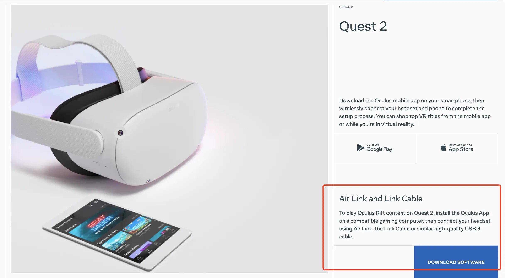

# Beat Saber 节奏光剑

>注意 Mod Assistant、Oculus Quest 2，以及很多第三方 mod 基本都是从国外服务器下载资源，需要自备加速手段。

Beat Saber 至今仍然是我最喜欢玩的 VR 游戏，但是它自身的歌曲数量实在是太少了，而且很不合我喜好。

第三方歌曲、第三方 Mod 都是 Beat Saber 玩得爽的必备要素，这里记录下我自己的游戏心得与配置。

## 硬件设备

我的硬件罗列如下：

- VR 头显：Oculus Quest 2
  - 购于 2020/10/1，日亚海购。2020/10/14 发货，海运到手好像就花了一周时间，不过清关一是需要提交身份证，二是可能会补税（有点记不清了）。
  - 价格 ￥ 2,233.85 + 关税 ￥ 290.40 = ￥ 2,524.25
- 主机配置: i5-13600kf + 32G 内存 + RTX 4090
  - 以前用过 R5-5800H + RTX 3070 Max-Q 满血版，但是体验差了点意思。帧率跟分辨率开不到这么高，一是会有点模糊、偶尔卡顿，二是无线串流延迟比较高（现在想想部分原因可能是，我没在 GeForece Experience 里优化配置...）。
- 连接方式：
  - Oculus Link: 非常稳定，不怕没电。但是有线束束缚，而且有时候线接触不良会断掉。
  - Oculus Air Link: 无线串流，没啥延迟，非常爽。

## 购买安装

这没啥可说的，直接在 Steam 里买就 OK。

然后桌面安装下 Oculus APP，在 [Quest Setup](https://www.meta.com/quest/setup/) 页面有提供下载链接，点击红框位置即可下载：

## 第三方 Mod 安装及使用

Beat Saber 只玩它本体，你很快就会腻了，功能、歌曲都太少了。

为了实现网上看到的炫酷效果，必须通过 Mod Assistant 安装第三方 Mod。

所以首先在 [ModAssistant/releases](https://github.com/Assistant/ModAssistant/releases) 这里下载最新版本的程序，然后启动它，就可以勾选各种 Mod 并安装了。

## 注意事项

1. Beat Saber 每次更新后，所有第三方 Mod 都会失效，需要在 Mod Assistant 里重新安装一下。

## 调整第三人称视角

1. （待验证）F1 会切到第三人称，看到头顶上白色的相机后，用手柄指着它按住扳机键就可拖动调整视角了。
2. 安装 CameraPlus 这个 mod，可以添加多视角，方便录制分享视频。

## 参考

- [Beat Saber 新手教程 - PC平台](https://bs.wgzeyu.com/pc-guide/)
