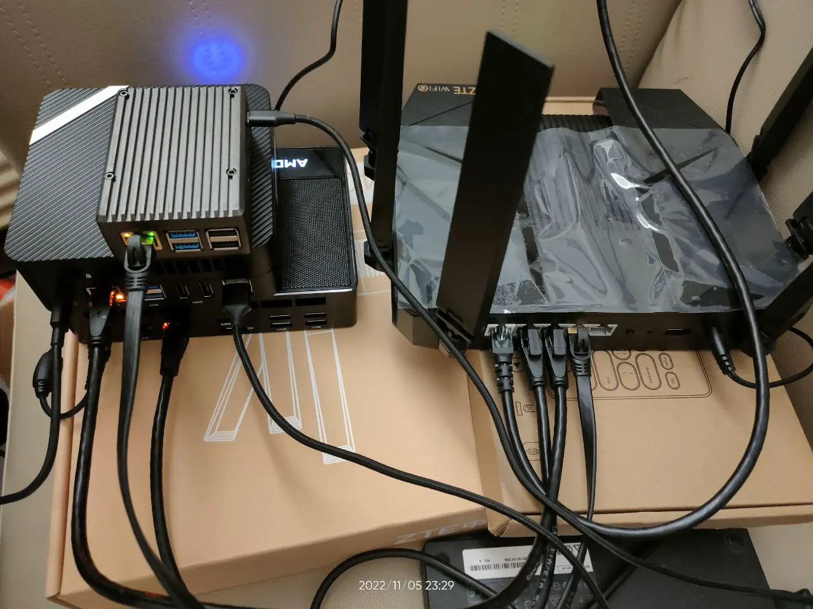
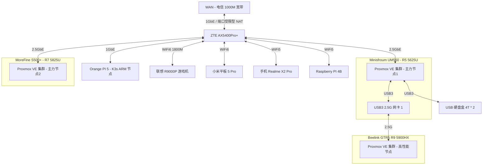
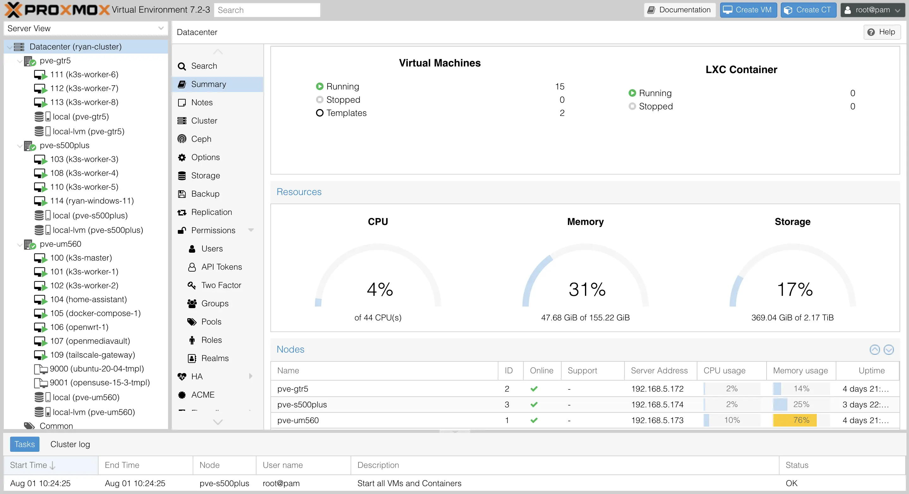
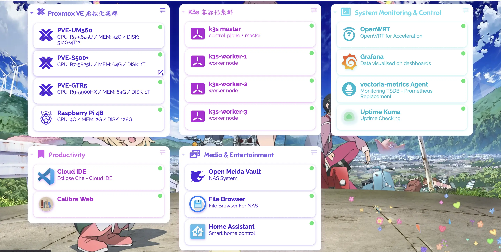

# 我的 Homelab

## 服务器架构




| 机器名称 | CPU | MEM | SSD | HDD | 说明 |
| :---: | :---: | :---: | :---: | :---: | :---: |
| Minisfroum UM560     | AMD R5 5625U, 15W, 6C12T | 16G * 2 |512G SSD | 4T * 2 HDD | 主力节点，低功耗 |
| MoreFine S500+       | AMD R7 5825U,  15W, 8C16T | 32G * 2 | 1T SSD | - | 主力设备，低功耗 |
| Beelink GTR5         | AMD R9 5900HX, 45W, 8C16T | 32G * 2 | 1T SSD | - | 高性能节点，日常维持低功耗运行 |
| Orange Pi 5  | RK 3588S, 8C(A76*4 + A55*4), GPU(4Cores, Mail-G610), NPU(6Tops) | 8G | 128G TF Card | - | 高性能 ARM64 主机，买来给 k8s 跑 ARM 负载的。（它的 NPU/GPU 也很强悍，可以拿来跑推理、视频转码） |
| Rock Pi 5A  | RK 3588S, 8C(A76*4 + A55*4), GPU(4Cores, Mail-G610), NPU(6Tops) | 4G | 128G TF Card | - | 配置与 Orange Pi 5 一致，内存小一点。还没到手，主机预计 2023/Q2 出货... |
| ~~Raspberry Pi 4B 2GB~~  | BCM2711 (ARMv8), 4C4T | 2G | 128G TF Card | - | ~~超低功耗 ARM64 主机~~，目前拿去玩电子了 |


## 网络拓扑



## 软件架构




- Minisfroum UM560
  - OS: Proxmox VE
  - VMs
    - OpenWRT: 1C/1G 2G - host CPU
      - 作为软路由系统，实现网络加速、DDNS 等功能
      - 安装 openclash、广告拦截插件
    - docker-compose server 4C/8G 32G
      - 硬盘盒 Sata 直通到此虚拟机，作为家庭 NAS 系统，提供 WebDAV 协议与 HTTP File Server.
      - 目前跑了这些服务
        - [sftpgo](https://github.com/drakkan/sftpgo): 一个文件共享服务器，支持 sftp、webdav、ftp/s 等协议，支持本地存储，或者使用 AWS/GCP/Azure 的对象存储。
        - [filebrowser](https://github.com/filebrowser/filebrowser): 文件浏览器，支持查看、上传、下载
        - [dashy](https://github.com/lissy93/dashy) HomePage 页
          - 在安装了如此多的自托管服务后，一个用于索引所有服务的 Homepage 就显得非常有必要了
        - [jellyfin](https://github.com/jellyfin/jellyfin): 影音系统
        - [syncthing](https://github.com/syncthing/syncthing): 在多台机器之间进行持续性的增量同步。
        - Envoy Gateway: 作为局域网所有小站点的网关（选择 envoy 单纯是为了熟悉 envoy 的使用）
        - [uptime-kuma](https://github.com/louislam/uptime-kuma): 站点可访问性检测
        - [actionsflow](https://github.com/actionsflow/actionsflow): 完全兼容 Github Action 的自托管 workflow 服务
        - [excalidraw](https://github.com/excalidraw/excalidraw): 自托管白板项目
    - windows server 2022 2c/8G
    - k3s-main single master 2C/4G 20G
      - 家庭网络，单 master 就够用了，省点性能开销
      - 主要用做控制面集群，用来跑些 istio/karmada 的控制面
    - k3s-data-1 single master 2C/4G 20G
      - 数据面集群 1，跑些常见任务
    - k8s-data-2 single master 2C/4G 20G
      - 数据面集群 2，跑些常见任务
    - k3s-data-1 worker node 4C/8G 32G
      - 跑监控、eclipse-che 云 IDE、eBPF 监测工具等
      - 跑各种其他 k8s 实验负载
- MoreFine S500+
  - OS: Proxmox VE
  - VMs
    - tailscale-gateway 1C/1G 20G
      - tailscale 在家里的路由节点，以 `Subnet router` 模式运行，这样就能在任意 tailscale 节点上访问家里的 homelab 跟 NAS 啦~
    - Home Assistant 2C/2G 20G
      - 干一些自动化的活，比如我到家后自动播放歌曲？？？
    - k3s-data-1 worker node 4C/16G 100G
      - 跑各种其他 k8s 实验负载
    - k8s-data-2 worker node 4C/16G 100G
      - 跑各种其他 k8s 实验负载
- Beelink GTR5
  - OS: Proxmox VE
  - VMs
    - k3s-data-1 worker node * 3
      - 4C/16G 100G
      - 作为 k3s 高性能实验节点
    - ubuntu test server * 1
      - 2C/8G 32G
- OrangePi Pi 5
  - OS: Debian
  - APPs
    - k3s-data-1 arm64 worker node
      - 需要添加污点，容忍该污点即可将任务调度到此节点。
      - 这也是当前 k3s 集群中唯一的 ARM64/NPU 节点，主要用于做一些 ARM 相关的测试

k3s 集群里可以跑这些负载：

- 数据库：etcd/mysql/postgresql/minio/redis
- 可观测性：
  - 监控：vectoriametrics + grafana
  - 日志：loki + promtail + grafana
- 证书管理：cert-manager
- 集群网咯：cilium
- 服务网格：istio
- 多集群管理：karmada
- 配置部署与同步：argo-cd
- CICD: argo-workflows/tekton
- serverless: keda + dapr + knative + openfunction
  - 这一套方案集成了很多 serverless 的前沿技术，玩一玩能学到很多东西
- 本地镜像仓库: harbor
- 镜像分发：[dragonfly](https://github.com/dragonflyoss/Dragonfly2)
  - 为了省点代理流量，也提升大镜像的拉取速度，有必要给 K3s 安装一个 dragonfly 搞局域网的镜像分发
- 集群安全策略: kyverno
- 等等

局域网有了 x64 架构下 22C44T CPU + 160G RAM，以及 ARM64 架构下 16C CPU + 12G RAM + Mail-G610 GPU * 2 + 16 Tops NPU 的算力后（必要时还能把我的联想笔记本也加入到集群， 再补充 8C16T CPU + 16G RAM +  Nvidia RTX 3070 GPU），已经可以直接在局域网玩一些需要高算力的任务了，比如说：

- 大数据
  - [airbyte](https://github.com/airbytehq/airbyte) 数据管道
  - [alluxio](https://github.com/Alluxio/alluxio) 统一的数据存储接口
  - [Presto](https://github.com/prestodb/presto) SQL 查询引擎，可对接多种数据源
  - [doris](https://github.com/apache/doris) 高性能实时数仓（OLAP 分析型关系数据库）
  -  分布式消息发布与订阅系统
     - [apache pulsar on k8s](https://github.com/apache/pulsar): 对标 kafka，专为高吞吐量、低延迟、快速(或至少表现均匀)的消费者而设计，不适合 RPC
     - [NATS on k8s](https://github.com/nats-io/nats-server): 一个轻量级的云原生消息系统，高性能、低功耗、体积小，跟 redis 一样适合较小的消息。
  - [spark on k8s](https://github.com/GoogleCloudPlatform/spark-on-k8s-operator) 离线数据分析
    - 一篇写得很好的相关文章：[Setting up, Managing & Monitoring Spark on Kubernetes](https://spot.io/blog/setting-up-managing-monitoring-spark-on-kubernetes/)
    - 结合 argocd + argo-workflows 可实现 gitops 的 spark 任务编排
  - [flink on k8s](https://github.com/apache/flink-kubernetes-operator) 实时数据分析
  - [superset](https://github.com/apache/superset) 数据可视化平台
- 区块链
  - 自建区块链集群


除了上面这些，还可以去 [awesome-selfhosted](https://github.com/awesome-selfhosted/awesome-selfhosted) 跟 [CNCF Landscape](https://landscape.cncf.io/) 翻翻有没有自己感兴趣的项目。


## 服务器虚拟化

使用的 PVE，相关使用心得参见我的文章 [Proxmox Virtual Environment 使用指南](https://thiscute.world/posts/proxmox-virtual-environment-instruction/)

## NAS 网络存储

详见 [Network Attached Storage](./Network%20Attached%20Storage.md)

## 数据备份与同步策略

- PVE 虚拟机备份
  - 通过 crontab 定时任务，写脚本调用 PVE 的接口或者命令，备份所有重要虚拟机，并使用 rsync/scp 将 `/var/lib/vz/dump` 中的备份文件同步到 HDD，并且将同步指标上传到 prometheus 监控系统，如果备份功能失效，监控系统将通过短信或邮件告警。
    - 为了确保监控系统 work，还得做监控系统的交叉验证（是不是有点重了 emmm）。
  - 已经坏了两次 SSD 了，其中第二次悲惨损坏掉我的 k3s master 与 home assistant 虚拟机，没做备份的结果就是要重搞这俩。万幸主要的 k3s 配置文件与 docker-compose 配置都是 gitops 保存的，不至于丢失。
- PVE 虚拟机高可用
  - 对于 k3s master/openwrt/tailscale-gateway 这类要求高可用的虚拟机，可以考虑使用 [PVE 的 High_Availability](https://pve.proxmox.com/wiki/High_Availability) 实现故障自动恢复。
- 手机/电脑数据同步：使用 [Syncthing](https://github.com/syncthing/syncthing) 将手机与电脑的数据同步到 homelab 的 HDD 中

## 远程访问

前面提过了，使用的方案是 [Tailscale VPN](https://github.com/tailscale/tailscale)，它是一个基于 wireguard 的家庭 VPN，安装非常简单，基本傻瓜式操作。

在 Homelab 上跑了一个 [tailscale-gateway](https://tailscale.com/kb/1019/subnets/) 作为 homelab 的入口节点，这样无论在哪，我的 Android、Macbook 等
设备都可以无缝接入 Homelab~

注意 MacOS/Linux 等终端设备需要使用如下命令启动 tailscale，这样才能自动添加 Homelab 相关的路由，而 Android 设备实测会自动添加相关路由规则:

```shell
tailscale up --accept-routes
```

以及，使用如下命令可以检查确认节点是直连（`direct`）还是中继（`DERP relay`），如果显示为中继，说明 NAT 或防火墙规则比较严格，导致难以直连，这会导致延迟明显上升、带宽下降！

```shell
# 查看当前所有节点的状态
tailscale status

# 检测到某个 ip 地址 / hostname 是否直连
tailscale ping <hostname-or-ip>
```

另外安全起见，虽然已经取得了公网 IP，暂时仍未启用任何面向公网的 Web 服务，仅将路由器 NAT 类型设为了「端口受限型」（未改为「全锥型」）。

## 监控告警

目前使用的 node_exporter + Victoria-Metrics，运行在 K3s 中，它的 Operator 提供了 API 可以很方便地采集静态主机的指标，而且配置完全兼容 Prometheus，非常棒~

告警也打算使用 Victoria-Metrics 的 vmalert，但是因为还没搭建完成，所以还没接告警。
或许会将告警发送到 Telegram/Discord/QQ，还没想好发给哪个。

## 功耗测量

>Linux 主机满载功耗测试命令为 `sysbench cpu --threads=16 --time=30 run`，其中 threads 值为 cpu 超线程数。

| 设备名称                            | 空载功耗 | 低负载功耗 | 满载功耗 | 电源最大功率 | 每月用电量 |
| :---:                              | :---:  | :---:   | :---:   | :---:      | :---: |
| 中兴 ZTE AX5400OPro+（双 2.5G 网口） | 10W    | 10W     | 10W     |            |按低负载功耗算 10W * 24h * 30day = 7.2 KWh |
| Minisfroum UM560 (AMD R5 5625U)    | 6W     | 15W  | 45W (CPU 被超频到了 30w) | -  | 按低负载功耗算 15W * 24h * 30day = 10.8 KWh |
| MoreFine S500+(AMD R7 5825U)       | 6W     | 16W  | 60W (CPU 被超频到了 40W)  |   | 低负载功耗跟 UM560 基本一致 |
| Beelink GTR5 (AMD R9 5900HX)       | 6W     | 35W     | 50W     |            | 按低负载功耗算 35W * 24h * 30day = 25.2 KWh |
| 双盘位硬盘盒 + 4T * 2                | (休眠)  | 12W     | 12W     | -          | 按低负载功耗算 12W * 24h * 30day = 8.64 KWh |
| 小米 AX1800（已闲置）                | 6W     | 6W      | 6W      | -          | 按低负载功耗算 6W * 24h * 30day = 4.32 KWh |
| Raspberry Pi 4B 2GB                | 3W     | -       | -       | 5V x 3A    |  - |

如果再乘上深圳这边租房的电价，基本都是 ￥1.5/KWh，费用还是有点高的...

这样算的话 GTR5 真的不适合当作常驻的机器用，低负载下电费也太贵了，homelab 的主力机必须是低压的，15W 比较稳。

## 价格与购入时间

主要设备：

| 设备名称 | 购入时间 | 购入渠道 | 价格 |  说明 |
| :---: | :---: | :---: | :---: |  :---: | 
| 小米 AX1800                | 2020-07-10 | 拼多多    | ￥265 | 最早的 WiFi6 产品，我曾经的主路由，目前已闲置 |
| Raspberry Pi 4B 2GB                | 2020-07-11 | 从同事手中购入 | ￥180 | 曾经拿来玩过 NAS，目前暂时作为 k3s 节点使用 |
| 中兴 ZTE AX5400OPro+（双 2.5G 网口） | 2022-11-02 | 京东自营   | ￥649 | 当前的主路由 |
| Minisfroum UM560 准系统 (AMD R5 5625U)    | 2022-11-02 | 京东官方店 | ￥1799 | 当前三台机器中颜值最高的机器，氮化镓充电器也很小巧，不过只有 6C12T，内存最高只支持 16G * 2 |
| Beelink GTR5 准系统 (AMD R9 5900HX)       | 2022-11-02 | 京东官方店 | ￥2545 | 双 2.5G 网口，性能高但是功耗也高些，颜值尚可，不过充电器较大 |
|  MoreFine S500+ (AMD R7 5825U) 准系统     | 2022-11-19 | 淘宝官方店 | ￥2069 | 就比 UM560 贵 ￥270，升级到 8C16T 且功耗不变，缺点是机箱颜值要差些，而且出风口在底部。 |
|  Orange Pi 5 8G + 5V4A电源     | 2023-02-04 | 淘宝官方店 | ￥749 + 运费 ￥8 | 高性能 Pi，买来给 k8s 跑 ARM 负载的 |


内存条与硬盘：

| 设备名称 | 购入时间 | 购入渠道 | 价格 | 说明 |
| :---: | :---: | :---: | :---: | :---: | 
| 优越者双盘位硬盘盒 Y-3355                | 2020-07-10 | 拼多多    | ￥369 | 主要用途：ISCSI 远程游戏存储、数据备份、影视下载 |
| 西数紫盘 4TB SATA 6Gb/s (WD40EZRZ)               | 2020-07-11 | 京东自营    | ￥539 | 插硬盘盒里，接在 UM560 上 |
| 西数蓝盘 4TB SATA 6Gb/s (WD40EJRX)               | 2020-07-11 | 京东自营    | ￥579 | 插硬盘盒里，接在 UM560 上 |
| 光威战将 DDR4 16GB 3200 笔记本内存    | 2021-06-08 | 京东自营    | ￥439 * 2 | 一开始是给 R9000P 用的，现在换到 UM560 上了（2022 年价格: 259 * 2） |
| ZhiTai SSD - TiPlus5000 512GB (TLC, 长江存储)        | 2022-11-02 | 京东自营    | ￥309 | 笔记本 Windows 游戏机存储（游戏都 ISCSI 远程存储了，所以本机不需要大空间） |
| Asgard SSD - AN3.0 512G NVMe-M.2/80 (TLC, 长江存储)  | 2022-11-02 | 京东自营    | ￥249 | UM560 的存储，2023-02-03 跪了，2/7 完成售后换新，看看这次能撑多久... |
| 京东京造 128G TF 卡（写入 120MB/s, 读取 160MB/s）  | 2022-11-06 | 京东自营    | ￥89 | Raspberry Pi 的存储 |
| 光威战将 DDR4 32GB 3200 笔记本内存 * 2            | 2022-11-07 | 京东自营    | ￥579 * 2 | GTR5 的内存条 |
| 西数 SSD - WD Blue SN570 1T (TLC) * 2          | 2022-11-17 与 2022-11-19 | 京东自营    | ￥559 * 2 | GTR5 与 S500+ 的存储 |
| 玖合 NB-DDR4-32G-3200 * 2           | 2022-11-19 | 京东自营    | ￥429 * 2 | S500+ 的内存条 |


其他小配件：

| 设备名称 | 购入时间 | 购入渠道 | 价格 | 说明 |
| :---: | :---: | :---: | :---: | :---: | 
| 标康电力监测插座 BK-033                  | 2020-07-29 | 京东自营    | ￥41 | 监测整个 Homelab 的功耗情况 |
| 斯泰克 USB 网卡 2.5GbE * 2             | 2022-11-02 | 京东自营    | ￥77 * 2 | 用于拓展 mini 主机与笔记本电脑的 2.5G 网口 |
| 绿巨能 HDMI 视频采集卡（1080P 输出, USB/Type-C 接口） | 2022-11-02 | 京东自营    | ￥79 | 配合 USB Camera APP 将安卓设备当成显示器用，主要用于机器装机 |
| 公牛抗电涌浪涌插座 6 位 GN-H3060 | 2022-11-17 | 京东自营    | ￥89 | Homelab 都插这个插座上 |

以及已经翻车的设备/配件：

| 设备名称 | 购入时间 | 翻车时间 | 购入渠道 | 价格 | 说明 |
| :---: | :---: | :---: | :---: | :---: | :---: | 
| 光威 SSD - 弈Pro 1T           | 2021-06-08 | 2022-11-13 | 京东自营    | ￥819 | 之前给 Windows 游戏机用了一年多，然后换到 GTR5 上没跑几天就掉盘了（系统无法启动，显示器报错 `nvme0: Device not ready; aborting reset`），京东售后给办理了 9 折退款（还好没存啥重要数据） |
| Asgard SSD - AN3.0 512G NVMe-M.2/80 (TLC, 长江存储)  | 2022-11-02 | 2023-02-03 | 京东自营    | ￥249 | 买到手后一直是 UM560 的存储。跑了刚三个月就出问题了，进入系统后用 `dmesg` 能看到非常多这类报错 `blk_update_request: critical medium error, dev nvme0n1, sector 951741928 op 0x0:(READ) flags 0x0 phys_seg 1 prio class 0`。京东售后给换了新，但是丢了一些数据，数据不重要，但是需要花些额外的精力重建环境（充分认识到了 SSD 不稳，必须做定时备份！）。 |


最后还有一些没入手，但是觉得很不错的设备：

- 高性能小主机（注意我没特别做过压测，实际性能释放不明哈）
  - Minisfroum UM590: 我之前买的时候卖 3000，现在 UM690 出来后，降价到了 2589（粉丝价）。还是氮化镓充电器，颜值也在线，感觉比 Beelink GTR5 更香了。
  - Minisfroum UM690: 3000 的价格，主要提升在核显上，另外就是接口升级到了 USB 4、内存频率也上升了不少。不搞什么视频流解码，这个核显提升意义不大，所以对我的 homelab 而言它性价比不高。
  - Beelink GTR6: 2789 的价格，比同样是 6900HX 的 UM690 便宜不少，不过它的供电器就大很多了，如果想上 6900HX 的话，就看需求选购吧。
    - GTR6 相比 UM590 才贵 200 块，从这个角度讲，性价比倒是不错。
- 中等性能、低功耗小主机（省电）
  - UM560 (AMD R7 5625U)，打折 1799 还不错
  - MoreFine S500+ (AMD R7 5825U)，打折 2069，默认给的功耗比较高，可以通过 BIOS 下调功耗墙，省钱（详见此文件夹中「Homelab 功耗调节」一文）。

总的来说，目前 Homelab 三台 mini 主机算上固态内存，花了接近 1W。
跟朋友对比了下，如果花差不多的钱买机架服务器，可以买到这个配置：`48C96T(2696v3 * 2) + 512G(32g * 16) + 9.6T(1.2T * 8)`
配置差别还是有点大的，不过胜在静音 + 低功耗 + 不占空间 + 发热小，对于小租房而言也算是不错的选择。
具体是要机架服务器还是 mini 主机，还是看个人需求吧。

mini 主机领域性价比高的机器，目前主要就是零刻、minisfroum、morefine 这三家，我刚好每家买了一台...

此外一些便宜的工控机其实也可以考虑，不过从我个人角度看，性价比高的工控机的性能都比较弱，性能上来后跟 mini 主机价格也差不多了，所以一般都被用做专门的软路由，目前不太符合我用来跑虚拟机的需求。

## 参考

- [Home-Network-Note](https://github.com/soulteary/Home-Network-Note): 苏洋的 Homelab 折腾笔记
- [bradfitz/homelab](https://github.com/bradfitz/homelab)
- [awesome-selfhosted](https://github.com/awesome-selfhosted/awesome-selfhosted)
