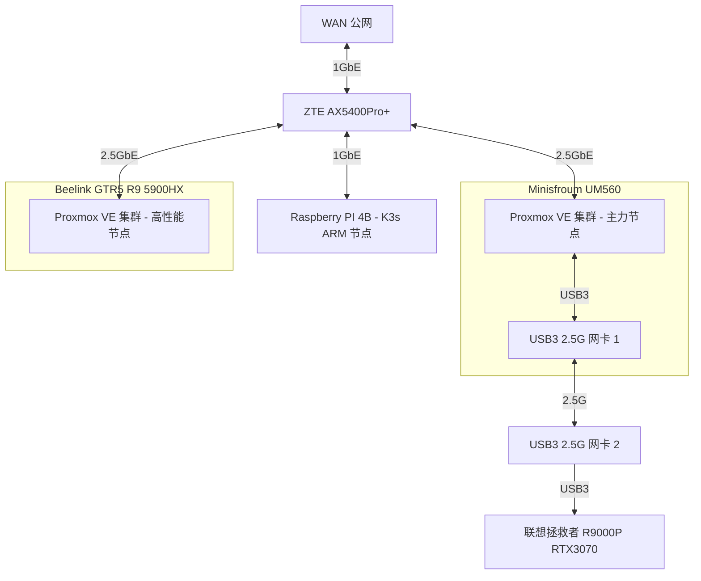

# 我的 Homelab

## 服务器架构

| 机器名称 | CPU | MEM | SSD | HDD | 说明 |
| :---: | :---: | :---: | :---: | :---: | :---: |
| Minisfroum UM560 | AMD R5 5625U, 15W, 6C12T | 16G * 2 |512G SSD | 4T * 2 HDD | 主力设备，低功耗，常驻 |
| Beelink GTR5 AMD Ryzen 9 5900HX | AMD R9 5900HX, 45W, 8C16T | 32G * 2 | 1T SSD | - | 高性能实验专用节点，常驻 |
| Raspberry Pi 4B | BCM2711 (ARMv8), 4C4T | 2G | 128G TF Card | - | 超低功耗 ARM64 节点，常驻 |

## 网络拓扑

## 软件架构

- Minisfroum UM560
  - OS: Proxmox VE
  - VMs
    - Envoy Proxy Server: 1c/1G 32G
      - 边缘网关，设为 DMZ 主机面向公网提供访问
    - OpenMediaVault: 2c/8G 32G
      - 硬盘盒 Sata 直通到此虚拟机，作为家庭 NAS 系统，提供 SMB/SFTP/ISCSI 等局域网 NAS 服务
      - 也通过 docker-compose 运行一些需要访问硬盘盒数据的其他服务，比如
        - [filebrowser](https://github.com/filebrowser/filebrowser): 文件浏览器，支持查看、上传、下载
        - [jellyfin](https://github.com/jellyfin/jellyfin) 影音系统
        - [calibre-web](https://github.com/janeczku/calibre-web) 私有电子书系统，不再需要在每台设备之间同步各种电子书了。
    - OpenWRT: 2c/1G 2G - host CPU
      - 作为软路由系统，实现网络加速、DDNS 等功能
    - k3s single master 2c/4G 32G
      - 家庭网络，单 master 就够用了，省点性能开销
    - k3s worker node 4c/8G 32G * 2
      - 跑各种实验、监控吧
    - docker-compose server 1c/2G 32G
      - 用于跑一些不需要访问硬盘盒，但是需要常驻的容器化应用
      - [Pihole](https://github.com/pi-hole/pi-hole) 广告屏蔽组件，它底层使用 dnsmasq 作为 DHCP 服务器 + DNS 服务器
    - Home Assistant 2c/2G
      - 干一些自动化的活，比如我到家后自动播放歌曲？？？
- Beelink GTR5 AMD Ryzen 9 5900H
  - OS: Proxmox VE
  - VMs
    - k3s worker node * 3
      - 4c/16G 200G 
    - ubuntu test server * 1
      - 2c/8G 32G
- Raspberry Pi 4B
  - OS: Raspberry Pi OS
  - APPs
    - k3s worker node
      - 需要添加污点，容忍该污点即可将任务调度到此节点。
      - 这也是当前 k3s 集群中唯一的 arm 节点，主要用于做一些 ARM 相关的测试
      - node_exporter 作为 daemonset
      - etcd

k3s 集群里可以跑这些负载：

- 数据库：etcd/mysql/postgresql/presto/minio
- 可观测性：prometheus + vectoriametrics + grafana
- [uptime-kuma](https://github.com/louislam/uptime-kuma): 站点可访问性检测
- [dashy](https://github.com/lissy93/dashy) HomePage 页
  - 在安装了如此多的自托管服务后，一个用于索引所有服务的 Homepage 就显得非常有必要了

局域网有了总共 14C28T 的 amd64 算力后（必要时还能把我的联想笔记本也加入到集群， 再补充 8C16T + Nvidia RTX 3070 的算力），已经可以直接在局域网玩一些需要高算力的任务了，比如说：

- 大数据
  - Spark on K8s
  - apach pulsar on K8s
  - flink on eks
  - redis cluster
  - programming toolbox Web 版
- 区块链
  - 自建区块链集群

其他从 [awesome-selfhosted](https://github.com/awesome-selfhosted/awesome-selfhosted) 中找到的，比较感兴趣的项目：

- [actionsflow](https://github.com/actionsflow/actionsflow): 完全兼容 Github Action 的自托管 workflow 服务
- [excalidraw](https://github.com/excalidraw/excalidraw): 自托管白板项目
- [【巨大的Docker整合】影视下载全自动化的部署](https://blog.ddsrem.com/archives/film)：很丰富的内容，值得一试
- [CasaOS](https://github.com/IceWhaleTech/CasaOS): 随便玩玩

## 功耗测量

| 设备名称 | 空载功耗 | 平时功耗 | 满载功耗 | 电源最大功率 |
| :---: | :---: | :---: | :---: | :---: |
| 中兴 ZTE AX5400OPro+ | 10W | 10W | 10W | 
| Minisfroum UM560 | 6W | 15W | 15W | - |
| Raspberry Pi 4B | 3W | - | - | 5V x 3A | 
| Beelink GTR5 AMD Ryzen 9 5900H | 6W | 30W~40W | 50W | 
| 双盘位硬盘盒 + 4T * 2 | - | 12W | 12W | - |
| 小米 AX1800（已闲置） | 6W | 6W | 6W | - |

## 数据备份与同步策略

- 数据备份：因为没啥重要的东西，暂时未设置任何备份。
- 数据同步：考虑之后有时间整个 [Syncthing](https://github.com/syncthing/syncthing)
  - 它可以在 NAS、Android、MacOS/Windows/Linux 之间自动同步数据，比如说 logseq 笔记。

## 远程访问

打算用下面这个：

- [Tailscale VPN](https://github.com/tailscale/tailscale): 基于 wireguard 的家庭 VPN

## 监控告警

目前使用的 node_exporter + Victoria-Metrics，运行在 K3s 中，它的 Operator 提供了 API 可以很方便地采集静态主机的指标，而且配置完全兼容 Prometheus，非常棒~

告警也打算使用 Victoria-Metrics 的 vmalert，但是因为还没搭建完成，所以还没接告警。
或许会将告警发送到 Telegram/Discord/QQ，还没想好发给哪个。

## 参考

- [Home-Network-Note](https://github.com/soulteary/Home-Network-Note): 苏洋的 Homelab 折腾笔记
- [bradfitz/homelab](https://github.com/bradfitz/homelab)
- [awesome-selfhosted](https://github.com/awesome-selfhosted/awesome-selfhosted)
