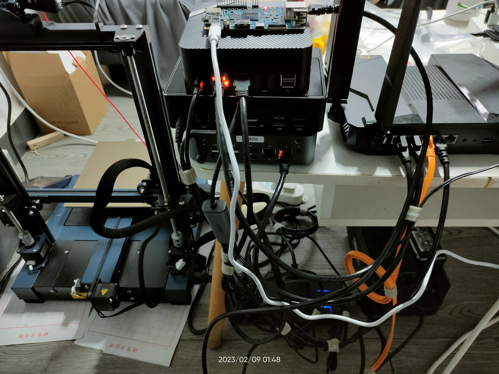
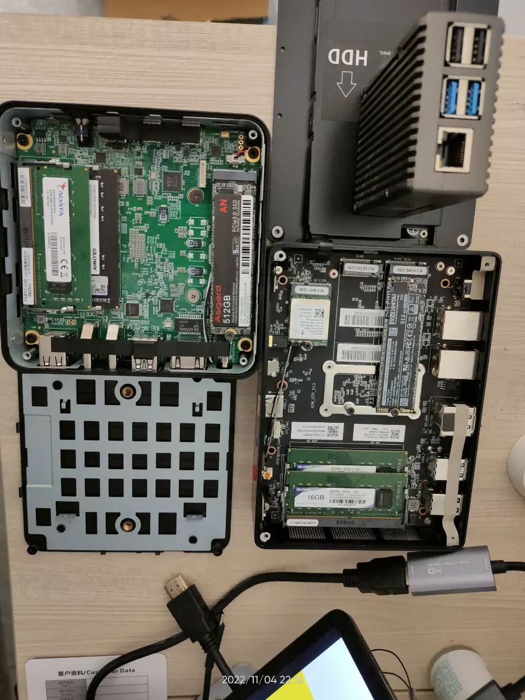
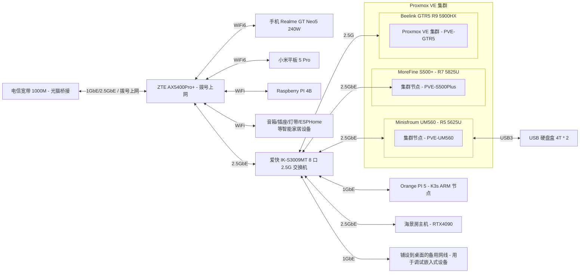
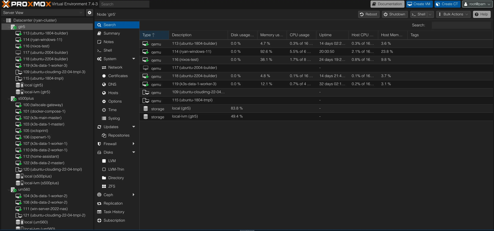
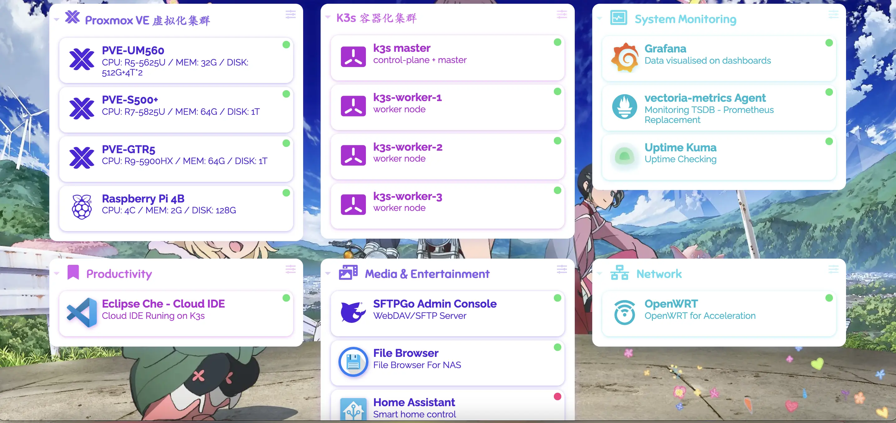

# 我的 Homelab

## 服务器架构




>听很多人说长期运行的机器用 ECC 内存才稳，不过我暂时没配，做好备份应该顶得住，后面真出问题再考虑吧...

| 机器名称 | CPU/GPU | MEM | SSD | HDD | 说明 |
| :---: | :---: | :---: | :---: | :---: | :---: |
| 海景房组装 PC | i3-13600kf 125W, 14C20T; RTX4090 24G | 16G * 2 | 2T SSD * 2 | - | 当前的主力电脑，主要用 [NixOS](https://github.com/ryan4yin/nixos-and-flakes-book) 系统，不过当然也装了 Windows 专门用来打游戏 |
| Minisfroum UM560     | AMD R5 5625U, 15W, 6C12T | 8G + 16G |512G SSD | 4T * 2 HDD | 主力节点，低功耗 |
| MoreFine S500+       | AMD R7 5825U,  15W, 8C16T | 32G * 2 | 1T SSD | - | 主力设备，低功耗 |
| Beelink GTR5         | AMD R9 5900HX, 45W, 8C16T | 32G * 2 | 1T SSD | - | 高性能节点，日常维持低功耗运行 |
| Orange Pi 5  | RK 3588S, 8C(A76*4 + A55*4), GPU(4Cores, Mail-G610), NPU(6Tops@int8) | 8G | 256G SSD | - | 低功耗 ARM64 主机，买来给 k8s 跑 ARM 负载的。（它的 NPU/GPU 也很强悍，可以拿来跑推理、视频转码、直播推流） |
| Orange Pi 5 Plus | RK 3588, 8C(A76*4 + A55*4), GPU(4Cores, Mail-G610), NPU(6Tops@int8) | 16G | 1T SSD | - | SoC 比 3588s 的 IO 性能更强，m2 支持 PCIe 3.0x4，双 2.5G 网口，其他外设也全面强化了。 |
| Rock Pi 5A  | RK 3588S, 8C(A76*4 + A55*4), GPU(4Cores, Mail-G610), NPU(6Tops@int8) | 4G | 128G TF Card | - | 配置与 Orange Pi 5 一致，尺寸跟树莓派一致，不过内存只 4G。 |
| OnePlus 5 6G+64G  | Snapdragon 835 (4x2.45 GHz Kryo & 4x1.9 GHz Kryo) | 6G | 64G | - | 低功耗 ARM64 手机，装了 [Ubuntu Touch](https://devices.ubuntu-touch.io/device/cheeseburger) 系统当 Linux ARM 服务器用，不过电池长期充电是隐患，还没想好怎么解决 |
| LicheePi 4A  | TH1520 RISC-V 64GCV C910*4@2GHz + 4TOPS@INT8  | 8G | 8G eMMC | - | 手上性能最强的 RISC-V 开发板，正在用来折腾 NixOS 系统移植 |

## 网络拓扑

当前的网络拓扑以 2.5G 交换机与路由器为中心，路由器负责拨号上网以及 WiFi，而交换机负责连接所有使用有线网络的设备：



## 软件架构




- Minisfroum UM560
  - OS: Proxmox VE
  - VMs
    - OpenWRT: 2C/1G + 2G DISK - host CPU
      - 作为软路由系统，实现网络加速、DDNS 等功能
      - 安装 openclash、广告拦截插件
    - windows server 2022 2c/8G
      - 硬盘盒 USB 直通到此虚拟机，作为家庭 NAS 系统，通过 SMB 协议对外提供服务
      - 使用 windows server 的原因是，它的 smb 协议速度最快，比开源的 OMV 强很多
    - k3s-data-1 worker node 4C/8G 32G
      - 跑监控、eclipse-che 云 IDE、eBPF 监测工具等
      - 跑各种其他 k8s 实验负载
    - k3s-data-2 worker node 4C/8G 32G
      - 跑各种其他 k8s 实验负载
- MoreFine S500+
  - OS: Proxmox VE
  - VMs
    - tailscale-gateway 1C/1G 20G
      - tailscale 在家里的路由节点，以 `Subnet router` 模式运行，这样就能在任意 tailscale 节点上访问家里的 homelab 跟 NAS 啦~
    - docker-compose server 4C/8G 32G
      - 目前跑了这些服务
        - [dashy](https://github.com/lissy93/dashy) HomePage 页
          - 在安装了如此多的自托管服务后，一个用于索引所有服务的 Homepage 就显得非常有必要了
        - [uptime-kuma](https://github.com/louislam/uptime-kuma): 站点可访问性检测
        - [actionsflow](https://github.com/actionsflow/actionsflow): 完全兼容 Github Action 的自托管 workflow 服务
        - [excalidraw](https://github.com/excalidraw/excalidraw): 自托管白板项目
        - 其他使用 SMB 远程挂载的容器（将 SMB 远程文件夹挂载到本机使用）
          - 数据备份与同步
            - 未来可能打算搞个 synthing 跟 restic
          - 数据浏览
            - [alist](https://github.com/alist-org/alist): Web 页面，支持文件上传、下载、预览，支持多种协议，还可以接入各种云盘。
          - 影音系统
            - [jellyfin](https://github.com/jellyfin/jellyfin): 影音系统
            - 也在考虑要不要装个 transmission/aria2 用来下载 BT 或 HTTP 文件
          - 直播相关处理工具
            - [DDTV](https://github.com/CHKZL/DDTV)：直播开播自动录制、转码保存
            - [BililiveRecorder](https://github.com/BililiveRecorder/BililiveRecorder): 同上
            - [owncast](https://github.com/owncast/owncast): 自建直播服务器
    - Home Assistant 6C/2G 20G
      - 干一些自动化的活，比如我到家后自动播放歌曲？？？
      - CPU 给得多是因为跑了 esphome，它编译固件还是要吃点 cpu 的。
    - k3s-main single master 2C/4G 20G
      - 家庭网络，单 master 就够用了，省点性能开销
      - 主要用做控制面集群，用来跑些 istio/karmada 的控制面
    - k3s-data-1 single master 2C/4G 20G
      - 数据面集群 1，跑些常见任务
    - k8s-data-2 single master 2C/4G 20G
      - 数据面集群 2，跑些常见任务
    - k3s-data-1 worker node 4C/16G 100G * 2
      - 跑各种其他 k8s 实验负载
    - k8s-data-2 worker node 4C/16G 100G * 2
      - 跑各种其他 k8s 实验负载
- Beelink GTR5
  - OS: Proxmox VE
  - VMs
    - ubuntu test server * 3
      - 16C/60G 150G
      - 三台机器分别为 ubuntu 18.04 20.04 跟 22.04，以满足各种程序的编译运行环境要求
      - GTR5 目前主要被我当成实验机用，vscode 连上来跑各种 Linux 系统的开发编译。
    - windows 11 6C/16G + 64G
      - 装一些常用的、NixOS 上兼容性不好的软件，通过 rdp 远程使用，比如企业微信、Windows for Android 等等
    - NixOS test server
      - 用于测试各种 NixOS 配置
- OrangePi Pi 5
  - OS: Debian
  - APPs
    - k3s-data-1 arm64 worker node
      - 需要添加污点，容忍该污点即可将任务调度到此节点。
      - 这也是当前 k3s 集群中唯一的 ARM64/NPU 节点，主要用于做一些 ARM 相关的测试


k3s 集群里可以跑这些负载：

- 数据库：etcd/mysql/postgresql/minio/redis
- 可观测性：
  - 监控：vectoriametrics + grafana
  - 日志：loki + promtail + grafana
- 证书管理：cert-manager
- 集群网咯：cilium
- 服务网格：istio
- 多集群管理：karmada
- 配置部署与同步：argo-cd
- CICD: argo-workflows/tekton
- serverless: keda + dapr + knative + openfunction
  - 这一套方案集成了很多 serverless 的前沿技术，玩一玩能学到很多东西
- 本地镜像仓库: harbor
- 镜像分发：[dragonfly](https://github.com/dragonflyoss/Dragonfly2)
  - 为了省点代理流量，也提升大镜像的拉取速度，有必要给 K3s 安装一个 dragonfly 搞局域网的镜像分发
- 集群安全策略: kyverno
- 等等

局域网有了 x64 架构下 22C44T CPU + 160G RAM 的算力后，已经可以直接在局域网玩一些需要高算力的任务了，比如说：

- 大数据
  - [airbyte](https://github.com/airbytehq/airbyte) 数据管道
  - [alluxio](https://github.com/Alluxio/alluxio) 统一的数据存储接口
  - [Presto](https://github.com/prestodb/presto) SQL 查询引擎，可对接多种数据源
  - [doris](https://github.com/apache/doris) 高性能实时数仓（OLAP 分析型关系数据库）
  -  分布式消息发布与订阅系统
     - [apache pulsar on k8s](https://github.com/apache/pulsar): 对标 kafka，专为高吞吐量、低延迟、快速(或至少表现均匀)的消费者而设计，不适合 RPC
     - [NATS on k8s](https://github.com/nats-io/nats-server): 一个轻量级的云原生消息系统，高性能、低功耗、体积小，跟 redis 一样适合较小的消息。
  - [spark on k8s](https://github.com/GoogleCloudPlatform/spark-on-k8s-operator) 离线数据分析
    - 一篇写得很好的相关文章：[Setting up, Managing & Monitoring Spark on Kubernetes](https://spot.io/blog/setting-up-managing-monitoring-spark-on-kubernetes/)
    - 结合 argocd + argo-workflows 可实现 gitops 的 spark 任务编排
  - [flink on k8s](https://github.com/apache/flink-kubernetes-operator) 实时数据分析
  - [superset](https://github.com/apache/superset) 数据可视化平台
- 区块链
  - 自建区块链集群
- AI 任务，比如 chatglm/stable-diffusion/wispher/...
  - 这个还是得在我 PC 上跑，毕竟有 RTX 4090
  - 缺点是待机功耗贼高，不太适合常驻。

除了上面这些，还可以去 [awesome-selfhosted](https://github.com/awesome-selfhosted/awesome-selfhosted) 跟 [CNCF Landscape](https://landscape.cncf.io/) 翻翻有没有自己感兴趣的项目。

## 来电开机

偶尔家里会断电，如果来电后未自动开机，那家里的 Homelab 就没法远程用了。

上电开机需要主板支持，根据零刻官方文档 [Set Auto Power On of GK Mini](https://www.bee-link.com/cms/support/kldetail?id=82)，有两种方法：

1. 方法一：依次选择 Chipset => "South Cluster Configuration" => "State After G3" => "S0 State"，保存后重启电脑即可。
2. 方法二：依次选择 Boot => "Auto Power On" => "Power on"，保存重启即可。

## 远程开机

来电开机只适合意外断电的情况，不适用于另一个我需要的场景：我的 PC 主机功耗较大，平常不用的时候会关机，有需要的时候我希望能远程开机。

我看有些人会使用「网络唤醒」功能，或者小米智能插座配合「来电开机」功能。不过对我而言，我有个更有意思的解决方案：使用 ESP8266/ESP32C3 控制 reset/poweron 两个引脚的通断 来实现远程开机。

再提供个极简 Web 界面，两个按钮就行，一个 power，一个 reset，肯定会很有意思~

TODO 方案待实施

## 服务器虚拟化

使用的 PVE，相关使用心得参见我的文章 [Proxmox Virtual Environment 使用指南](https://thiscute.world/posts/proxmox-virtual-environment-instruction/)

## NAS 网络存储

详见 [Network Attached Storage](./Network%20Attached%20Storage.md)

## 数据备份与同步

详见 [数据备份与同步](./数据备份与同步.md)


## 远程访问

前面提过了，使用的方案是 [Tailscale VPN](https://github.com/tailscale/tailscale)，它是一个基于 wireguard 的家庭 VPN，安装非常简单，基本傻瓜式操作。

在 Homelab 上跑了一个 [tailscale-gateway](https://tailscale.com/kb/1019/subnets/) 作为 homelab 的入口节点，这样无论在哪，我的 Android、Macbook 等
设备都可以无缝接入 Homelab~

注意 MacOS/Linux 等终端设备需要使用如下命令启动 tailscale，这样才能自动添加 Homelab 相关的路由，而 Android 设备实测会自动添加相关路由规则:

```shell
tailscale up --accept-routes
```

以及，使用如下命令可以检查确认节点是直连（`direct`）还是中继（`DERP relay`），如果显示为中继，说明 NAT 或防火墙规则比较严格，导致难以直连，这会导致延迟明显上升、带宽下降！

```shell
# 查看当前所有节点的状态
tailscale status

# 检测到某个 ip 地址 / hostname 是否直连
tailscale ping <hostname-or-ip>
```

另外安全起见，虽然已经取得了公网 IP，暂时仍未启用任何面向公网的 Web 服务，仅将路由器 NAT 类型设为了「端口受限型」（未改为「全锥型」）。

## 监控告警

目前使用的 node_exporter + Victoria-Metrics，运行在 K3s 中，它的 Operator 提供了 API 可以很方便地采集静态主机的指标，而且配置完全兼容 Prometheus，非常棒~

告警也打算使用 Victoria-Metrics 的 vmalert，但是因为还没搭建完成，所以还没接告警。
或许会将告警发送到 Telegram/Discord/QQ，还没想好发给哪个。

## 功耗测量

>Linux 主机满载功耗测试命令为 `sysbench cpu --threads=16 --time=30 run`，其中 threads 值为 cpu 超线程数。

>带 GPU 的主机同时使用了前面的 `sysbench cpu` 命令和 pytorch AI 运算，分别跑满 CPU 与 GPU，测得满载功耗。

| 设备名称                            | 空载功耗 | 低负载功耗 | 满载功耗 | 电源最大功率 | 每月用电量 |
| :---:                              | :---:   | :---:    | :---:   | :---:      | :---: |
| 中兴 ZTE AX5400OPro+（双 2.5G 网口） | 10W     | 10W      | 10W     |            |按低负载功耗算 10W * 24h * 30day = 7.2 KWh |
| 联想拯救者 R9000P RTX3070 2021 款    | 20W    |  -       | 190W    |   300W     | 按低负载功耗算 20W * 24h * 30day = 14.4 KWh    |
| Minisfroum UM560 (AMD R5 5625U)    | 6W     | 15W      | 45W (CPU 被超频到了 30w) | -  | 按低负载功耗算 15W * 24h * 30day = 10.8 KWh |
| MoreFine S500+(AMD R7 5825U)       | 6W     | 16W      | 60W (CPU 被超频到了 40W)  |   | 低负载功耗跟 UM560 基本一致 |
| Beelink GTR5 (AMD R9 5900HX)       | 6W     | 35W      | 50W     |            | 按低负载功耗算 35W * 24h * 30day = 25.2 KWh |
| 双盘位硬盘盒 + 4T * 2                | (休眠)  | 12W      | 12W     | -          | 按低负载功耗算 12W * 24h * 30day = 8.64 KWh |
| 小米 AX1800（已闲置）                | 6W     | 6W       | 6W      | -          | 按低负载功耗算 6W * 24h * 30day = 4.32 KWh |
| Raspberry Pi 4B 2GB                | 3W     | -        | -       | 5V x 3A    |  - |

如果再乘上深圳这边租房的电价，基本都是 ￥1.5/KWh，费用还是有点高的，目前整个 Homelab 一个月用电量大概 60KWh，也就是 90 大洋...这还是我尽量选用了低功耗设备，日常负载也不高，不然就更夸张了...

## 价格与购入时间

主要设备：

| 设备名称 | 购入时间 | 购入渠道 | 价格 |  说明 |
| :---: | :---: | :---: | :---: |  :---: | 
| ~~小米 AX1800~~                | 2020-07-10 | 拼多多    | ￥265 | 最早的 WiFi6 产品，我曾经的主路由，打算寄回老家用 |
| ~~联想 R9000P 2021 款, 16G RAM + 512G SSD + RTX3070~~    | 2021-06-01 | 京东自营 | ￥9699 | 用了两年的主力机，打算寄回家给我妹用 |
| Raspberry Pi 4B 2GB                | 2020-07-11 | 从同事手中购入 | ￥180 | 曾经拿来玩过 NAS，目前暂时作为 k3s 节点使用 |
| 中兴 ZTE AX5400OPro+（双 2.5G 网口） | 2022-11-02 | 京东自营   | ￥649 | 当前的主路由 |
| Minisfroum UM560 准系统 (AMD R5 5625U)    | 2022-11-02 | 京东官方店 | ￥1799 | 当前三台机器中颜值最高的机器，氮化镓充电器也很小巧，不过只有 6C12T，内存最高只支持 16G * 2 |
| Beelink GTR5 准系统 (AMD R9 5900HX)       | 2022-11-02 | 京东官方店 | ￥2545 | 双 2.5G 网口，性能高但是功耗也高些，颜值尚可，不过充电器较大 |
|  MoreFine S500+ (AMD R7 5825U) 准系统     | 2022-11-19 | 淘宝官方店 | ￥2069 | 就比 UM560 贵 ￥270，升级到 8C16T 且功耗不变，缺点是机箱颜值要差些，而且出风口在底部。 |
|  Orange Pi 5 8G + 5V4A电源     | 2023-02-04 | 淘宝官方店 | ￥749 + 运费 ￥8 | 高性能 Pi，买来给 k8s 跑 ARM 负载的（它的 NPU/GPU 也很强悍，可以拿来跑推理、视频转码、直播推流） |
|  OnePlus 5 6G+64G    | 2023-02-26 | 闲鱼二手 | ￥290 | 二手手机确实挺划算的，比同性能的开发板便宜好多啊 |
|  爱快 IK-S3009MT 8 口 2.5G 交换机    | 2023-04-11 | 京东 | ￥459 | 路由器 2.5G 口不够用，终于还是买了台交换机 |
|  Orange Pi 5 Plus 16G     | 2023-05-21 | 淘宝官方店 | ￥949 + 运费 ￥8 | 高性能 Pi，IO 比 3588s 强很多 |
|  Rock 5A 4G 带 WiFi    | 2023-05-21 | 淘宝官方店 | ￥498 + WiFi 模块 ￥72 + 运费 ￥13 | 之前买的预售优惠券便宜 ￥200，终于发货了 |
|  LicheePi 4A 内测板 8+8G    | 2023-05-05 | 淘宝官方店 | ￥799 - 预售券便宜 ￥50 | 目前市面上性能最高的 RISC-V 开发版，性能跟树莓派 4B 差不多，主要用来玩 RISC-V 架构的 |


>目前 Minisfroum/Beelink 新出的 UM690/UM773/GTR6 等基于第 6 代 AMD CPU 的 mini 主机打折的时候跟我买的上一代基本上一个价，而且还支持了自带 ECC 的 DDR5，还提供 40Gbps 速度的 USB 4.0，此外 6900HX/7773HS 的核显重大升级，性能堪比 GTX1050（桌面主机党狂喜）。还是挺香的，如果我是今年买的话，肯定会在打折的时候买这些新款。只能说时间没碰上了。


内存条与硬盘：

| 设备名称 | 购入时间 | 购入渠道 | 价格 | 说明 |
| :---: | :---: | :---: | :---: | :---: | 
| 优越者双盘位硬盘盒 Y-3355                | 2020-07-10 | 拼多多    | ￥369 | 主要用途：NAS 远程游戏存储、数据备份、影视下载 |
| 西数紫盘 4TB SATA 6Gb/s (WD40EZRZ)               | 2020-07-11 | 京东自营    | ￥539 | 插硬盘盒里，接在 UM560 上 |
| 西数蓝盘 4TB SATA 6Gb/s (WD40EJRX)               | 2020-07-11 | 京东自营    | ￥579 | 插硬盘盒里，接在 UM560 上 |
| 光威战将 DDR4 16GB 3200 笔记本内存    | 2021-06-08 | 京东自营    | ￥439 * 2 | 一开始是给 R9000P 用的，现在换到 UM560 上了（2022 年价格: 259 * 2） |
| ZhiTai SSD - TiPlus5000 512GB (TLC, 长江存储)        | 2022-11-02 | 京东自营    | ￥309 | 笔记本 Windows 游戏机存储（游戏都 ISCSI 远程存储了，所以本机不需要大空间） |
| Asgard SSD - AN3.0 512G NVMe-M.2/80 (TLC, 长江存储)  | 2022-11-02 | 京东自营    | ￥249 | UM560 的存储，2023-02-03 跪了，2/7 完成售后换新，看看这次能撑多久... |
| 金胜维 2242 NVMe 256G           | 2023-02-07 |  淘宝    | ￥189 | Orange Pi 5 的存储 |
| 京东京造 128G TF 卡（写入 120MB/s, 读取 160MB/s） * 2  | 2022-11-06, 2023-02-06 | 京东自营    | ￥89 * 2 | 一张是 Raspberry Pi 的存储（这张已经被我不小心压断了...），另一张本来是给 Orange Pi 5 用，后来给换了 SSD 就闲置了 |
|  三星 128G TF 卡 EVO Plus（写入 60MB/s, 读取 130MB/s） | 2022-12-25 | 京东自营    | ￥72 | 目前是给家里监控摄像头用 |
|  三星 128G TF 卡 Pro Plus（写入 120MB/s, 读取 160MB/s） | 2023-02-08 | 京东自营    | ￥89 | 闲置中 |
| 光威战将 DDR4 32GB 3200 笔记本内存 * 2            | 2022-11-07 | 京东自营    | ￥579 * 2 | GTR5 的内存条 |
| 西数 SSD - WD Blue SN570 1T (TLC) * 2          | 2022-11-17 与 2022-11-19 | 京东自营    | ￥559 * 2 | GTR5 与 S500+ 的存储 |
| 玖合 NB-DDR4-32G-3200 * 2           | 2022-11-19 | 京东自营    | ￥429 * 2 | S500+ 的内存条 |


其他小配件：

| 设备名称 | 购入时间 | 购入渠道 | 价格 | 说明 |
| :---: | :---: | :---: | :---: | :---: | 
| 标康电力监测插座 BK-033                  | 2020-07-29 | 京东自营    | ￥41 | 监测整个 Homelab 的功耗情况 |
| 斯泰克 USB 网卡 2.5GbE * 2             | 2022-11-02 | 京东自营    | ￥77 * 2 | 用于拓展 mini 主机与笔记本电脑的 2.5G 网口 |
| 绿巨能 HDMI 视频采集卡（1080P 输出, USB/Type-C 接口） | 2022-11-02 | 京东自营    | ￥79 | 配合 USB Camera APP 将安卓设备当成显示器用，主要用于机器装机 |
| 公牛抗电涌浪涌插座 6 位 GN-H3060 | 2022-11-17 | 京东自营    | ￥89 | Homelab 都插这个插座上 |

以及已经翻车的设备/配件：

| 设备名称 | 购入时间 | 翻车时间 | 购入渠道 | 价格 | 说明 |
| :---: | :---: | :---: | :---: | :---: | :---: | 
| 光威 SSD - 弈Pro 1T           | 2021-06-08 | 2022-11-13 | 京东自营    | ￥819 | 之前给 Windows 游戏机用了一年多，然后换到 GTR5 上没跑几天就掉盘了（系统无法启动，显示器报错 `nvme0: Device not ready; aborting reset`），京东售后给办理了 9 折退款（还好没存啥重要数据） |
| Asgard SSD - AN3.0 512G NVMe-M.2/80 (TLC, 长江存储)  | 2022-11-02 | 2023-02-03 | 京东自营    | ￥249 | 买到手后一直是 UM560 的存储。跑了刚三个月就出问题了，进入系统后用 `dmesg` 能看到非常多这类报错 `blk_update_request: critical medium error, dev nvme0n1, sector 951741928 op 0x0:(READ) flags 0x0 phys_seg 1 prio class 0`。京东售后给换了新，但是丢了一些数据，数据不重要，但是需要花些额外的精力重建环境（充分认识到了 SSD 不稳，必须做定时备份！）。 |


最后再列下 Homelab 的主机可选项：

- Mini 主机，主要是 Minisfroum、Beelink、MoreFine 三家的 AMD 主机，性价比不错，而且够小巧。除了买全新设备，也可以考虑在闲鱼上收别人的二手主机，更便宜。
  - 优点
    - 小巧便携
    - 移动 CPU，功耗低
  - 缺点
    - 小主机性能差一点，而且 CPU 不能升级、也插不了独立 GPU，没啥 DIY 空间。
    - 如果当作桌面主机用的话，高负载时风扇会有些声音，就跟游戏本一样啦。不过我是当 Homelab 用的，离我比较远，基本听不到风扇声。
- 自组 ITX/MATX 主机：好处就是可以自己 DIY，包括CPU/主板/机箱在内的所有组件都可按需求更换，如果选用现在很流行的海景房机葙（就是玻璃橱窗机箱），再放上一两个手办，放在桌面上也很养眼。
- 机架服务器：有些朋友玩这个，我以前也接触过，好处就是便宜大碗，缺点是电老虎 + 发热巨大 + 风扇贼吵，我选择放弃。

总的来说，目前 Homelab 三台 mini 主机算上固态内存，花了接近 1W。
跟朋友对比了下，如果花差不多的钱买机架服务器，可以买到这个配置：`48C96T(2696v3 * 2) + 512G(32g * 16) + 9.6T(1.2T * 8)`
配置差别还是有点大的，不过胜在静音 + 低功耗 + 不占空间 + 发热小，对于小租房而言也算是不错的选择。
具体是要机架服务器还是 mini 主机，还是看个人需求吧。

mini 主机领域性价比高的机器，目前主要就是零刻、minisfroum、morefine 这三家，我刚好每家买了一台...

此外一些便宜的工控机其实也可以考虑，不过从我个人角度看，性价比高的工控机的性能都比较弱，性能上来后跟 mini 主机价格也差不多了，所以一般都被用做专门的软路由，目前不太符合我用来跑虚拟机的需求。

## 闲鱼捡垃圾

除了前面我买的全新小主机/ARM 开发板，以及提到的二手机架服务器外，其实还有一类设备也很值得考虑，就是闲鱼上的二手货，比如说：

- 老版本的 NUC/零刻
- 用旧安卓手机当 Linux ARM 服务器，参考 [Andorid Phone as a Linux Server](./android%20phone/README.md)
- 老旧笔记本，这个选项是从苏洋那里了解到的，确实二手笔记本比 NUC 啥的市场存量大很多，价格也很有诱惑力
- 显卡方面也有些 P40/P100 之类的便宜二手服务器显卡。

## 参考

- [Home-Network-Note](https://github.com/soulteary/Home-Network-Note): 苏洋的 Homelab 折腾笔记
- [bradfitz/homelab](https://github.com/bradfitz/homelab)
- [awesome-selfhosted](https://github.com/awesome-selfhosted/awesome-selfhosted)
