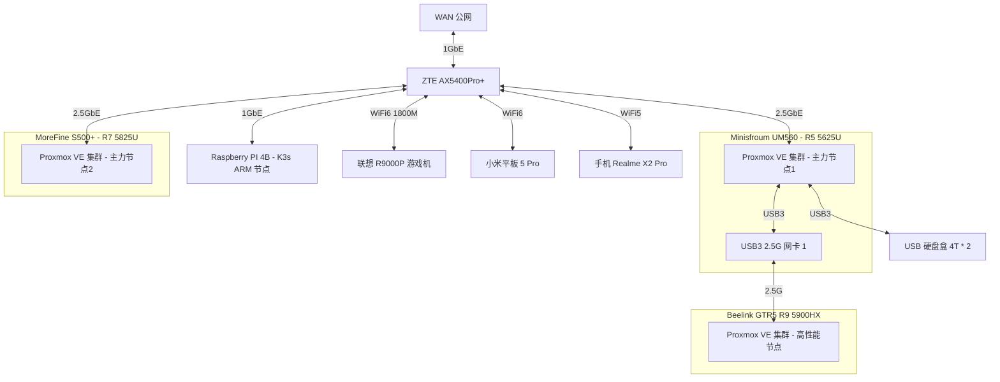

# 我的 Homelab

## 服务器架构

| 机器名称 | CPU | MEM | SSD | HDD | 说明 |
| :---: | :---: | :---: | :---: | :---: | :---: |
| Minisfroum UM560     | AMD R5 5625U, 15W, 6C12T | 16G * 2 |512G SSD | 4T * 2 HDD | 主力设备，低功耗，常驻 |
| MoreFine S500+       | AMD R7 5825U,  15W, 8C16T | 32G * 2 | 1T SSD | - | 高性能、低功耗节点，常驻 |
| Beelink GTR5         | AMD R9 5900HX, 45W, 8C16T | 32G * 2 | 1T SSD | - | 高性能实验节点，平常维持低功耗运行 |
| Raspberry Pi 4B 2GB  | BCM2711 (ARMv8), 4C4T | 2G | 128G TF Card | - | 超低功耗 ARM64 节点，常驻 |

## 网络拓扑

## 软件架构

- Minisfroum UM560
  - OS: Proxmox VE
  - VMs
    - Envoy Proxy Server: 1c/1G 32G
      - 边缘网关，设为 DMZ 主机面向公网提供访问
      - 注：选择 envoy 单纯是为了熟悉 envoy 的使用，没这需求的建议用 traefik/caddy，更简单好用
    - OpenMediaVault: 2c/8G 32G
      - 硬盘盒 Sata 直通到此虚拟机，作为家庭 NAS 系统，提供 SMB/SFTP/ISCSI 等局域网 NAS 服务
      - 也通过 docker-compose 运行一些需要访问硬盘盒数据的其他服务，比如
        - [filebrowser](https://github.com/filebrowser/filebrowser): 文件浏览器，支持查看、上传、下载
        - [jellyfin](https://github.com/jellyfin/jellyfin) 影音系统
        - [calibre-web](https://github.com/janeczku/calibre-web) 私有电子书系统，不再需要在每台设备之间同步各种电子书了。
    - OpenWRT: 2c/1G 2G - host CPU
      - 作为软路由系统，实现网络加速、DDNS 等功能
      - 安装 openclash、广告拦截插件、tailscale-vpn 等
    - k3s single master 2c/4G 32G
      - 家庭网络，单 master 就够用了，省点性能开销
    - k3s worker node 4c/8G 32G * 2
      - 跑监控、eclipse-che 云 IDE、eBPF 监测工具等
      - 跑各种其他 k8s 实验负载
    - docker-compose server 1c/2G 32G
      - 用于跑一些不需要访问硬盘盒，但是需要常驻的容器化应用
    - Home Assistant 2c/2G
      - 干一些自动化的活，比如我到家后自动播放歌曲？？？
- MoreFine S500+ 
  - OS: Proxmox VE
  - VMs
    - k3s worker node * 3
      - 4c/16G 100G
      - 跑各种其他 k8s 实验负载
    - ubuntu test server * 1
      - 2c/8G 32G
- Beelink GTR5
  - OS: Proxmox VE
  - VMs
    - k3s worker node * 3
      - 4c/16G 100G
      - 作为 k3s 高性能实验节点
    - 跑其他测试负载
- Raspberry Pi 4B
  - OS: Raspberry Pi OS
  - APPs
    - k3s worker node
      - 需要添加污点，容忍该污点即可将任务调度到此节点。
      - 这也是当前 k3s 集群中唯一的 arm 节点，主要用于做一些 ARM 相关的测试
      - node_exporter 作为 daemonset
      - etcd

k3s 集群里可以跑这些负载：

- 数据库：etcd/mysql/postgresql/presto/minio
- 可观测性：prometheus + vectoriametrics + grafana
- [uptime-kuma](https://github.com/louislam/uptime-kuma): 站点可访问性检测
- [dashy](https://github.com/lissy93/dashy) HomePage 页
  - 在安装了如此多的自托管服务后，一个用于索引所有服务的 Homepage 就显得非常有必要了

局域网有了总共 22C44T CPU + 160G RAM 的算力后（必要时还能把我的联想笔记本也加入到集群， 再补充 8C16T CPU + 16G RAM +  Nvidia RTX 3070 GPU），已经可以直接在局域网玩一些需要高算力的任务了，比如说：

- 大数据
  - Spark on K8s
  - apach pulsar on K8s
  - flink on eks
  - redis cluster
  - programming toolbox Web 版
- 区块链
  - 自建区块链集群

其他从 [awesome-selfhosted](https://github.com/awesome-selfhosted/awesome-selfhosted) 中找到的，比较感兴趣的项目：

- [actionsflow](https://github.com/actionsflow/actionsflow): 完全兼容 Github Action 的自托管 workflow 服务
- [excalidraw](https://github.com/excalidraw/excalidraw): 自托管白板项目
- [【巨大的Docker整合】影视下载全自动化的部署](https://blog.ddsrem.com/archives/film)：很丰富的内容，值得一试
- [CasaOS](https://github.com/IceWhaleTech/CasaOS): 随便玩玩

## 功耗测量

| 设备名称 | 空载功耗 | 平时功耗 | 满载功耗 | 电源最大功率 |
| :---: | :---: | :---: | :---: | :---: |
| 中兴 ZTE AX5400OPro+（双 2.5G 网口） | 10W | 10W | 10W | 
| Minisfroum UM560 (AMD R5 5625U)    | 6W | 15W | 15W | - |
| Raspberry Pi 4B 2GB                    | 3W | - | - | 5V x 3A | 
| Beelink GTR5 (AMD R9 5900HX)       | 6W | 30W~40W | 50W | 
| 双盘位硬盘盒 + 4T * 2                | - | 12W | 12W | - |
| 小米 AX1800（已闲置）                | 6W | 6W | 6W | - |

## 价格与购入时间

主要设备：

| 设备名称 | 购入时间 | 购入渠道 | 价格 |  说明 |
| :---: | :---: | :---: | :---: |  :---: | 
| 小米 AX1800                | 2020-07-10 | 拼多多    | ￥265 | 最早的 WiFi6 产品，我曾经的主路由，目前已闲置 |
| Raspberry Pi 4B 2GB                | 2020-07-11 | 从同事手中购入 | ￥180 | 曾经拿来玩过 NAS，目前暂时作为 k3s 节点使用 |
| 中兴 ZTE AX5400OPro+（双 2.5G 网口） | 2022-11-02 | 京东自营   | ￥649 | 当前的主路由 |
| Minisfroum UM560 准系统 (AMD R5 5625U)    | 2022-11-02 | 京东官方店 | ￥1799 | - |
| Beelink GTR5 准系统 (AMD R9 5900HX)       | 2022-11-02 | 京东官方店 | ￥2545 | 就性能比较高，并且双 2.5G 网口吧，不过如果现在让我选，可能不会买它 |
|  MoreFine S500+ (AMD R7 5825U) 准系统     | 2022-11-19 | 淘宝官方店 | ￥2069 | 就比 UM560 贵 ￥270，从 6C12T 升级到 8C16T，而功耗仍然是 15W，感觉很划算 |

内存条与硬盘：

| 设备名称 | 购入时间 | 购入渠道 | 价格 | 说明 |
| :---: | :---: | :---: | :---: | :---: | 
| 优越者双盘位硬盘盒 Y-3355                | 2020-07-10 | 拼多多    | ￥369 | 主要用途：ISCSI 远程游戏存储、数据备份、影视下载 |
| 西数紫盘 4TB SATA 6Gb/s (WD40EZRZ)               | 2020-07-11 | 京东自营    | ￥539 | 插硬盘盒里，接在 UM560 上（2022 年价格: 306） |
| 西数蓝盘 4TB SATA 6Gb/s (WD40EJRX)               | 2020-07-11 | 京东自营    | ￥579 | 插硬盘盒里，接在 UM560 上（2022 年价格: 302） |
| 光威战将 DDR4 16GB 3200 笔记本内存    | 2021-06-08 | 京东自营    | ￥439 * 2 | 一开始是给 R9000P 用的，现在换到 UM560 上了（2022 年价格: 259 * 2） |
| ZhiTai SSD - TiPlus5000 512GB (TLC, 长江存储)        | 2022-11-02 | 京东自营    | ￥309 | 笔记本 Windows 游戏机存储（游戏都 ISCSI 远程存储了，所以本机不需要大空间） |
| Asgard SSD - AN3.0 512G NVMe-M.2/80 (TLC, 长江存储)  | 2022-11-02 | 京东自营    | ￥249 | UM560 的存储 |
| 京东京造 128G TF 卡（写入 120MB/s, 读取 160MB/s）  | 2022-11-06 | 京东自营    | ￥89 | Raspberry Pi 的存储 |
| 光威战将 DDR4 32GB 3200 笔记本内存 * 2            | 2022-11-07 | 京东自营    | ￥579 * 2 | GTR5 的内存条 |
| 西数 SSD - WD Blue SN570 1T (TLC) * 2          | 2022-11-17 与 2022-11-19 | 京东自营    | ￥559 * 2 | GTR5 与 S500+ 的存储 |
| 玖合 NB-DDR4-32G-3200 * 2           | 2022-11-19 | 京东自营    | ￥429 * 2 | S500+ 的内存条 |

其他小配件：

| 设备名称 | 购入时间 | 购入渠道 | 价格 | 说明 |
| :---: | :---: | :---: | :---: | :---: | 
| 标康电力监测插座 BK-033                  | 2020-07-29 | 京东自营    | ￥41 | 监测整个 Homelab 的功耗情况 |
| 斯泰克 USB 网卡 2.5GbE * 2             | 2022-11-02 | 京东自营    | ￥77 * 2 | 用于拓展 mini 主机与笔记本电脑的 2.5G 网口 |
| 绿巨能 HDMI 视频采集卡（1080P 输出, USB/Type-C 接口） | 2022-11-02 | 京东自营    | ￥79 | 配合 USB Camera APP 将安卓设备当成显示器用，主要用于机器装机 |
| 公牛抗电涌浪涌插座 6 位 GN-H3060 | 2022-11-17 | 京东自营    | ￥89 | Homelab 都插这个插座上 |

以及已经翻车的设备/配件：

| 设备名称 | 购入时间 | 翻车时间 | 购入渠道 | 价格 | 说明 |
| :---: | :---: | :---: | :---: | :---: | :---: | 
| 光威 SSD - 弈Pro 1T           | 2021-06-08 | 2022-11-13 | 京东自营    | ￥819 |本来是给 Windows 游戏机用的，换到 GTR5 上没跑几天就掉盘了（`nvme0: Device not ready; aborting reset`），京东售后给办理了 9 折退款（还好没存啥重要数据） |

## 数据备份与同步策略

- 数据备份：因为没啥重要的东西，暂时未设置任何备份。
  - 后面会考虑把 PVE 虚拟机备份同步到 HDD 上
- 数据同步：考虑之后有时间整个 [Syncthing](https://github.com/syncthing/syncthing)
  - 它可以在 NAS、Android、MacOS/Windows/Linux 之间自动同步数据，比如说 logseq 笔记。

## 远程访问

打算用下面这个：

- [Tailscale VPN](https://github.com/tailscale/tailscale): 基于 wireguard 的家庭 VPN

## 监控告警

目前使用的 node_exporter + Victoria-Metrics，运行在 K3s 中，它的 Operator 提供了 API 可以很方便地采集静态主机的指标，而且配置完全兼容 Prometheus，非常棒~

告警也打算使用 Victoria-Metrics 的 vmalert，但是因为还没搭建完成，所以还没接告警。
或许会将告警发送到 Telegram/Discord/QQ，还没想好发给哪个。

## 参考

- [Home-Network-Note](https://github.com/soulteary/Home-Network-Note): 苏洋的 Homelab 折腾笔记
- [bradfitz/homelab](https://github.com/bradfitz/homelab)
- [awesome-selfhosted](https://github.com/awesome-selfhosted/awesome-selfhosted)
