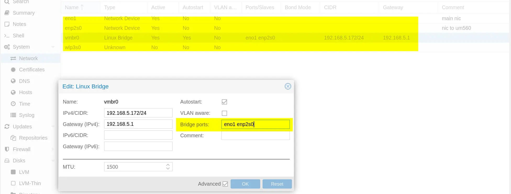

# Proxmox VE Networks

## 1. 如何桥接多张物理网卡

示例如下，主要就是在 vmbr0 网桥的 `Bridge Ports` 里面：

## 2. 如何手动添加 USB 物理网卡

>参考官方文档: [SysAdmin - Network Configuration](https://pve.proxmox.com/pve-docs/chapter-sysadmin.html#sysadmin_network_configuration)

我遇到这个问题的场景是：我的 mini 主机（GTR5）只有两个 2.5G 网卡，不太够用。而家里的路由器剩下的都是千兆网口，路由器也难以拓展网卡。
网上搜了下 2.5G 交换机又发现价格 429 起步，所以决定买两张 USB 2.5GbE 网卡插在这台小主机上作为便宜的网口拓展方案。

现在网卡有了，有两种方式可以让 PVE 识别到这张网卡：

1. 方法一：直接重启机器，然后就能在 Web UI 的 `Network` 配置中见到这张 USB 网卡了。之后直接把该网卡加入到 vmbr 网桥的 `Bridge Ports` 中并应用配置，就大功告成了。
2. 方法二：不重启机器实现添加 USB 网卡。如果机器不能重启，就可以走这个流程：
   1. 首先，使用 `ip link` 命令打印出当前的所有网络接口
   2. 将 2.5GbE 网卡插到 USB3.0 端口上，Linux 将自动识别到它
   3. 现在再使用 `ip link` 命令查看所有网络接口，找到新增的接口名称（通常在输出内容最末尾）。
      1. 在我的环境中新的 USB 网卡名称为 `enx00e04c680178`
   4. 在配置文件 `/etc/network/interfaces` 的末尾新增一行：`iface enx00e04c680178 inet manual`（注意替换网卡名称）
   5. 现在直接刷新 Web UI 页面， USB 网卡就会出现了。之后直接把该网卡加入到 vmbr 网桥的 `Bridge Ports` 中并应用配置，就大功告成了。

## 3. 如何配置 WiFi 网卡

如果主机自带了 WiFi 网卡，启动后 Proxmox VE 能识别到该网卡，但是无法通过 Web UI 修改它的任何配置。

那么本着物尽其用的精神，该如何利用上这张 WiFi 网卡呢？

根据 PVE 官方文档 [WLAN - Proxmox VE Docs](https://pve.proxmox.com/wiki/WLAN)，并不建议在 PVE 上使用 WLAN，它存在如下问题：

- WiFi 自身必须是一个 Linux Bridge 设备，无法被桥接到 vmbr0 等网桥上。因为大多数 Access Point 都会直接拒绝掉未授权的源地址发过来的数据包...
- 与有线连接相比，WiFi 的延迟要高得多，而且不太稳定。

如果要配置 WLAN 网卡的话，可以直接参考 Debian 的官方文档进行配置：[How to use a WiFi interface - Debian](https://wiki.debian.org/WiFi/HowToUse)

因此，我觉得将 WiFi 网卡直接 PCI 直通给机器内的 OpenWRT 虚拟机来玩，可能是更好的主意。

后续将会更新相关内容...待续
