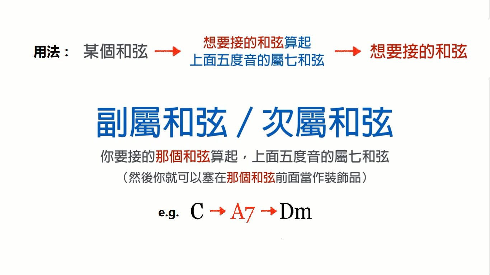

# 和弦进阶

`乐理`

和弦的转位：

* 原位：最低音是根音(其它音无所谓)
* 第一转位(First Inversion)：最低音是三音，也叫六四和弦。常用于终止(主和弦)、经过、持续。
* 第二转位：最低音是五音

1. 

2. 「三全音代理」和弦
3. **借用和弦**：借用同主音不同调式里的和弦来用
4. **和声外音**：
    1. 邻音：和声音→邻音→折回和声音，例如I级和弦中的1→2→1，2是邻音
    2. 经过音：和声音→经过音→进行到下一个和声音，例如I级和弦中的1→2→3，2是经过音
    3. 倚音：发生在相对强拍的和声外音
