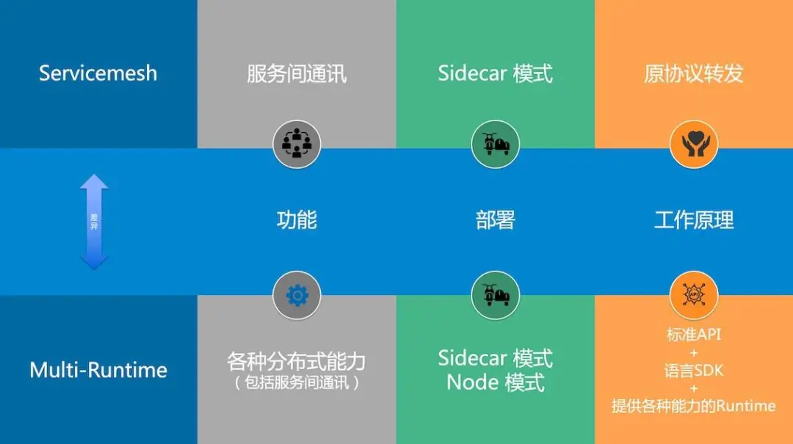

# Dapr

它给自己的定位是 Multi-Runtime - 一个比服务网格更通用、能力更强的运行时，一个运行时就能提供原本需要多个 Sidecar 实现的能力（如缓存代理，绑定代理）

但是 Dapr 主要关注服务的状态管理，并不负责流量治理。如果需要流量治理，可以同时使用 Dapr 与 Istio/Linkerd2.

## Multi-Runtime 的特点和差异

虽然同为 Sidecar 模式，但是和 Service Mesh 相比，Multi-Runtime 有自身的特点：

- 提供能力的方式和范围：Multi-Runtime 提供的是分布式能力，体现为应用需要的各种分布式原语，并不局限于单纯的服务间点对点通讯的网络代理
    - 服务网格专注于网络代理，而 Muti-Runtime 更通用，还可提供缓存、生命周期管理、状态管理等其他分布式能力。
- Runtime 部署的方式：Multi-Runtime 的部署模型，不局限于 Sidecar 模式，**Node 模式**在某些场景下（如 Edge/IoT，Serverless FaaS）可能会是更好的选择。
- 和 App 的交互方式：Multi-Runtime 和应用之间的交互是开放而有 API 标准的，Runtime 和 Micrologic 之间的“协议”体现在 API 上，而不是原生的 TCP 通讯协议。另外 Multi-Runtime 不要求无侵入，还会提供各种语言的 SDK 以简化开发。

## 参考

- [一年增加1.2w星，Dapr能否引领云原生中间件的未来？](https://mp.weixin.qq.com/s/KSln4MPWQHICIDeHiY-nWg)

