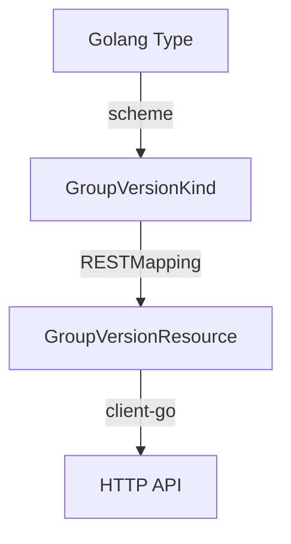

# Kubernetes 编程

> https://kubernetes.io/docs/concepts/extend-kubernetes/

## 架构

https://book.kubebuilder.io/architecture

## 名词解释

1. Cloud Provider: 与云服务提供商 API 交互的代码，如 AWS 的 EC2, ELB, EBS 等。
1. Controller: a controller implements a control loop, watching the shared state of the cluster
   through the API server and making changes in an attempt to move the current state toward the
   desired state.
   1. 通常每个 CR 对应一或多个 controller. 譬如你也可以创建一个 controller 来监控 Pod/Deployment 的
      状态并进行相应操作。
1. Operator: Operator 可以简单地理解成 CRD + Controller，它包含一些额外的运维逻辑，负责管理一个或多
   个 CRD 对象的生命周期。

## 一、CRD 方式

### Controller

Controller 在启动后会进入一个 Control Loop，即无限循环，它会在循环中不断地检查资源的当前状态和期望状
态，然后采取行动。

Control Loop 的几个核心概念：

1. Informer: 一个高层的抽象接口，用于监控资源的变化，当资源发生变化时，Informer 会通知 Controller.
   1. 它的底层自动处理了连接、重连、缓存、高效索引等问题，让开发者可以专注于业务逻辑的实现。
   1. 主要基于事件驱动的方式更新数据，效率高，当然也可以强制全量更新。
1. Work Queue: 用于存储需要处理的资源对象，Controller 从 Work Queue 中取出资源对象进行处理。

Kubernetes 遵从 Events 与松散耦合组件的设计原则，各 Controller 通过 Watch Events 的方式来监控资源的
变化，避免轮询 API Server，降低了系统的负载。Events 是 K8s 的核心机制之一，各组件之间所有信息的传递
都是通过 Events 来实现的（当然间隔一段时间也会进行一次全量同步避免偶然因素导致事件信息丢失）。

### API

1. GroupVersionKind(GVK): Kind 即资源的类型，如 Pod, Service, Deployment 等，它们都是通过前缀 Group
   和后缀 Version 来区分的。
1. GroupVersionResource(GVR): Resource 对应资源的 RESTful API 的 base URL 路径。每个 GVK 都对应一个
   GKR，譬如 `apps/v1.deployments` 就被映射到 `/apis/apps/v1/namespaces/namespace/deployments` 这个
   HTTP base URL.
   1. GVK 通过 `RESTMapping()` 注册对应的 GVR.
1. `scheme`: 定义 GVK 的结构，以及其序列化和反序列化方式。

大概的链条如下：

### Marker Comments 与 controller-gen

Go 语言比较简单，缺乏类似 Java 注解、Ruby 元编程之类的动态特性。在 Go 语言中，我们通常通过代码生成工
具来实现类似的动态功能。

Kubernetes 官方的 controller-gen 是一个命令行工具，它被用于自动生成 CRD 的 Yaml 配置跟一些模板化的
Controller 代码。

controller-gen 的配置与代码生成流程可通过 Go 语言的 Marker Comments 来控制，所有可用的 Marker
Comments 及相关介绍如下：

- [controller-gen CLI - kubebuilder docs](https://book.kubebuilder.io/reference/controller-gen)
- [markers - kubebuilder docs](https://book.kubebuilder.io/reference/markers)

上面这种方式是直接生成 Controller 代码，是更高层次的抽象。如果你不想使用 kubebuilder，并且希望从更底
层着手编写你的 Controller, Kubernetes 也提供了一些更底层的代码生成工具，它能自动生成 Informer,
Client, Lister 等底层 API 的代码，详见
[kubernetes/code-generator](https://github.com/kubernetes/code-generator)

### 编写 Operator 的多种方式对比

目前主要有这三种方式：

1. 使用 kubebuilder
1. 使用 operator-sdk
1. 使用 code-generator + client-go 自己实现

目前比较流行的是使用 Kubebuilder，它是官方项目，与官方 API 是同步开发的，而且提供了一整套的开发工
具，包括代码生成、测试、部署等。

operator-sdk 是 RedHat 出品的，它因为不是官方项目，通常会有一些滞后。

## 二、自定义 API Server 方式

除了通过 Operator 的方式（Custom Kind + Custom Controller）来扩展 Kubernetes 的 API 之外，
Kubernetes 还支持直接使用自定义 API Server 来扩展 API。

自定义 API Server （Aggregation API Server）能够完全替代 CRD + Controller 的功能，并且提供了极大的灵活性。
而代价则是开发与维护成本更高。

实践中 Operator 是最常见的拓展方式，一般只有在 Operator 无法满足需求时才会考虑使用自定义 API Server。

CRDs 的局限：

1. 使用 etcd 存储数据，不适合存储大量数据。
1. 不支持 protobuff，只能使用 API Server 的 RESTful API（即使用 JSON 作为序列化格式）.
1. 无法自定义 subresources，只支持 status 和 scale 两种标准的 subresources.
1. 不支持优雅删除操作，只能通过 finalizer 来实现。
1. 因为大量使用 RESTful API，CR 的基础校验工作也是由 API Server 完成的，因此它会给 API Server 带来一定的压力。

而自定义 API Server 则不存在这些问题，譬如：

1. 数据能存在任何地方，举例：
   1. metrics server: 抓到的指标都存在内存中，以提高查询速度。
   1. keda: 一个自定义伸缩组件，它通过自定义 API Server 实现对 HPA 的扩展。
1. 支持 protobuff，可以使用 gRPC 作为通信协议。
1. 支持自定义 subresources，可以自定义任意的 subresources.
   1. 能自定义类似 `pod/exec` `pod/logs` `pod/prot-forward` 这样的 subresources，它们常常使用 Websocket HTTP/2 等自定义协议。
1. 支持优雅删除操作，可以自定义删除操作的逻辑。
1. 所有的 API 相关逻辑都是在开发者自己的代码中实现的，API Server 只负责转发请求，因此它不会给 API Server 带来压力。

