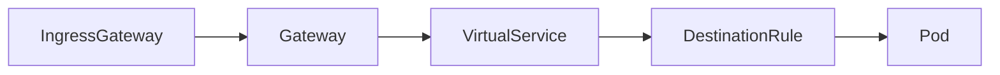
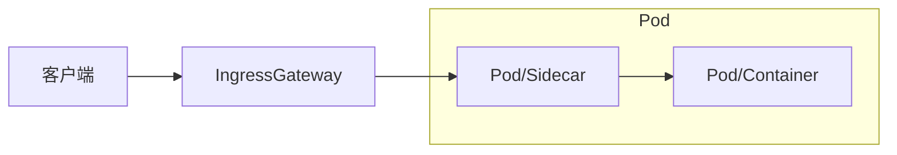
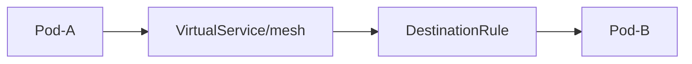
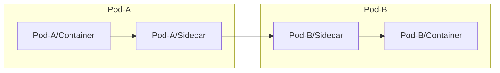

>个人笔记，不保证正确

# Istio 网格流量管理

网格流量分为两种：

1. 南北向流量：从 IngressGateway 流入网格的流量
2. 东西向流量: 网格内部 Pod 之间的流量

## 南北向流量（网关层流量）

从 CR 自定义资源层面看南北流量路径：



从容器层面看南北流量路径：



## 东西向流量（网格内流量）

从 CR 自定义资源层面看网格内流量路径：



从容器层面看网格内流量的路径：



## 流量管理

VirtualService 的 gateways 字段指定网关名称，网关名称有一个保留属性——**mesh**，表示所有集群内的流量。
如果要对集群内部的流量进行切分，就必须在 gateways 添加上 **mesh**！
gateways 默认为 **mesh**，因此对于纯内部流量，可以省略 gateways 属性。


DestinationRule 是一个负载均衡配置，它使用 Label 对 endpoints （在 k8s 中就是 Pod）进行分类。
并且它的规则将覆盖掉 K8s 自带的 Service 的规则。

而 VirtualService 可以根据配置将流量按比例分配给各类 subset，这个规则是在 SideCar/Gateway 中生效的。
当 VirutalService 的 gateways 列表中包含有 `mesh` 时，VirutalService 配置将会被分发到网格中所有的 SideCar。
当 VirutalService 的 gateways 列表中包含有 `xxxgateway` 时，VirutalService 配置将会被分发到对应的 Gateway 容器中。

如果你的 VS 规则需要应用到多个 gateways 中，同时也需要应用到 mesh 中，那就 `mesh` 和 `xxxgateway` 都加上。


流量是被靠近客户端的 SideCar 处理转发的，比如入口流量就会在网关层直接处理。
而 Pod A 访问 Pod B，那请求会被 Pod A 中的 SideCar 处理、负载均衡。
Pod A 的 SideCar 会查询出所有 Pod B 的副本（SideCar），使用 DestinationRule 中配置的行负载均衡策略进行转发。

使用了 Istio 服务网格后，实际上 k8s Service 的负载均衡功能就没有被使用了。但是 Service 仍然被用来查询所有的 endpoints，所以不能去掉。


## 东西向流量管理：VirtualService 与 Service

VirtualService 如果想要管理 k8s service 的 HTTP/TCP 流量，有两个点：

1. hosts 中要包含该 k8s service 的 DNS 域名（可使用通配符 `*` 做前缀），Istio 官方建议使用 全限定域名 FQDN（比如 `reviews.default.svc.cluster.local`）。
2. 如果 k8s service 有多个端口，你还需要设置 `http.match.port`/`tcp.match.port`/`tls.match.port` 以说明你的路由规则需要被应用到哪个端口。
   1. 否则会匹配所有端口。
   2. 大部分的 k8s service 都只会暴露出一个端口，这种情况下可以忽略掉端口号的配置。
3. 流量切分的 weight 总和[必须为 100](https://istio.io/latest/docs/reference/config/networking/virtual-service/#HTTPRouteDestination)，这是 istio 当前的限制。
   1. envoy 已经支持[调整 `weight_taotl` 的值](https://www.envoyproxy.io/docs/envoy/latest/api-v3/config/route/v3/route_components.proto#envoy-v3-api-field-config-route-v3-weightedcluster-total-weight)，但是 istio 仍未支持


- [VirutalService - Istio](https://istio.io/zh/docs/reference/config/networking/virtual-service/#VirtualService)


## IngressGateway

### 添加 gzip 压缩

>生产环境下，建议在对外负载均衡上配置 gzip 压缩，内网流量(istio)不压缩。因为内网带宽很够，而且不费钱。
也就是说，这里介绍的 gzip 压缩配置，开发环境用用就行了，别在生产环境配。


参考：[Istio - Support gzip compression](https://github.com/istio/istio/issues/18443#issuecomment-562628682)

```yaml
---
apiVersion: networking.istio.io/v1alpha3
kind: EnvoyFilter
metadata:
  name: ingressgateway-gzip
  namespace: istio-system
spec:
  workloadSelector:
    labels:
      istio: ingressgateway
  configPatches:
    - applyTo: HTTP_FILTER
      match:
        context: GATEWAY
        listener:
          filterChain:
            filter:
              name: "envoy.http_connection_manager"
              subFilter:
                name: 'envoy.router'
      patch:
        operation: INSERT_BEFORE
        value:
          name: envoy.gzip
          config:
            remove_accept_encoding_header: true
            compression_level: DEFAULT
```

## [Locality Load Balancing](https://istio.io/latest/docs/tasks/traffic-management/locality-load-balancing/)

使用此功能，应该可以实现 Zone Aware Load Balancing，大量跨区流量成本，但是需要注意负载是否均衡！

为了避免负载不均衡，或许需要考虑结合使用 descheduler/podAntiAffinity/nodeAffinity/服务间的 pod 亲和，确保各可用区的 pods 数量较为均衡。


```yaml
apiVersion: networking.istio.io/v1beta1
kind: DestinationRule
metadata:
  name: helloworld
spec:
  host: helloworld.sample.svc.cluster.local
  trafficPolicy:
    loadBalancer:
      localityLbSetting:  # 启用本地负载均衡，其余全部使用默认策略
        enabled: true
        # 默认会按每个 zone 的 endpoints 数量来设置权重，完全起不到降低跨区流量的效果！
        distribute:
        # - from: us-east-1/us-east-1a/*
        #   to:
        #     "us-east-1/us-east-1a/*": 80  # 80% 的流量走当前 zone
        #     "us-east-1/us-east-1b/*": 20  # 20% 的流量走其他 zone
        # - from: us-east-1/us-east-1b/*
        #   to:
        #     "us-east-1/us-east-1a/*": 20
        #     "us-east-1/us-east-1b/*": 80
    # outlierDetection 或许可以缓解服务雪崩的问题，给服务一定的时间恢复自己
    # 但是终极手段应该还是 pod 的 warm up
    outlierDetection:
      interval: 3s
      consecutive5xxErrors: 120  # 如果 3s 内有 100 个 5xx
      consecutiveGatewayErrors: 15  # gateway Error 是非常严重的网络层问题！
      baseEjectionTime: 30s       # 给该 endpoint 30s 的时间恢复自己，期间不会有流量过去
      maxEjectionPercent: 10  # 最多只有 10% 的 endpoints 可以被 eject.
```