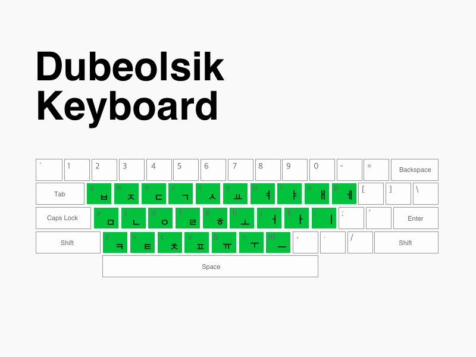

# 韩语音节（한글 音节）

韩文（한글，Hangul）是韩国使用的文字系统，由世宗大王于 1443 年创造。

韩文是一种拼音文字，与日语的假名类似，但有以下关键区别：

## 韩文 vs 日文

| 特性 | 韩文（한글） | 日文假名 |
|------|-------------|----------|
| **文字数量** | 24 个基本字母（14 辅音 + 10 元音） | 46 个基础假名（平假名）+ 46 个（片假名） |
| **组合方式** | 字母组合成方块音节 | 假名单独或组合使用 |
| **书写方向** | 从左到右，现代韩语从上到下 | 从左到右，从上到下 |
| **汉字使用** | 现代韩语已基本不用汉字（但仍保有大量汉字词读音） | 仍然大量使用汉字 |


## 韩文结构

韩文音节由**辅音**和**元音**组合成方块形状：

```
辅音 + 元音 → 音节块
```

**示例：**
- `ㅎ` (h) + `ㅏ` (a) = `하` (ha)
- `ㄴ` (n) + `ㅏ` (a) = `나` (na)
- `ㄱ` (g/k) + `ㅏ` (a) = `가` (ga)

## 音节组成规则

韩语音节块可以有以下几种组合方式：

1. **辅音 + 元音**（2 个字母）
   - 가 (ga), 나 (na), 다 (da)

2. **辅音 + 元音 + 辅音**（3 个字母）
   - 강 (gang), 한 (han), 곶 (got)

3. **辅音 + 元音 + 辅音 + 辅音**（4 个字母）
   - 값 (kaps), 없 (eops), 많 (manh)

## 基本字母

> 注意：虽然韩语也有罗马音（romaji），但基本只在英文场景中使用（如护照、国际航班、英文标注等），基本没啥人用它作为韩语输入法。

### 辅音（자음）
详见 [consonants.md](consonants.md)

### 元音（모음）
详见 [vowels.md](vowels.md)

## 学习顺序

建议按以下顺序学习韩语音节：

1. **第一步**：掌握 14 个基本辅音
2. **第二步**：掌握 10 个基本元音
3. **第三步**：学习辅音 + 元音组合
4. **第四步**：学习收音（받침，音节末尾的辅音）
5. **第五步**：学习双元音和紧辅音

## 在 Linux 上输入韩语

使用 **fcitx5-hangul** 输入法：
- 默认使用 **두벌식 (Dubeolsik - 双排式)** 输入法
- 直接输入字母对应的键位，输入法会自动组合成音节块
- 例如：输入 `h` + `k` → `하`，输入 `g` + `k` → `가`

键位映射图：




## 下一步

开始学习：
- [辅音](consonants.md)
- [元音](vowels.md)
