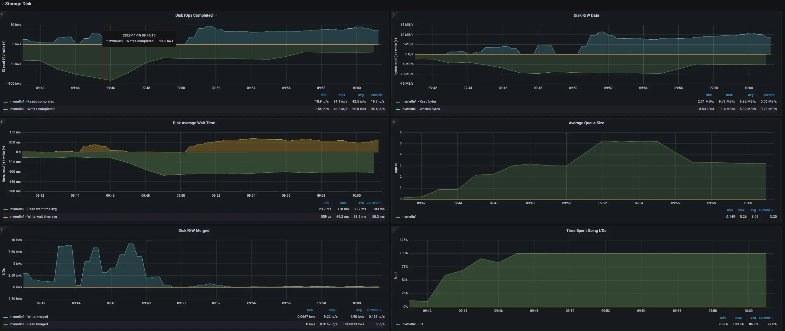

# Linux SSD IO 性能问题与解决思路

## 一、磁盘 IOPS 跟读写速率都很低，但 IO 利用率一直 100%，应用程序响应很慢

### 1 案例一：AIGC 程序

环境：

1. 系统：Amazon Linux 2
2. 磁盘：AWS GP3 类型，IOPS 3000，吞吐量 750MB/s
3. 应用程序：AIGC 推理服务

现象：

node-exporter 提供的磁盘相关监控指标：

AIGC 推理程序在首次运行时会因为 IO 问题卡 15 分钟，后续运行时因为数据已经缓存到内存中，所以不会再出
现这种卡顿。

把 GP3 的吞吐上限改到 750MB/s，没任何改善。鉴于监控中的 IOPS 也不超过 100，预计把 IOPS 调高也没啥
用。

### 2 案例二：Kafka 节点

线上环境中经常遇到某 Kafka 节点因为磁盘 IO 跑满导致响应满，无法正常提供服务。但监控看 IOPS 跟读写速
率都很低，只有 IO 使用率一直 100%。

### 3 排查思路

#### 3.1. 底层原理分析

要搞明白这个问题的原因，需要首先理解 HDD/SSD 的性能区别，以及 Linux 系统中相应的驱动程序架构，如下这
篇文章对此有比较详细的说明：

- [【阿里云总监课】存储系统设计——NVMe SSD性能影响因素一探究竟](https://developer.aliyun.com/article/658502)

简单的说，HDD 是通过单个磁头读写数据，所以针对 HDD 的 AHCI 规范只定义了一个命令队列，即不论 CPU 有几
个核，HDD 都只能同时处理一个 IO 请求。

而 SSD 的性能全方位地超越了 HDD，并且硬件层面就支持多个并发 IO，所以针对 SSD 的 NVMe 规范采用了多队
列设计。从软件层面看，每个 CPU Core 都可以创建一对 Queue Pair 和 SSD 进行数据交互。

SSD 的性能受两方面的影响：

1. 硬件层面：比如 NAND Flash 的类别（TLC/QLC/SLC/MLC/...）、后端通道数（CE数量）及总线频率、SSD 控制
   器的处理能力与架构、PCIe 带宽、使用寿命等等。
   1. 由于我们这里主要考虑云服务场景，硬件层面的因素不展开讨论。
2. 软件层面：即 Linux 系统层面
   1. **数据布局方式**：数据布局方法需要充分考虑NAND Flash中的并发单元，如何将IO操作转换成NAND Flash
      的并发操作，这是数据布局需要考虑的问题。例如，采用数据交错的方式在多通道page上进行数据布局，通
      过这种方式可以优化顺序带宽。
   2. **垃圾回收 / wear leveling 调度方法**：数据回收、wear leveling、data retention等操作会产生大量
      的NAND Flash后端流量，后端流量直接反应了SSD的写放大系数，也直接体现在后端带宽的占用。
   3. **Overprovisioning 预留空间**：为了解决坏块、垃圾回收等问题，在SSD内部预留了一部分空闲资源作为
      备用，即 Overprovisioning 空间。
   4. **IO调度算法**：NAND Flash具有严重的性能不对称性，Flash Erase和Program具有ms级延迟，Flash read
      的延迟在us级。因此，如何调度Erase、Program以及read是SSD后端设计需要考虑的问题。另外，前端IO以
      及背景IO之间的调度也是需要权衡考虑，通过IO调度可以达到最佳性能表现。在IO调度过程中，还需要利用
      NAND Flash的特性，例如Program Suspension，通过这些特性的利用，最优化SSD前端IO性能。
   5. **IO Pattern**：IO Pattern影响了SSD内部的GC数据布局，间接影响了GC过程中的数据搬移量，决定了后
      端流量。当IO Pattern为全顺序时，这种Pattern对SSD内部GC是最为友好的，写放大接近于1，因此具有最
      好的性能；当IO Pattern为小块随机时，会产生较多的GC搬移数据量，因此性能大为下降。在实际应用中，
      需要通过本地文件系统最优化IO Pattern，获取最佳性能。
   6. FTL算法 / Bit error 处理机制，这几个不展开了。
   7. 系统层面的系统优化：比如内存中的 Page Cache、文件系统、SSD 驱动程序的实现方式等等。
3. 云服务场景下的特殊因素：
   1. AWS 的 GP3 或 GCP 的 pd-ssd 都是云磁盘，底层架构的差异会导致一些意料之外的性能差异。
      1. 比如说 AWS 上从 EBS 快照（或 AMI 镜像）新建的 EBS 卷在第一次被读取时是「冷数据」，这些数据
         的读速度非常慢（可能低于 10M/s），不论如何调整 IOPS 与吞吐量都无济于事。而一旦这些数据被读
         取过一次
         （[初始化 Amazon EBS 卷](https://docs.aws.amazon.com/zh_cn/AWSEC2/latest/UserGuide/ebs-initialize.html)），
         就会被缓存到离 EC2 最近的后端存储系统中，后续再读取这些数据就能达到预设的 IOPS / 吞吐量了。

我们在前面看到的两个案例中，都是因为 IO 利用率一直 100%，但 IOPS 和读写速率、CPU 利用率等都很低。这
说明 AWS 的 GP3 云磁盘卡在了其他因素上，与 GP3 磁盘本身的 IOPS / 吞吐量以及 CPU 性能等无关。

进一步排查实际上就能确认这是因为 AWS EBS 快照未预热，读「冷数据」导致的。

#### 3.2. 排查

首先我们已经通过 node-exporter 对应的 grafana 监控面板，确定了当前磁盘 IO 利用率一直 100%、IOPS 与读
写速率都很低，一开始读的 wait 显然非常高，能确认是卡在了读上面。

进一步可用 `iotop` 定位到消耗 IO 的进程，然后用 `strace -f -T -tt -e read -p $pid` 与 `lsof -p $pid`
定位到导致 IO 高的文件。

#### 4. 解决思路

常见手段：

1. 针对磁盘和应用程序 I/O 模式的特征，我们可以选择最适合的 I/O 调度算法。云主机一般都默认用 `noop`
   算法，但对于 kafka / mysql / aigc 等应用场景，`deadline` 可能更合适。
   1. If in doubt, use the `deadline` scheduler.
2. 对于顺序读较多的场景，调整 /sys/block/sdb/queue/read_ahead_kb 的值，增大磁盘的预读数据。
3. 对应用程序进行磁盘级别的隔离，比如把 kafka 的数据目录和日志目录这些 IO 压力较高的目录分别放到不同
   的磁盘上。
4. 应用程序层面的优化，比如 kafka 自身就通过追加写的方式来减少磁盘随机写的次数，从而提高性能。kafka
   本身也有一些 IO 行为相关的参数可调整。
5. 对于云主机可以考虑如下手段：
   1. 使用本地存储卷（Local SSD / Local NVMe Storage），它的性能远高于 AWS EBS / GCP pd-ssd / Aliyun
      ESSD 等云磁盘，但其中的数据在多种情况下并不持久化，需要自己做好数据备份与容灾考量。
   2. 不要将数据预置在 AWS 的 EBS 卷快照中，而是在启动时再从 S3 将数据下载到本地，这样就能避免 EBS
      卷冷数据读取速度慢的问题。

## 参考

- [Linux性能优化实践-磁盘I/O篇](https://mp.weixin.qq.com/s/mLEVKXShnifHbQiQrgJGSA)
