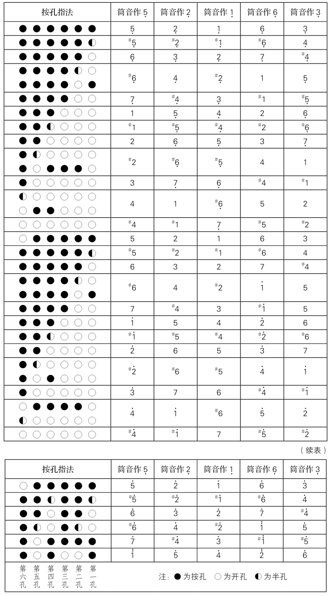
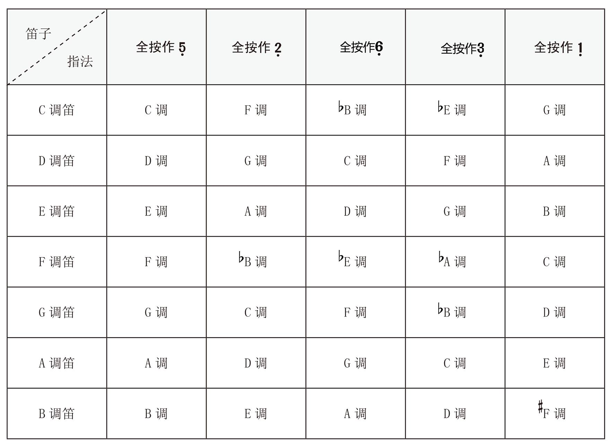

首先我们要知道，竹笛传统上很难演奏半音，它主要是个首调乐器。

因此绝大多数竹笛资料就使用简谱，下面的资料也主要是以首调为基础的。

# 竹笛的常用指法（含半孔技术）

## 竹笛及指法的转调一览表

# 竹笛的音域

利用上半孔技术，笛子能演奏出完整的 12 音阶。这对竹笛与现代音乐结合是很重要的。

但是按半孔、超吹这类技巧要都有一定难度。按半孔把握不好也会导致音不准。

总的来说，要使用竹笛演奏有些难度的十二平均律的曲子，比如 ACG 作品，是有一定难度的，需要熟练掌握住半孔手法。

