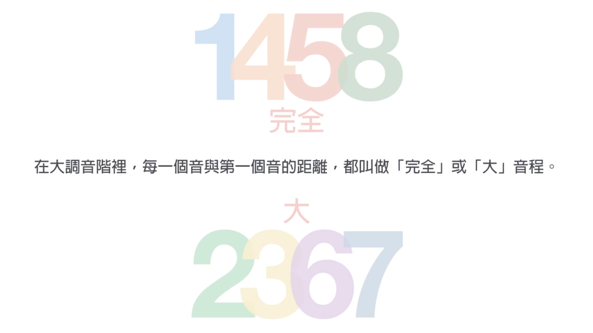
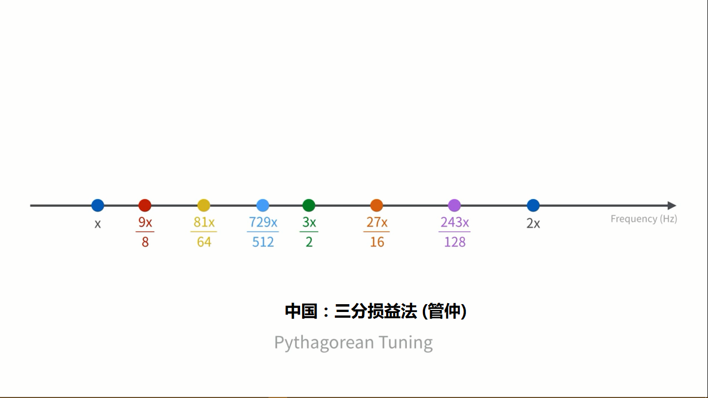
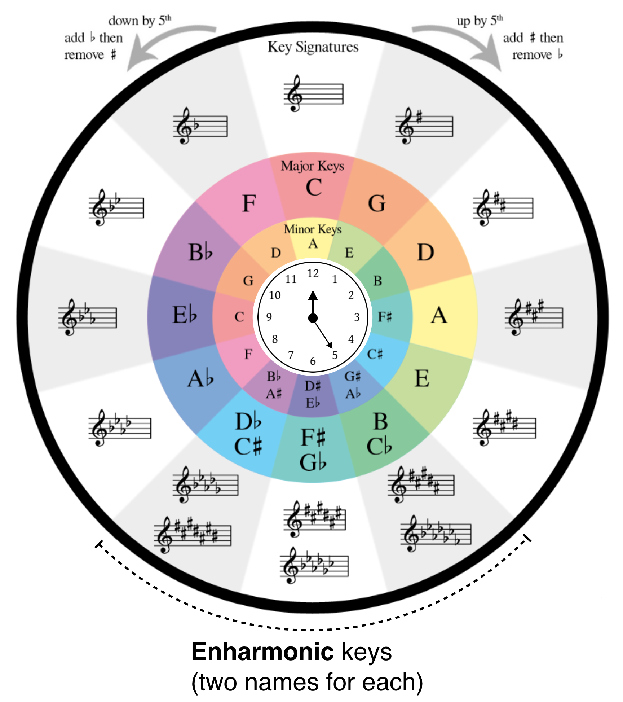
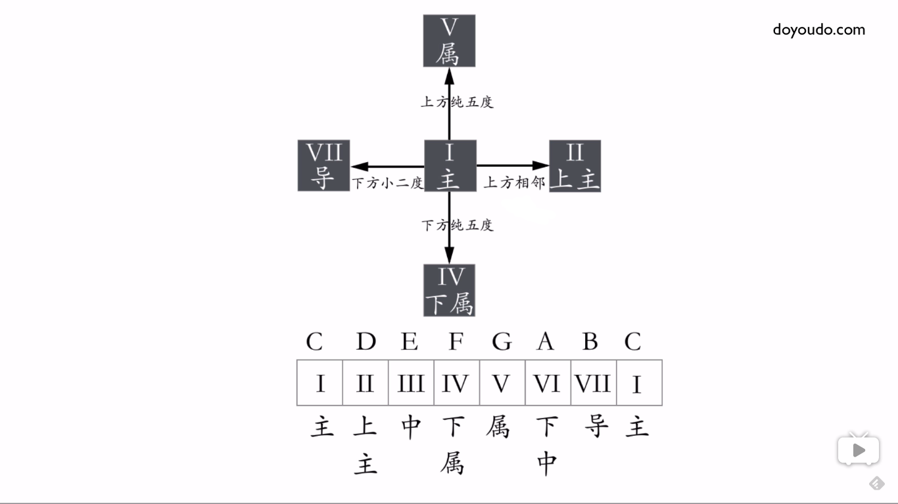
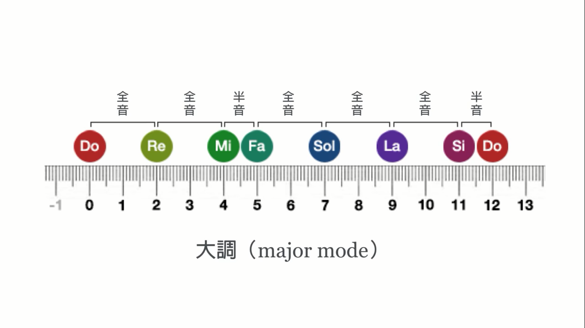
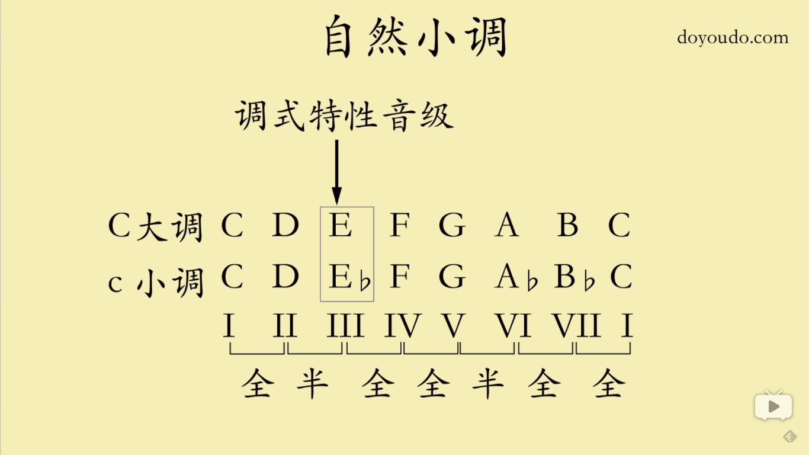
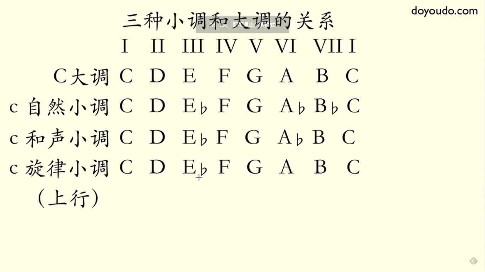

# 乐理基础

`乐理`

1. **音色：**由泛音列的频谱决定。
2. **音长关系**
   1. **节拍**: 3/4 分子表示一小节三拍，分母表示以四分音符为一拍
   2. **节奏**: 音长间的关系，还有拍子的强弱。
   3. **bpm**: beats(节拍) per minute

3. **音高关系**: 其实质是音频比值的关系
   1. **音名CDEFGAB/唱名1234567**
   2. **全音(Whole step)/半音(Half step)**
   3. **音程(interval):** [纯/大/小/增/减][0-8]度  (Quality + Quantity)
        - [0-8] 表示包含的音级(CDEFGAB)。包含的音级数目相同的，半音少的为小/减，伴音多的为大/增, 见下图：

        - 如果不在这里面，再根据音程的宽度，由下图推算你听到的实际音程。.png)

          1. **纯(Perfect)音程**: 是音频比值较为单纯的音程，又分为**完全协和(Perfect harmonic)音程**和**协和音程**，完全协和的有“同度(1:1)“、“八度(2:1)“，协和的有“五度(3:2)“、“四度(4:3)“。它们被称作**纯[1/8/5/4]度**
          2. **大(Major)/小(Minor)音程**： 稍微复杂些的比数关系，比如5：4、6：5、8：5、5：3这四种比数关系上的各自两音，仍属于协和的音关系，但其协和程度较上述纯音程要差许多，所以称为“**不完全协和的音关系**”，用音程来表述，就是**“大/小三度”、“大/小六度”**。
          3. **不协和音程:** 剩下的都属不协和音程，有**大/小二度，大/小七度、增四/减五度，及其他增减音程(变化音程)**。
          4. **音程转位: 度数和为9，[大小/增减]互换，纯音程仍为纯音程。** 用于从容易判断的音程来推断一时难以判断的音程。例如F-E的音程直接算需要一定时间，但可很快地由"E-F是小二度"推出它是大七度。
          5. **和弦：**是指組合在一起的兩個或更多不同音高的音。但在现代流行乐/古典乐中，更多的是指**三個或以上的音三度叠置**而成的组合(两个音用音程表示)。和弦中的第一个音叫根音，叠上去的音依次叫三音、五音、七音、九音、十一音......
          6. **律制：**所谓律制，即是用以确定一个乐音体系中乐音音阶(scale)的标准方法——即采用某种特定的频比关系，作为推算一系列乐音音频值的基本算法。律，即是特定算法得出的各个结果，是该体系下，各个乐音音高的标准尺度。符合这一尺度的音，即可被采纳为该乐音体系中的乐音。
               - 2：1的音关系，是八度音关系，这一关系上的两音，被认为只有音高差异，没有性质上的不同，故被当作同样的乐音，使用相同的音名。所以，现代音乐的乐音体系中，只有七个音名，即用C D E F G A B这七个字母表示。
               - **五度相生律**：2:1已经用了，而剩下3：2这一关系，就构成了其他乐音音高推算的基础。在某一特定音高的音频值上，经过多次与3/2相乘，次第得出其他六个乐音的音频值，再乘以或除以若干次2（按八度关系移动），即得到各个八度内的各音音高。由于3：2这一频比关系是音程上的纯五度关系，故这种生律方式称为“五度相生律”。**五度相生律是最自然的律法**。(但存在狼音程问题)

            1. **纯律**：在五度相生律的基础上，简化了三度音程(因为这个音程用的越来越多)的算法。如在五度相生律，大三度音需要经由音程上的低音向上作四次五度相生才可得到，这使得两音的频比关系稍微复杂（81：64），较之大二度音程上两音的频比（9：8）还不协和。为了和声上的需要，纯律在分音列中找到解决办法——即在纯五度两音中，插入一中间音，使得三音的频比关系为4：5：6，如此5：4就是大三度（5/4，上下同时乘以16这一公倍数，即得80/64，这与五度相生律下的大三度上两音频比关系81/64极为接近），6：5就是小三度。简化小三度使当时使用越来越广泛的小三度和谐了，但是纯五度却因此变得很复杂。
            1. **十二平均律**：因3：2这一比数不可整除，故单纯以之作为推算的基础，则八度音的还原就不可能，而且，经其推算的半音并不相等，比如C到#C，与#C到D，这两个半音大小是不一致的，后者要稍大于前者。如此，就为乐曲的转调，以及多种不同的乐器间合奏带来困难。所以有了等程律的必要，即使一个八度中每个半音都完全相等。
               - 自然大音阶中，一个八度内共有十二个半音。若使每个半音都相等，最直接的办法，就是以八度音程上两音的频比值，开12次方，即得到统一的每个半音上两音的频比值，约1.059463。

               - 大二度音程中有两个半音，则由低音的音频乘以1.059463^2，即得到上方音的音频值；若纯五度则含有7个半音，则低音音频值乘以1.059463的7次方，即可得到上方音。这一计算音律的方法，就称为“十二平均律”。

               - **十二平均律是一种人工律制**，与纯自然的五度相生律不同。虽然它为音乐的演奏、演唱，乃至记谱的诸多方面带来了极大便利。但由此，也将乐音的音关系特征弱化了。因为在十二平均律的算法中，所有乐音间的关系亲密性都是平等的。不像五度相生律中，可以直观地看到——**两音间经过五度相生的次数越少，两音关系就越密切；反之则越疏远。。。。**

        1. **五度循环圈：**纯五度是协和度仅次于纯一/八度的音程，应用很广。(记忆方式:上午11点(F)，猫饿了，所以**F**at **C**at **G**o**D**own **A**nd **E**at **B**read； 到下午6点猫又饿了，再次**G**o **D**own **A**nd **E**at **B**read。也就是说从五度圈的11点开始，顺时针方向依次是FCGDAEB，从6点钟开始又是GDAEB，由于是晚上这些音都要降半音，即在后在面都加个b。)
        1. **调式(mode)** 若干高低不同的乐音(律制内)，围绕某一有稳定感的中心音，按一定的[音程](http://baike.baidu.com/item/%E9%9F%B3%E7%A8%8B)关系组织在一起，成为一个有机的体系，称为调式。

        1. 调式的音级名称(用于说明每个音在音阶中的地位和性质，其中主音、与主音相差纯五度的属音和下属音，这三个音最为特别，以它们为根音的和弦统称正三和弦。)    
            1. (自然)大调(natural major)：    1. "大调"表示按**“全全半全全全半”**的规律得到音阶(scales)的方法。
            
            2. 自然小调: 将X大调的3、6、7音降低半音，就得到X小调。
            
            3. 关系大小调：关系大小调拥有相同的音阶和调号，大调下行小三度即为它的关系小调。
            4. 其它小调: 和声小调是用来解决小调在和声上的使用问题，而旋律小调是用来解决和声小调的旋律问题。
        
        2. 总结：音乐的音高关系中，协和的音高关系是主导。所以，一个乐音体系的确立，是构建于这种主导的协和音关系的基础上的。因此，完全协和的音关系中，2：1和3：2这两种频比关系，就成为构建整个乐音体系的核心标准。即便是十二平均律下，八度（2：1频比关系）和五度（比值约为1.498，接近3：2这一比数的值1.5）也是一切音关系的核心。
