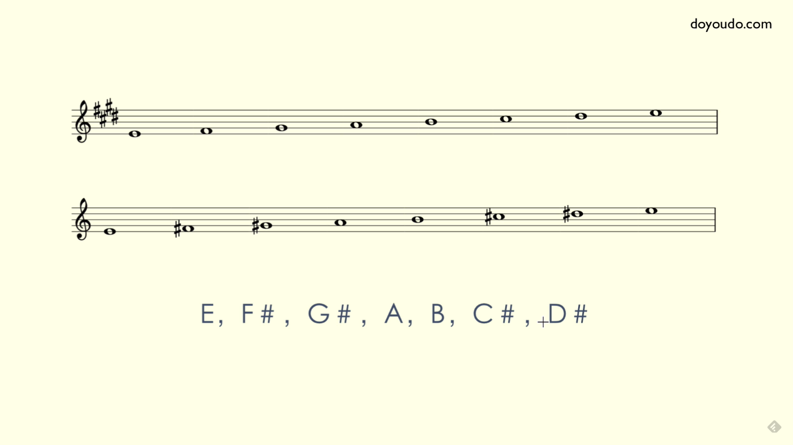
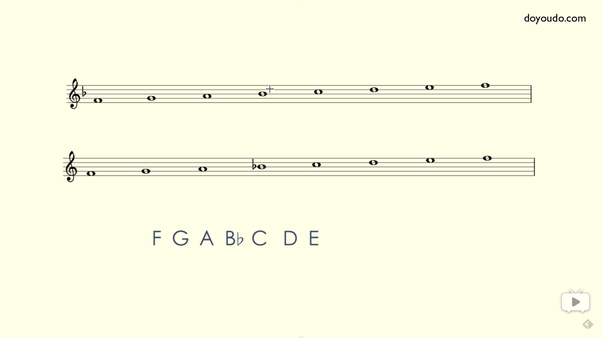
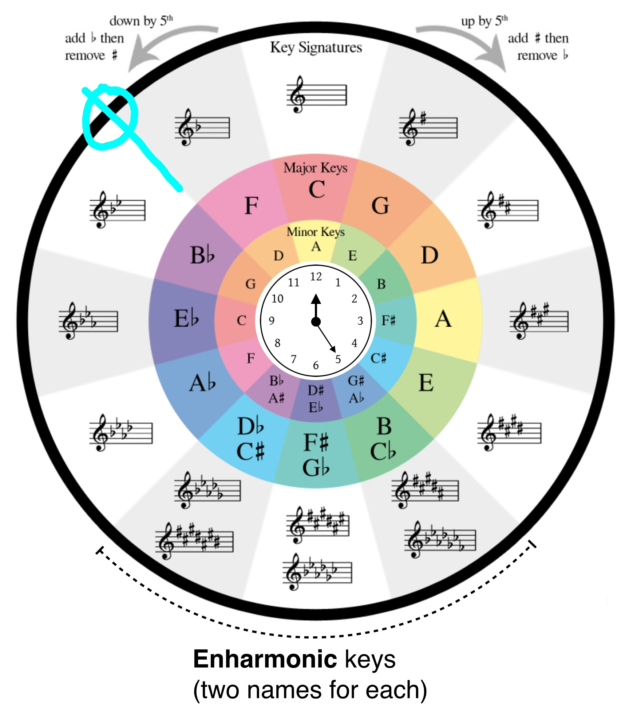

# 五线谱调号的判别与书写原理

`乐理`

X大调表示1(do)在X，X小调表示6(la)在X。这是音名与唱名的对应关系。而1/6是指乐曲的主音。通常乐曲从主音/
主和弦(家)开始进行，最后再回到主音(家)。

简谱开头通都有标识“1=Y”，然后通过结束音是“1”还是“6”判别大小调，再用开头的“1=X”推断出调的主音。

而对五线谱，先通过调号判断主音，再看 尾和弦/尾音 的根音，得到对应调式。

识别：

.png>)

原理：

上图下方是E大调的音阶(按全全半全全全半得出)。把它写在五线谱上，有上面两种等价的形式。

E大调谱号 通过在F-C-G-D(顺序原理见下面的五度循环圈)四个音名对应的 线/间 写上#号，表示这四个 线/间(升
降x个八度也同样适用) 上的音符默认升高半音，从而在后面的音符中省略了#号。

这个降号调也是一样，通过在B音名对应的 线(第三线)上书写一个b，从而在后面省略了b号。

谱号书写：

**调号书写规律(**低音谱号也一样**)**是，在五度循环圈上，从中间的C大调开始往两边，升号调/降号调依次增
加#号/b号。

而这依次增加的 #或者b 书写的位置的规律是，从左上方的蓝色圆圈开始往两边，#/b一次书写在对应音名(上图的
外圈)，所对应的线/间上。

**而小调的调号，与其上数两个音名对应的大调的调号相同。**

p.s. C#和CЬ调号基本不用(因为它们的等音调号更简单。)
