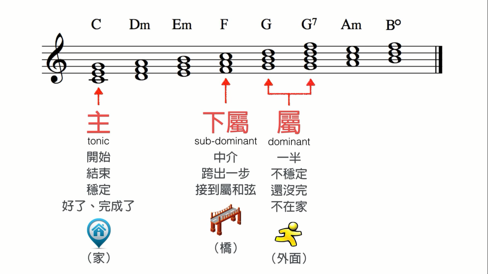
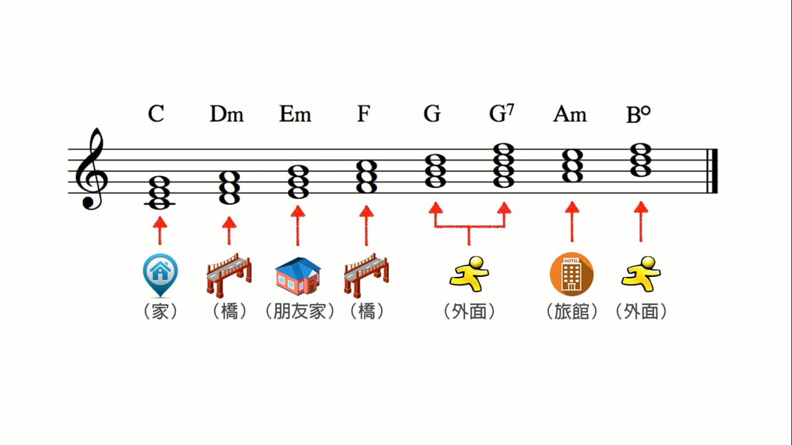
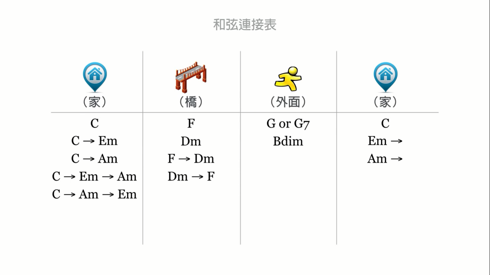

# 和弦的功能(以C大调为例)

`乐理`

**1. 三个最常用、最有用的和弦的功
能：**

主(C):      135

下属(F):  461

属(G):      572  (半终止)

**2. 七个基本和弦的功能:**

上主和弦(Dm): 246

和下属和弦(F)有两个相同的音(46)，所以和下属和弦一样有桥的功能。

中和弦(Em): 357

和主和弦(C)有两个相同的音(35)，所以有家的功能，又和属和弦(G)有同样的两个音(57)，所以又不全是在家。于
是就成了朋友家。

下中和弦(Am):613

和主和弦有两个相同的音，有家的感觉，又和下属和弦有两个相同音，像桥。综合起来就是旅馆。

导和弦(B°): 724

只和属和弦有两个相同的音，在外面。

\*\*

\*\*

**3. 和弦的走向图: (从家出发，最后回到家)**

**其它大调的和弦：**

所有大调，都有是**135 246 357 461 572 613 724**这七个三和弦，由此可知大调任一级和弦的大小是确定了
的。

以G大调为例，它以G为do，于是得到 G**major** A**m** B**m** C**major** D**major** (D7**major**) E**m**
F#**°** 这七个和弦，可以看到它的X级和弦的大小和C大调
是一样的。
