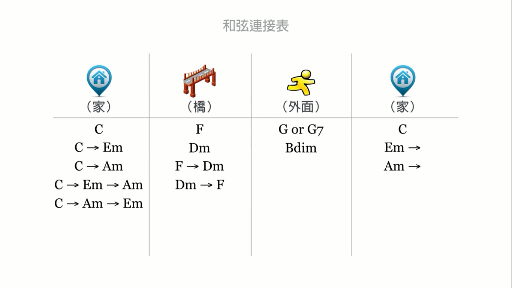

# 给歌曲配和弦

`乐理`

基本方法：

1. 每小节配一到两个和弦。
2. 编排要遵循和弦走向图。

3. 和弦出现的时候对应的旋律音一定要是和弦的组成音，这样听起来才和谐。

确定和弦后，要做进一步编排，因为**存粹的三和弦太过单调**：

1. **低音部一般为两个音**，且最低的音和次低音之间的距离不能低于一个五度。由于最低音一般为根音，所以
   要把三音升一个八度，这样次低音为五音，刚好一个五度。
2. **三个音太少，要多加几个音使之更丰满。**可用的音除了和弦本身的音外，还可以用与根音相差一度的两个
   音(构成九和弦)。
3. 遵循**上密下疏，中间适中**原则。就是低音部要疏(相差五度以上)，上面的音域要稍密集一点，两个音域之
   间的距离不能超过一个八度(要适中)。
4. 和弦变换时要遵循**平稳过渡**原则，尤其是容易辨识的高音部分，变化不能太过突兀。最好可以一直有一个
   共同音。可以通过适当选音、升降八度解决它。

**给很长的和弦加花，让它不要太无聊：**

1. 用sus2和sus4玩点花样
2. 添加九音、十一音或十三音
3. 添加二音
4. 使用其它变化和弦

所有的音同起同落也比较呆板，所以需要**分解和弦：**

1. 一个和弦内，高音部分可以重复两次，而低音部要一直延续到结束。

然后演奏时，可以使用和弦的组成音适当的加花。

**和弦套路：**

1. 卡农和弦

**和弦的低音部分bass的编写：**

1. bass一般演奏和弦的根音
2. bass的主节奏要跟着底鼓走，在这之上可以适当加花。

**小节之间的过渡：**

一小节结束是半终止，可用主音的高八度音和高两个八度音的连续做和弦的过渡进行状态。
