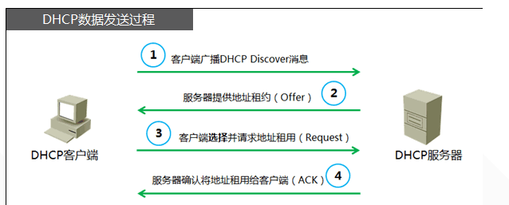

## DHCP 协议

DHCP，即 Dynamic Host Confguration Protocol，动态主机配置协议，是一个基于 UDP 的应用层协议。
可以为自动为主机分配一个可用的 IP 地址，同时告知主机子网掩码、默认网关IP、默认DNS服务器。


其中主机会根据 ip 地址和子网掩码自动生成一条网段内寻址的路由规则，该路由规则实际上只会在链路层进行寻址，不会上升到第三层。
如果有设置默认网关，还会生成一条目标网段为 `0.0.0.0/0` 的路由规则，将其他流量转发给默认网关（路由器）进行处理，路由器会使用 OSPF 等路由协议计算出的路由表，将数据路由到下一跳（next-hop）。

公用服务器需要配置静态 IP，使大家都能通过固定的 IP 访问它。而其他的个人主机（手机电脑游戏机可穿戴设备等等）基本都会使用 DHCP 协议自动获取 IP 和其他必要信息。

局域网的 DHCP 功能通常由路由器提供，因为路由器知道各网段的可用 IP 段、子网掩码、默认网关、默认 DNS 服务器。（很多路由器会自己提供自己的 DNS 递归解析器，当然也可以修改。）

DHCP 协议工作在网络层，流程如下：




1. discover: 新入网的主机，通过 UDP 协议发送一个 `DHCP 发现报文`，目标端口为 67。外层 IP 报文使用 src: 0.0.0.0，dest: 255.255.255.255（广播地址，表示将报文发送给所有主机）
1. offer: DHCP 服务器，收到请求后，同样通过广播地址 `255.255.255.255` 回复一个响应报文。该报文带有一个可用的 IP 地址，还会附上一个租期。（告诉主机这个 IP 可以用，你要不要用？）
1. request: 主机可能会收到多个 DHCP 服务器的应答，它会从中选择一个，带上该 IP 地址和 DHCP 服务器的 ID，再次广播一个 DHCP 请求。
1. ack: 目标 DHCP 服务器返回 ACK 响应。主机收到后，就知道自己可以使用这个 IP 进行通信了。
1. 租期结束后，主机会重复第三、第四步刷新租期。

设置租期，是为了回收 IP。公共场所的设备流动很快，如果 IP 分配出去就不回收，很快 IP 就不够用了。

### DHCP 的租约设置为多长比较合适？

参见 [What is a good DHCP lease timeout configuration？](https://serverfault.com/questions/251815/what-is-a-good-dhcp-lease-timeout-configuration)，
算是众说纷纭，不过比较明确的观点是租期不适合设得过短，因为有些设备/程序在工作状态刷新租期，可能会导致问题。（比如突然断一下网？）

EdgeRoute-X 的默认租期是 86400s，也就是 24h.

我们希望设短租期的原因，是为了在修改 DHCP 信息如 DNS 服务器、默认网关之类的信息时，能更及时地通知到所有服务器。（因为没有能强制更新所有主机租约的方法）

DHCP 一般会在 1/2 租期的时候尝试更新租约，我想了下，可能设 1h 应该是比较合适的值。如果出现问题就改成默认的 86400（一天）。

### 修改了 DHCP 服务器的设置后，如何强制所有主机更新租约？

目前的 DHCP 服务器没有任何手段可以干这个事！参见 [How to force ALL of the DHCP Clients to renew?](https://stackoverflow.com/questions/28917135/how-to-force-all-of-the-dhcp-clients-to-renew)

只能够通过在客户端执行更新租约的命令以实现强制更新。。（或者重启网络服务、网卡驱动）

```
# windows
ipconfig /renew

# linux，先释放旧租约，再建立新租约
sudo dhclient -r eth0 && sudo dhclient eth0
# 查看租期
cat /var/lib/dhcp/dhcpd.leases
```
