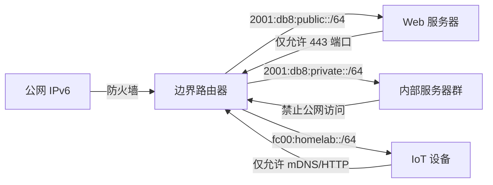

# IPv6 协议及家庭 / Homelab 配置与安全指南

## 一、IPv6 核心地址类型与配置

### **1. 全球单播地址（GUA）**

**定义**：公网可路由地址，对应 IPv4 公网地址，格式为 `2001:db8::/3` 等。\
**获取方式**：

\

| 方式              | 家庭场景适用性 | 关键配置                                                                   | 隐私与安全要点                            |
| ----------------- | -------------- | -------------------------------------------------------------------------- | ----------------------------------------- |
| **SLAAC**         | ★★★★★          | 基于 RA 前缀 + 接口 ID（默认 EUI-64，可启用**随机化接口 ID（隐私扩展）**） | 随机化 ID 避免 MAC 地址追踪，保护设备隐私 |
| **DHCPv6 有状态** | ★★☆☆☆          | 需部署服务器，分配地址 + DNS + 网关                                        | 适合企业集中管理，家庭场景复杂度高        |
| **DHCPv6 无状态** | ★★★★☆          | RA 提供前缀，DHCPv6 仅传 DNS/NTP                                           | 推荐家庭使用，兼顾自动配置与 DNS 管理     |

\

**隐私扩展配置**：\
家庭路由器应在 RA 中启用 `Privacy Extensions`
标志（多数默认开启），设备会生成临时地址（如每小时更换），减少长期地址追踪风险。

### **2. 链路本地地址（LLA，fe80::/10）**

**功能**：仅限局域网通信，用于 NDP 邻居发现、路由协议（如 OSPFv3）。\
**安全特性**：

\

- 不可路由，天然隔离公网攻击。
- 管理设备时需通过链路本地地址（如 `http://[fe80::1%eth0]/`），需注意接口标识（`%eth0`）正确性。

### **3. 新增地址类型：任播、组播、ULA**

- **任播地址（Anycast）**：\
  多个设备共享同一地址，流量路由至最近节点（如 DNS 任播服务器 `2001:4860:4860::8888`）。\
  **Homelab 场景**：搭建高可用服务（如双网关负载均衡），需路由协议支持，家庭场景通常无需配置。

- **组播地址（Multicast，ff00::/8）**：

  - `ff02::1`：所有 IPv6 节点，用于 RA 广播。
  - `ff02::2`：所有 IPv6 路由器，用于 RS 单播响应。\
    **安全提示**：家庭防火墙需放行组播流量，否则可能影响设备发现（如智能电视投屏、打印机共享）。

- **唯一本地地址（ULA，fc00::/7）**：\
  本地私网地址（类似 IPv4 的 192.168.x.x），用于 Homelab 内部隔离网络（如 `fc00:1::/64`
  测试环境），无需全球路由。

## 二、协议生态与配置深度解析

### **1. 邻居发现协议（NDP）与 ICMPv6**

**核心功能**：

- **地址解析**：替代 IPv4 ARP，通过 NS（邻居请求）/NA（邻居通告）消息解析链路层地址。
- **重复地址检测（DAD）**：设备生成 GUA 后发送 NS 消息，确保地址唯一。
- **路由器发现**：主机通过 RA/RS 消息获取前缀和配置参数。


**技术细节**：

- 基于 ICMPv6 消息（类型 133-137），所有消息源地址为发送接口的 LLA.
- 示例：主机发送 NS（Neighbor Solicitation）消息解析邻居 MAC 地址，目标地址为被解析节点的请求节点多播地址（`ff02::1:ffXX:XXXX`）。


**故障排查工具**：

- `ndisc6 -a`（Linux）：查看邻居缓存和 RA 接收详情。
- `ping6 -I eth0 fe80::1`：测试 LLA 连通性（需指定接口）。

### **2. DHCPv6 与前缀委托（PD）**

**家庭 / Homelab 典型流程**：

1. 路由器通过 DHCPv6-PD 从 ISP 获取 `/56` 的 IAPD 前缀（如 `2001:db8::/56`）。
2. 划分为多个 `/64` 子网（如 `2001:db8:1::/64` 用于手机，`2001:db8:2::/64` 用于服务器）。
3. 通过 RA 广播子网前缀，设备自动生成 GUA 或通过无状态 DHCPv6 获取 DNS（如 `240c::6666`）。

\

**安全配置**：

- 限制 DHCPv6 服务器仅响应局域网请求（绑定接口），避免公网恶意配置。
- Homelab 可配置 DHCPv6 选项 `58`（NTP 服务器）和 `24`（默认网关），实现自动化部署。

### **3. Unnumbered 模式：家庭不推荐，Homelab 谨慎用**

**定义**：接口借用其他地址（如 LLA）通信，无需独立 GUA。\

**家庭场景**：
- **不推荐**：地址充足且需直观管理的场景（如直接访问 `2001:db8::1`
  路由器），启用 Unnumbered 反而增加排查复杂度。\

**Homelab 场景**:
- **适用场景**：核心路由设备间互联接口（如 OSPFv3 邻居关系），减少地址消耗。
- **风险**：接口无独立地址，需依赖链路本地路径（如 `ping6 -I eth0 fe80::a`），本地地址在外部不可见，问题排查不便。

## 三、安全与隐私最佳实践

### **1. 地址隐私保护**

- **强制启用随机化接口 ID**：

  - Windows：`netsh interface ipv6 set global randomizeidentifiers=active`
  - Linux：`sysctl net.ipv6.conf.all.use_tempaddr=2`（`2` 表示总是使用临时地址）。

- **避免暴露 MAC 地址**：EUI-64 接口 ID 包含 MAC 前缀，随机化 ID 可隐藏设备物理标识。

### **2. 防火墙与流量控制**

**家庭路由器必放通规则**：

| 协议 / 端口           | 用途                   | 风险等级 |
| --------------------- | ---------------------- | -------- |
| ICMPv6 (类型 133-137) | NDP（邻居发现、RA/RS） | 必需     |
| UDP 546/547           | DHCPv6 客户端 / 服务器 | 必需     |
| 组播（ff02::/8）      | 设备发现（mDNS、SSDP） | 建议放行 |
| TCP 443/80            | 公网 HTTPS/HTTP 访问   | 按需     |

\

**Homelab 额外配置**：

- 隔离 IoT 子网：为 IoT 设备分配独立 `/64` 前缀（如
  `2001:db8:iot::/64`），禁止其访问内部服务器子网。
- 启用 IPsec：在 VPN 或敏感通信中强制加密（如 WireGuard over IPv6）。

### RA 广播参数配置

- 前缀（举例）：`2001:db8:abcd:0001::/64`
- M 标志：0（启用 SLAAC）
- O 标志：1（通过无状态 DHCPv6 获取 DNS）
- DNS 服务器：使用知名公共 DNS，尽量避免使用 ISP 提供的 DNS 服务器
  - [alidns](https://www.alidns.com/): `2400:3200::1`, `2400:3200:baba::1`
  - [dnspod](https://www.dnspod.cn/products/publicdns): `2402:4e00::`
  - [cloudflare](https://developers.cloudflare.com/1.1.1.1/ip-addresses/): `2606:4700:4700::1111`, `2606:4700:4700::1001`


### **4. 兼容性与攻击防范**

- **NAT64/DNS64 部署**：若设备仅支持 IPv4，可通过路由器开启 NAT64（如 `2001:db8:ffff::/96`
  转换前缀），实现 IPv6 到 IPv4 的访问。
- **关闭非必要服务**：禁止公网访问路由器的 SSH/Telnet 端口，仅允许局域网管理。
- **定期固件更新**：修复 IPv6 协议栈漏洞（如 2023 年披露的 IPv6 路由缓存溢出漏洞 CVE-2023-32313）。

## 四、家庭与 Homelab 配置模板

### **家庭路由器典型配置（以 OpenWrt 为例）**

```conf

# 1. WAN 口获取前缀（DHCPv6-PD）
interface wan
  ipv6 pd 56  # 从 ISP 获取 /56 前缀
  pd-exclude 2001:db8::/60  # 排除特定前缀（可选）

# 2. LAN 口分配子网（/64）
interface lan
  ipv6 address ${pd_prefix}1::1/64  # 假设前缀第 1 个子网为 ::1::/64
  ipv6 ra nd suppress-ra off  # 启用 RA 广播
  ipv6 ra prefix ${pd_prefix}1::/64 autonomous  # 宣告前缀
  ipv6 dhcp-server option dhcp6.name-servers 240c::6666, 240c::6644  # 配置 DNS
```

### **Homelab 安全分段示例**




## 五、故障排查 checklist

1. **地址生成失败**：

   - 检查路由器 RA 消息是否包含有效前缀（`ndisc6 -g eth0`）。
   - 确认 DHCPv6 服务器状态（家庭场景通常由路由器内置，Homelab 需独立部署）。

2. **无法访问公网**：

   - `ping6 ipv6.google.com` 测试连通性，若失败检查 WAN 口 IPv6 配置（如 DHCPv6 或 PPPoE）。
   - 检查防火墙是否阻断 ICMPv6 或 UDP 546/547。

3. **本地通信异常**：
   - `arp -n`（IPv4）无效，需用 `ip -6 neighbor` 查看 IPv6 邻居缓存，确认 LLA 可达。

## 六、隐私与安全权衡总结

| 场景               | 优先策略                          | 妥协点               |
| ------------------ | --------------------------------- | -------------------- |
| 家庭日常上网       | 启用隐私扩展地址 + 自动防火墙规则 | 牺牲少许地址生成速度 |
| Homelab 多网段隔离 | 划分 ULA/GUA 子网 + IPsec 加密    | 增加路由配置复杂度   |
| 老旧设备兼容       | 部署 NAT64/DNS64 + 限制转换流量   | 可能引入性能延迟     |

\

通过系统化配置 IPv6 地址、协议与安全策略，家庭用户可享受即插即用的高速网络，Homelab 玩家则能构建灵活、安全的下一代基础设施。始终牢记：**默认启用隐私保护，最小化公网暴露面，定期审计网络配置**。
