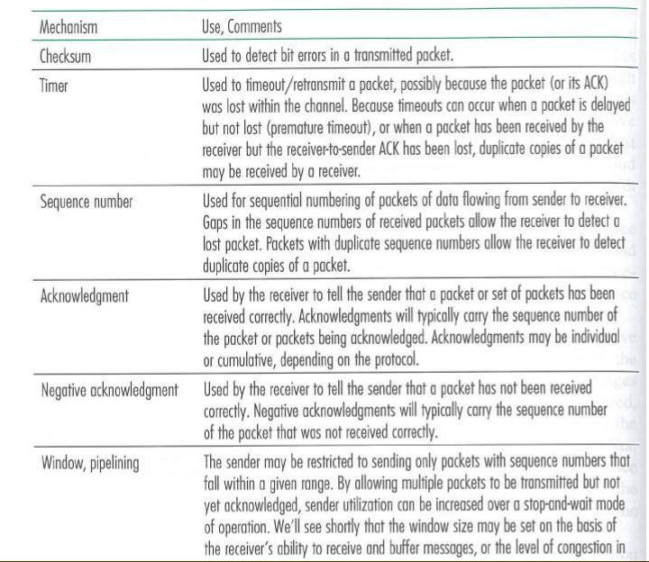

>2018-04-02

可靠传输、流水线传输、窗口变化算法

1. seq：当前分组的序列号
1. ack：是本主机接下来希望接收的分组的序列号。（虽名为确认号，但其值是被确认的分组序号+1） 

在流水线传输技术中，ack号的含义为确认接收（但其数值仍为接收到的分组序号+1 一是兼容，二是用在快速重传中）。因此发送方下一个发送的分组序号不一定和上一个确认ack号相同。 

tcp流水线技术中，分组重传只有两种可能： 

1. 收到三次冗余ack号，会执行快速重传。 
1. 分组超时，重传。

可靠数据传输所依赖的机制：

附加：在互联网络，分组序号的重用可能导致的问题。

### 参考

- [理解TCP序列号（Sequence Number）和确认号（Acknowledgment Number）](https://blog.csdn.net/a19881029/article/details/38091243)
- [浅谈TCP的窗口字段](http://blog.51cto.com/shjrouting/1612855)
- [TCP中报文段大小（MSS）、MTU](https://blog.csdn.net/bian_qing_quan11/article/details/72630354)
