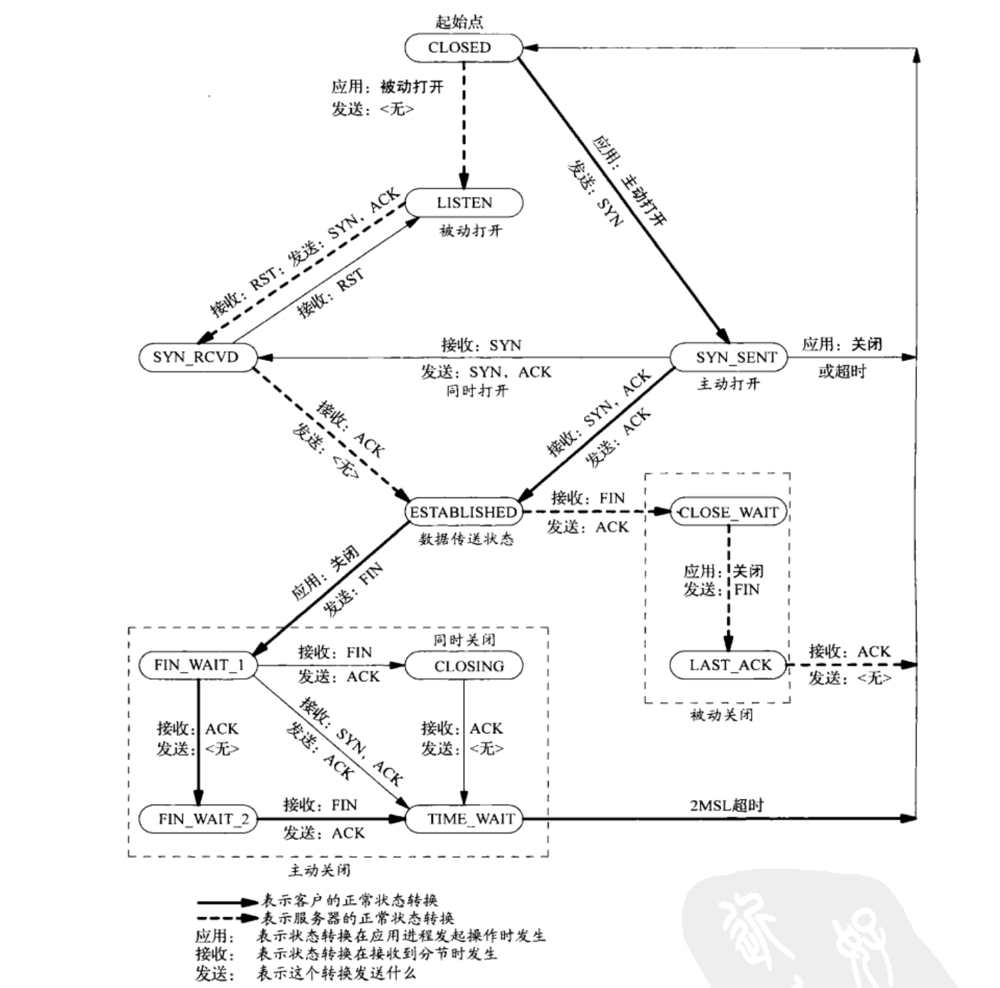

> 2018-04-02

## TCP 协议

### 可靠传输、流水线传输、窗口变化算法

1. seq：当前分组的序列号
1. ack：是本主机接下来希望接收的分组的序列号。（虽名为确认号，但其值是被确认的分组序号+1）

在流水线传输技术中，ack号的含义为确认接收（但其数值仍为接收到的分组序号+1 一是兼容，二是用在快速重传
中）。因此发送方下一个发送的分组序号不一定和上一个确认ack号相同。

tcp流水线技术中，分组重传只有两种可能：

1. 收到三次冗余ack号，会执行快速重传。
1. 分组超时，重传。

可靠数据传输所依赖的机制： 

附加：在互联网络，分组序号的重用可能导致的问题。

### TCP 连接的状态变化图



### 三次握手及 SYN 洪泛攻击

建立连接需要三次握手，并且客户端和服务端都需要为连接分配资源。

- 服务端通常在接收到 SYN 数据包后，发送第二次握手数据包的同时，会为将连接放入「未连接队列」，同时将
  此连接的状态 LISTEN => SYN_RCVD
- 客户端通常在完成三次握手后，才为连接分配资源。

攻击者通过大量发送 SYN 数据包给服务端，同时拒绝接收服务端发回的 SYN-ACK 数据包，可以快速填满服务端的
「未连接队列」，导致大量连接因为队列超出上限而被丢弃（或者 cpu/mem 资源耗尽），无法 TCP 建立连接，使
服务端「拒绝服务」。

### 断开连接的四次挥手及 TIME_WAIT

断开连接中比较特殊的一个状态是 TIME_WAIT。

TCP 连接中主动断开连接的一方（即最先发送 FIN 的一方），会进入 TIME_WAIT 阶段，等待 2msl 后才进入
CLOSED 状态。

MSL 即最大报文段的寿命，在 Linux 中硬编码了它的值为 60HZ（差不多为 60s，极端情况下用时可能会不精确，
在 52.5s - 112.5s 之间波动）：

```
# 允许重用 TIME_WAIT 状态的连接，具体原理还不是很清楚，但是肯定还是得重建 tcp 连接吧？
net.ipv4.tcp_tw_reuse = 1
define TCP_TIMEWAIT_LEN (60HZ) / how long to wait to destroy TIME-WAIT
```

反向代理/负载均衡器（比如 Nginx）的服务器上通常都会出现很多的 TIME_WAIT，就是因为 TIME_WAIT 要等这么
久。

每个 tcp 连接（客户端 ip+port - 服务端 ip+port 这一个结对）在 TIME_WAIT 阶段，都是不可用的。所以在高
并发场景下，Nginx 代理服务器可能会在同一时间内关掉了过多的连接，然后又重新发起新连接，就可能遇到端口
耗尽的问题。

这个问题的解法，一是扩大 Nginx 发起请求时能使用的端口范围，二是可以允许 TIME_WAIT 状态的连接，linux
sysctl 参数如下：

```
net.ipv4.ip_local_port_range = 32768 60999

```

### RST 和 FIN 的区别

FIN 表示正常关闭连接，数据被妥善处理后，才关闭的连接。

RST 表示复位，用来关闭异常的连接。常见的几种收到 RST 信号的场景：

- 被目标主机的防火墙拦截
- 应用程序还未读取数据时，直接关闭了连接。（比如 nginx 设置了最大连接数，超过此数字的连接会被直接
  RST）
- 向已关闭的 socket 发送数据
- 等等

### 参考

- [理解TCP序列号（Sequence Number）和确认号（Acknowledgment Number）](https://blog.csdn.net/a19881029/article/details/38091243)
- [浅谈TCP的窗口字段](http://blog.51cto.com/shjrouting/1612855)
- [TCP中报文段大小（MSS）、MTU](https://blog.csdn.net/bian_qing_quan11/article/details/72630354)
- [面试官，不要再问我三次握手和四次挥手](https://zhuanlan.zhihu.com/p/86426969)
- [TCP RST 产生的几种情况](https://zhuanlan.zhihu.com/p/30791159)
- [从Linux源码看TIME_WAIT状态的持续时间](https://www.cnblogs.com/alchemystar/p/13883871.html)
- [解读TIME_WAIT--你在网上看到的大多数帖子可能都是错误的](https://www.cnblogs.com/rexcheny/p/11143128.html)
