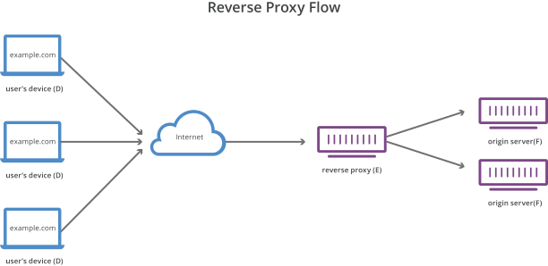

# Network-Proxy & Web Server

## 网络代理

有两种类型的网络代理：

1. 反向代理(Reverse Proxy): 可理解成**服务端代理**，是服务端配置的一个中间代理服务器，负责将客户端的请求转发给后端服务器。 
   - 常被用于流量负载均衡(Load Balancer)、API网关、实现缓存/https/安全等功能。
   - 
2. 前向代理(Forward Proxy)/转发代理: 可理解成**客户端代理**，是客户端配置的一个中间代理服务器，负责将客户端的请求转发给后端服务器。 
   - 常被用于突破某些服务端的访问限制（比如地域限制-翻墙），或者在网络上隐藏自己的真实身份（Tor 洋葱代理）。
   - 也可用于添加某些访问限制：比如学校/企业可以通过前向代理禁止用户访问 Zhihu/Bilibili 等娱乐网站。
   - 

下面介绍几种当下比较流行的代理软件：

全能选手，既可用做代理，又可用做 Web 服务器：

1. Nginx: 使用最广泛，最年长，性能也几乎是最高的，但是配置稍显复杂，学习起来有些门槛。
2. Caddy: 新兴的 Web Server & Network-Proxy。配置比 Nginx 简单，支持自动配置 SSL 证书，默认启用 HTTP2/HTTPS。
   - 是 go 语言写的，性能相比 Nginx 要弱一些，同时内存消耗比 Nginx 大很多。

专用代理软件：

1. Traefik: 一个纯粹的代理软件，支持自动配置 SSL 证书，配置很简单，功能相当丰富，还有好看的 Web UI。
   - Traefik 相对的，性能也要比 Nginx 差。
2. Envoy: Istio 钦定代理，在服务网格中专门负责流量转发
3. Linkerd: 用 rust 写的轻量高效的代理，值得一看。

其他经常听说的代理：

4. [OpenResty](https://github.com/openresty/openresty): 基于 Nginx+Lua Web 平台，很多网关/代理的底层都是它。
5. Kong/APISIX: 这俩都是基于 Openresty 开发的 API 网关。
6. HAProxy: 一个 C 专用负载均衡器，单纯做负载均衡，它的性能比 Nginx 还要好些。
   - 但是纯四层负载均衡 LVS 性能比它更高，另外它的代码结构也不如 nginx，导致二次开发难度大，社区也就小很多。
   - 所以好像不推荐使用。

高性能的 4 层代理，只关注第四层，因此能获得更高的性能：

- ipvs: 有二十多年历史的 4 层负载均衡技术，linux 内核模块。
- [katran](https://github.com/facebookincubator/katran): Facebook 开源的，基于 eBPF 的新一代 4 层负载均衡。

在四层负载均衡方面，也有一些将 ipvs/eBPF 及其他技术结合起来的尝试，比如：

- [性能提升40%: 腾讯 TKE 用 ipvs+eBPF 绕过 conntrack 优化 K8s Service](https://juejin.cn/post/6844904198752960520)
- [网易数帆基于 DPDK 的高性能四层负载均衡实践](https://www.infoq.cn/article/hlhteohg8elx6eyveifl)

## 该选择哪个产品作为我们的代理工具？

这是一个见仁见智的问题，不同的技术栈、不同的业务现状，都可能会让人们作出不同的选择。

## 参考

- [What is a reverse proxy? - cloudflare](https://www.cloudflare.com/learning/cdn/glossary/reverse-proxy/)
